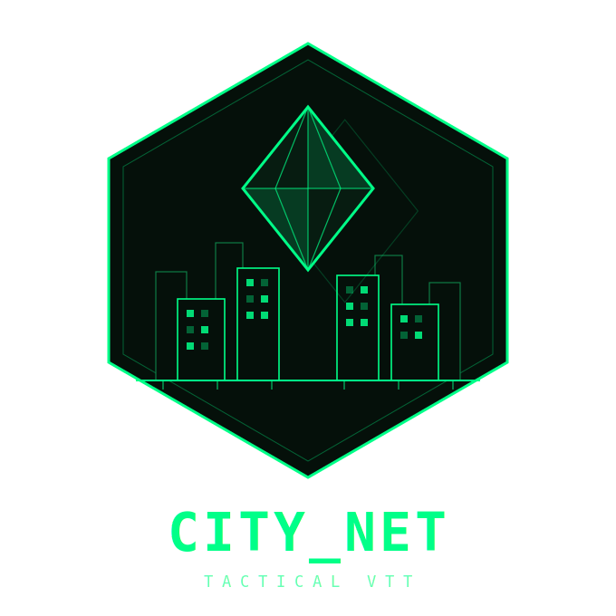

<table>
<tr>
<td width="160" align="center" valign="middle">

</td>
<td valign="middle" style="padding-left: 16px;">

## CITY_NET

**A self-hosted, real-time 3D city for tabletop RPG sessions.**

The GM generates a living cyberpunk city — procedural districts, roads, overpasses, traffic, and custom signs — while players connect live and interact with it. Run a battle map, manage the economy, roll dice, stream to an audience, and never touch a third-party platform.

Built with React + Three.js · Node.js + SQLite · Socket.IO · Docker

</td>
</tr>
</table>

<p>
  <a href="LICENSE"></a>
  <a href="https://github.com/over2take/CITY_NET/stargazers"></a>
  <a href="https://ko-fi.com/over2take"></a>
  
  
  
</p>

---

[CITY_NET Trailer](https://youtu.be/3DfL-aB5MKU)

---

## For Game Masters — Getting Started

### Prerequisites

- **Docker option:** [Docker Desktop](https://www.docker.com/products/docker-desktop/) (recommended, easiest setup)
- **Manual option:** [Node.js](https://nodejs.org/) v18 or newer
- A terminal (PowerShell, bash, etc.)

### 1. Clone the repo

```bash
git clone https://github.com/over2take/CITY_NET.git
cd CITY_NET
```

---

## Option A: Docker (Recommended)

### 2. Configure environment

**Linux/Mac:**
```bash
cp backend/.env.example backend/.env
cp backend/.env .env
```

**Windows (PowerShell):**
```powershell
Copy-Item backend\.env.example backend\.env
Copy-Item backend\.env .env
```

Edit `backend/.env` with your values. See `backend/.env.example` for all options and defaults.

> **Note:** We copy to both locations because docker-compose needs the root `.env` to substitute variables like `DUCKDNS_SUBDOMAINS` in the compose file itself.

**Required in both files:**
```env
ADMIN_USER=your_admin_name
ADMIN_PASS=your_secure_password
JWT_SECRET=some_long_random_string
```

Generate a strong token:
```bash
node -e "console.log(require('crypto').randomBytes(32).toString('hex'))"
```

**Optional settings** (safe to leave as-is):
```env
PORT=5000
SECURE_MODE=false
APP_PORT=80
DUCKDNS_SUBDOMAINS=yourname
DUCKDNS_TOKEN=your-token-from-duckdns.org
TZ=America/Chicago
```

> **Never commit `.env` files.** They're already in `.gitignore`.

### 3. Start Docker

```bash
docker compose up -d
```

Everything runs automatically. Access the app at `http://localhost:$APP_PORT` (default `http://localhost:80`).

---

## Option B: Manual Setup

### 2. Configure the backend

**Linux/Mac:**
```bash
cd backend
cp .env.example .env
```

**Windows (PowerShell):**
```powershell
cd backend
Copy-Item .env.example .env
```

Edit `backend/.env` with your values (same required/optional settings as above).

### 3. Install dependencies

```bash
cd backend && npm install
cd ../frontend && npm install
```

### 4. Run in development

Open two terminals:

```bash
# Terminal 1 — backend
cd backend
node server.js

# Terminal 2 — frontend
cd frontend
npm run dev
```

Frontend is at `http://localhost:5173`, backend at `http://localhost:5000`.

### 5. Build for production

```bash
cd frontend
npm run build
cd ../backend
node server.js
```

---

## Connectivity & Deployment

The app runs locally on `localhost:5000` (manual) or `localhost:$APP_PORT` (Docker). To let players connect over the internet, you need to expose it publicly:

---

**Cloudflare Tunnel** (recommended — free, no port forwarding, works behind NAT)
1. Install [cloudflared](https://developers.cloudflare.com/cloudflare-one/connections/connect-networks/downloads/)
2. `cloudflared tunnel --url http://localhost:5000` (or `http://localhost:$APP_PORT` for Docker)
3. Cloudflare prints a public `https://` URL — share that with your players

---

**DuckDNS** (free persistent subdomain — good for home servers with dynamic IPs)

DuckDNS gives you a free subdomain like `yourcity.duckdns.org` that always points to your home IP even when it changes. Unlike Cloudflare Tunnel it requires port forwarding on your router, but it gives players a clean, permanent URL.

> **Port note:** port `80` gives a clean URL (`http://yourcity.duckdns.org`) but many residential ISPs block inbound port 80. If yours does, set `APP_PORT=8080` in `backend/.env` and players connect to `http://yourcity.duckdns.org:8080`. Port `443` enables a clean HTTPS URL but requires an SSL certificate (see Certbot below).

> **Firewall note:** OS firewalls (e.g. Windows Defender Firewall) will need a rule to allow incoming connections on your selected port (`80` or `8080`). Without it, the router forwards the port but the host machine silently drops the connection.

1. Register a free subdomain and copy your token at [duckdns.org](https://www.duckdns.org)
2. In `backend/.env` set:
   ```env
   DUCKDNS_SUBDOMAINS=yourcity
   DUCKDNS_TOKEN=your-token-here
   APP_PORT=80          # or 8080 if your ISP blocks 80
   TZ=America/Chicago   # your timezone
   ```
3. The `duckdns` service in `docker-compose.yml` runs automatically and keeps your IP updated — no cron job needed
4. Forward the chosen port (e.g. `80` or `8080`) on your router to the host machine
5. Players connect to `http://yourcity.duckdns.org` (or `:8080` if you used that port)

**Adding HTTPS with Let's Encrypt (optional but recommended)**
```bash
# Install Certbot with the DuckDNS plugin
pip install certbot certbot-dns-duckdns
# Issue a cert (DNS-01 challenge — no port 443 needed for issuance)
certbot certonly \
  --authenticator dns-duckdns \
  --dns-duckdns-token your-token-here \
  -d yourcity.duckdns.org
```
Then update `nginx.conf` to listen on 443 with the issued cert and set `APP_PORT=443`.

---

**IPv6 direct connect** (LAN play — no internet, no port forwarding)

If your players are on the same local network, they can connect directly via your machine's IPv6 address — no router config needed.

1. Find your IPv6 address:
   - **Windows:** `ipconfig` → look for `IPv6 Address` under your network adapter
   - **Linux/Mac:** `ip addr` or `ifconfig` → look for `inet6` (use the global address, not `fe80::`)
2. Make sure Docker is running (`docker compose up -d`)
3. Players open `http://[your-ipv6-address]` in their browser (brackets required)
   - Example: `http://[2001:db8:85a3::8a2e:370:7334]`
   - If using a custom `APP_PORT`: `http://[2001:db8::1]:8080`

> **Tip:** IPv6 LAN addresses are stable on most home networks but can change if the router restarts. For regular sessions, set a static IPv6 address on the host machine.

---

**ngrok** (quick and easy, free tier has session limits)
1. Sign up at [ngrok.com](https://ngrok.com) and install the CLI
2. `ngrok http 5000` (or `$APP_PORT` for Docker)
3. ngrok prints a public URL good for the session

---

**Nginx reverse proxy** (self-hosted VPS, requires a domain)
- An `nginx.conf` is included in the repo — it proxies HTTP and WebSocket traffic to port `5000`
- Point your domain's DNS at your server, install [Nginx](https://nginx.org/en/docs/install.html), drop the config in `/etc/nginx/sites-available/`, and enable it
- Pair with [Certbot](https://certbot.eff.org/) for free HTTPS via Let's Encrypt

**Checking for updates**

The admin panel includes a **Check for update** button that queries Docker Hub for new versions.

- **Docker installs (in-app):** When an update is available, click **CLICK TO UPDATE (docker only)** — the server pulls the latest images and restarts all containers automatically. The page reloads once the new version is live.
- **Docker installs (manual fallback):** If the button doesn't work, run these on your host:
  ```bash
  docker compose pull
  docker compose up -d
  ```
- **Manual installs:** Pull the latest changes from the repo and restart your server manually.

The GitHub Actions workflow automatically tags Docker images with version numbers from `package.json`. When you bump the version and run the release workflow, new images are available on Docker Hub with version tags.

**Checking for new environment variables after updates**

When you update the Docker images, new required environment variables may have been added. If you're missing any, the backend logs a warning on startup with the missing var names.

To see the latest `.env.example` from a running container:
```bash
docker cp citynet-backend:/app/.env.example ./backend/.env.example.new
diff backend/.env.example backend/.env.example.new
```

Compare the diff and add any new vars to your `backend/.env`, then restart:
```bash
docker compose up -d
```

---

## Secure Mode

When `SECURE_MODE=false` (default), players just enter a name to join — no password required.

When `SECURE_MODE=true`, players must register an account before they can access the map. Registration is self-service from the login screen.

**Admin first login with Secure Mode ON:**
Enter your `.env` admin credentials on the player login screen. The app will recognise them as admin credentials, log you in, and open the admin dashboard automatically — no separate player account needed.

---

## Admin Panel

Click `ADMIN_LOGIN` in the top bar once you're on the map. Enter your `.env` `ADMIN_USER` / `ADMIN_PASS`. This gives you access to:

- Full map editing (create, move, edit, delete locations)
- Player token management (place and move player characters)
- HP / injury tracking for all players
- Bank ledger and scheduled pay
- Dice roll history
- Battle map uploads
- City database and district management
- Custom sign placement (text, image, multi-line; free-transform gizmo for wall placement; custom font upload)

---

## Project Structure

```
CITY_NET/
├── backend/
│   ├── server.js               # Express entrypoint — mounts routes, starts Socket.IO
│   ├── db.js                   # SQLite schema and migrations
│   ├── middleware/
│   │   └── auth.js             # JWT verify middleware (admin + elevated users)
│   ├── routes/
│   │   ├── admin.js            # Admin-only REST endpoints; undo covers locations, roads, signs
│   │   ├── locations.js        # Location CRUD; JOIN→CUSTOM classification upserts roots + child parts to custom_structure_library; serves GET /custom-library (CUSTOM-only)
│   │   ├── battle_maps.js      # Battle map image upload/management
│   │   ├── maps.js             # Saved map snapshots (locations, districts, roads, overpasses, water bodies); preserves only rhombus tokens on load/clear
│   │   ├── music.js            # Radio Feed — library CRUD + file upload
│   │   ├── roads.js            # Road CRUD; DELETE /:id removes a single segment
│   │   ├── overpasses.js       # Overpass CRUD (GET all / POST one / DELETE :id)
│   │   ├── signs.js            # Custom sign CRUD (GET all / POST / PATCH :id / DELETE :id); text optional when image_url set
│   │   ├── fonts.js            # Font file upload/list/delete (.ttf .otf .woff .woff2); served as static under /uploads/fonts/
│   │   └── player.js           # Player auth (register, login, forgot, reset, registration status poll)
│   ├── sockets/
│   │   └── index.js            # All Socket.IO event handlers
│   ├── startup/
│   │   └── sanity_checks.js    # In-memory DB checks on boot
│   └── __tests__/
│       ├── helpers/
│       │   └── testDb.js               # In-memory SQLite factory for isolated test DBs
│       ├── admin.test.js               # Admin endpoints (auth, settings, undo access)
│       ├── battle_maps.test.js         # Battle map upload/list/delete
│       ├── locations.test.js           # Location CRUD and classification
│       ├── locations.global.test.js    # Custom structure global persistence tests
│       ├── maps.global.test.js         # Map load/clear global preservation tests
│       ├── music.test.js               # Radio Feed library endpoints
│       ├── overpasses.test.js          # Overpass API (GET / POST / DELETE :id, 400 validation)
│       ├── player.test.js              # Player auth (register, login, forgot/reset, registration flow)
│       ├── roads.test.js               # Road API (GET / POST / DELETE / DELETE :id)
│       ├── signs.test.js               # Sign API (GET / POST / PATCH / DELETE, auth, image-only, filter_intensity clamping, XSS)
│       ├── sockets.editing.test.js     # Socket editing access flow; regression for stale elevatedUsers bug
│       └── undo.test.js                # Undo endpoint (all action types, auth, ordering)
│
├── frontend/
│   ├── src/
│   │   ├── App.tsx             # Root component — state, routing, socket wiring
│   │   ├── App.css / index.css # Global styles and CSS variables
│   │   ├── components/
│   │   │   ├── AdminPanel.tsx          # GM dashboard; CUSTOM type integrates into NEXT_STYLE cycle using cross-map custom_structure_library
│   │   │   ├── HitPoints.tsx           # HP tracking + injury panel + HealthReviewWindow
│   │   │   ├── BankWindows.tsx         # Player bank UI
│   │   │   ├── ChatWindow.tsx          # In-game chat
│   │   │   ├── DiceTray.tsx            # Dice roller
│   │   │   ├── Buildings.tsx           # 3D building meshes
│   │   │   ├── Sidewalks.tsx           # Road-flanking pavement strips (mitered quad ribbons, no geometry under roads) + neon curb line overlays
│   │   │   ├── AutoSignage.tsx         # Procedural signs on building faces (seeded RNG, weighted type pool: text, preset SVG images, vertical neon; overlap check)
│   │   │   ├── Signs.tsx               # Custom sign meshes — canvas-texture renderer (text, image, multi-line), TV/CRT shader filter, free-transform gizmo
│   │   │   ├── Rhombuses.tsx           # Player token meshes
│   │   │   ├── Overpasses.tsx          # Elevated road meshes (deck tiles, ramps, pillars) + ghost OverpassPreview
│   │   │   ├── MapElements.tsx         # Roads, water, overlays; RoadEraser (segment/path delete with hover highlight)
│   │   │   ├── Sidebar.tsx             # Nav rail — controls, volume, help, geometry tools
│   │   │   ├── SecureLogin.tsx         # Player login, registration, password reset UI; polls registration status until approved
│   │   │   ├── LogoScene.tsx           # Three.js animated login logo (hex badge, wireframe skyline, spinning gem)
│   │   │   ├── CityDatabase.tsx        # Location search/browse
│   │   │   ├── DraggableWindow.tsx     # Reusable draggable panel wrapper
│   │   │   ├── CursorPing.tsx          # Cursor-position ping broadcast and animation
│   │   │   ├── AttackAnimations.tsx    # Attack hit/miss animations (swipe, projectile, miss text)
│   │   │   ├── RadioFeed.tsx           # Admin music library panel (folder tree, upload, delete)
│   │   │   ├── RadioPlayer.tsx         # Playback window (scrubber, transport, per-client volume)
│   │   │   ├── Camera.tsx              # CameraController and cursor-pivot helpers
│   │   │   ├── HealthBar.tsx           # 3D health bar rendered above tokens
│   │   │   ├── MeasurementTool.tsx     # Ruler overlay for distance measurement
│   │   │   ├── StatusDisplay.tsx       # Status log and status bar text
│   │   │   ├── Streamer.tsx            # Camera broadcaster/rig pairs for streamer mode
│   │   │   ├── StreamerOverlay.tsx     # HUD overlay rendered on the spectator window
│   │   │   ├── StreamerDirectorPanel.tsx # Admin director controls (camera mode, visibility flags)
│   │   │   ├── UpdateModal.tsx          # Draggable update notification modal (shown on admin login when update available; Update Now / Remind Me Later / Skip Version; docker-aware)
│   │   │   └── __tests__/              # Component unit tests (Vitest + Testing Library)
│   │   │       ├── AdminPanel.test.tsx
│   │   │       ├── AttackAnimations.test.tsx
│   │   │       ├── BankWindows.test.tsx
│   │   │       ├── Buildings.test.tsx
│   │   │       ├── Camera.test.tsx
│   │   │       ├── ChatWindow.test.tsx
│   │   │       ├── CityDatabase.test.tsx
│   │   │       ├── CursorPing.test.tsx
│   │   │       ├── DiceTray.test.tsx
│   │   │       ├── DraggableWindow.test.tsx
│   │   │       ├── HitPoints.test.tsx
│   │   │       ├── MapElements.test.tsx
│   │   │       ├── MeasurementTool.test.tsx
│   │   │       ├── RadioFeed.test.tsx
│   │   │       ├── RadioPlayer.test.tsx
│   │   │       ├── Rhombuses.test.tsx
│   │   │       ├── SecureLogin.test.tsx  # Login, register, approval polling, password reset, deny flows
│   │   │       ├── Sidebar.test.tsx
│   │   │       └── UpdateModal.test.tsx  # Rendering, docker/non-docker branching, button callbacks, update flow
│   │   ├── context/
│   │   │   └── StreamerVisibilityContext.ts # React context for audience-layer visibility flags
│   │   ├── hooks/
│   │   │   ├── useSocket.ts    # Socket.IO connection and all event listeners
│   │   │   ├── useApi.ts       # Fetch helpers
│   │   │   ├── useMapData.ts   # Location/district/road/overpass/water body/sign data fetching
│   │   │   └── __tests__/
│   │   │       ├── useApi.test.ts                        # Fetch helper unit tests
│   │   │       └── useSocket.pendingRequests.test.ts     # Pending edit-request state; regression for stale requests on newly-promoted temp admins
│   │   ├── streamerMode.ts     # IS_SPECTATOR constant — detects ?streamer=true URL param
│   │   └── utils/
│   │       ├── locationHelpers.ts  # Location geometry utilities; exports ZONE_TYPE_NAMES and isUserDefinedName
│   │       ├── rhombusHelpers.ts   # Player token position math
│   │       ├── threeHelpers.tsx    # Three.js scene utilities
│   │       ├── roadHelpers.ts      # consolidateRoads, chainRoadPolylines, buildRoadRibbonGeometry, getClosestPointOnRoads
│   │       ├── overpassHelpers.ts  # Elevation profile, deck tile subdivision, pillar placement with road-avoidance
│   │       ├── fontLoader.ts       # FontFace loader for remote fonts (cached by URL); BUILTIN_FONTS list
│   │       └── __tests__/
│   │           ├── locationHelpers.test.ts  # Unit tests for isUserDefinedName and getStructLabel
│   │           ├── roadHelpers.test.ts      # consolidateRoads, chainRoadPolylines, buildRoadRibbonGeometry
│   │           └── overpassHelpers.test.ts  # Elevation, geometry, and path-sampling tests
│   └── public/
│       ├── signs/              # Preset neon SVG sign images (motel, bar, cyber-clinic, etc.)
│       └── ...                 # Audio, icons, kofi.png
│
├── docs/                       # Reference docs (deployment plans, feature notes)
├── Dockerfile.backend
├── Dockerfile.frontend
├── docker-compose.yml
├── nginx.conf
└── .env.example
```

### Tech stack

| Layer | Tech |
|---|---|
| Frontend | React 19, TypeScript, Three.js, @react-three/fiber, Vite |
| Backend | Node.js, Express 5, SQLite3 |
| Realtime | Socket.IO |
| Auth | JWT (admin) + bcrypt (player accounts) |
| Deployment | Docker, Nginx, GitHub Actions |

### Key architectural patterns

- **Socket.IO is the source of truth for live state.** REST endpoints handle persistence; sockets broadcast `dataUpdated` events so all clients re-fetch.
- **`useSocket.ts` owns all socket subscriptions.** Adding a new real-time event means adding it there and nowhere else.
- **`DraggableWindow` is the UI primitive.** Every floating panel wraps it.
- **Inline SVG components instead of `` tags** for icons that need CSS-variable colour control.
- **Roads are chained into continuous ribbons, not per-segment quads.** `chainRoadPolylines` walks degree-2 nodes into full street polylines; `buildRoadRibbonGeometry` builds a single mitered-joint mesh per street so bends render seamlessly. Ghost traffic uses the same chains.
- **Undo is action-history driven.** Mutating operations push a typed payload to `action_history`; `POST /api/admin/undo` pops the latest entry and reverses it in a single `db.serialize` block.
- **Secure Mode is a pure opt-in.** When `SECURE_MODE=false`, the player auth routes return 404 and the frontend shows the simple name-only login — existing behaviour is unchanged.
- **Streamer mode is a read-only spectator client.** Append `?streamer=true` to the URL to open a broadcast-safe overlay view. The spectator socket role is invisible to presence/chat and all mutating events are blocked server-side. A `DirectorState` object is broadcast from admin to spectators over Socket.IO, controlling camera mode, visibility flags, scene title, and letterbox.

---

## Upgrading

See [UPGRADE.md](UPGRADE.md) for step-by-step instructions when updating an existing install.

---

## Contributing

1. Fork the repo and create a branch off `main`
2. `npm run dev` (frontend) + `node server.js` (backend) for local development
3. Run tests: `cd frontend && npm test` / `cd backend && npm test`
4. Open a PR against `main` — describe what changed and why

---

## License

[GNU Affero General Public License v3.0](LICENSE)

You are free to use, modify, and self-host this software. If you distribute a modified version — or run it as a hosted service — you must release your changes under the same AGPL-3.0 license and provide users access to the source code.
