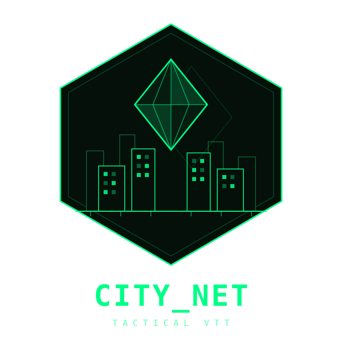

<table>
<tr>
<td width="160" align="center" valign="middle">

</td>
<td valign="middle" style="padding-left: 16px;">

## CITY_NET

**A self-hosted, real-time 3D city for tabletop RPG sessions.**

The GM generates a living cyberpunk city — procedural districts, roads, overpasses, traffic, and custom signs — while players connect live and interact with it. Run a battle map, manage the economy, roll dice, stream to an audience, and never touch a third-party platform.

Built with React + Three.js · Node.js + SQLite · Socket.IO · Docker

</td>
</tr>
</table>

<p>
  <a href="LICENSE"></a>
  <a href="https://github.com/over2take/CITY_NET/stargazers"></a>
  <a href="https://ko-fi.com/over2take"></a>
  <a href="https://discord.gg/Zc3GVztTAD"></a>
  
  
  
</p>

---

[CITY_NET Trailer](https://youtu.be/3DfL-aB5MKU)

---

## For Game Masters — Getting Started

### Prerequisites

- **Install Git:** [Git install](https://git-scm.com/install/)
- **Docker option:** [Docker Desktop](https://www.docker.com/products/docker-desktop/) (recommended, easiest setup)
- **Manual option:** [Node.js](https://nodejs.org/) v18 or newer
- A terminal (PowerShell, bash, etc.)

### 1. Clone the repo

```bash
git clone https://github.com/over2take/CITY_NET.git
cd CITY_NET
```

---

## Quick Setup (Guided Script)

> ## ⚠️ NEVER RUN SCRIPTS FROM AN UNTRUSTED SOURCE
>
> Only use `setup.ps1` / `setup.sh` if you downloaded them **directly from this repository** ([github.com/over2take/CITY_NET](https://github.com/over2take/CITY_NET)). Scripts can do anything your user account can do — if someone sends you a "setup script" for CITY_NET from anywhere else (Discord, forums, a re-upload, a YouTube description), **do not run it.** When in doubt, open the script in a text editor and read it first, or use the manual setup below instead — it's only a few copy-paste steps.

If you'd rather not edit config files by hand, run the guided setup script. It supports both install methods — Docker (recommended) or manual with Node.js — generates a secure `JWT_SECRET` for you, asks for your admin login and port, optionally sets up DuckDNS (Docker only), writes the `.env` files, and can build and launch the app — all from a few prompts.

**Windows:** double-click `setup.bat`, or from PowerShell:
```powershell
powershell -ExecutionPolicy Bypass -File setup.ps1
```

**Linux/Mac:**
```bash
bash setup.sh
```

Requires Docker (recommended) or Node.js v18+ to be installed. For manual configuration instead, follow the options below.

**Starting the app later:**
- **Docker install:** containers auto-restart; or run `docker compose up -d`
- **Node.js install:** double-click `start.bat` (Windows) or run `bash start.sh` (Linux/Mac). The server runs in that terminal — closing it stops the app.

---

## Option A: Docker (Recommended)

### 2. Configure environment

**Linux/Mac:**
```bash
cp backend/.env.example backend/.env
cp backend/.env .env
```

**Windows (PowerShell):**
```powershell
Copy-Item backend\.env.example backend\.env
Copy-Item backend\.env .env
```

Edit `backend/.env` with your values. See `backend/.env.example` for all options and defaults.

> **Note:** We copy to both locations because docker-compose needs the root `.env` to substitute variables like `DUCKDNS_SUBDOMAINS` in the compose file itself.

**Required in both files:**
```env
ADMIN_USER=your_admin_name
ADMIN_PASS=your_secure_password
JWT_SECRET=some_long_random_string
```

Generate a strong token:
```bash
node -e "console.log(require('crypto').randomBytes(32).toString('hex'))"
```

**Optional settings** (safe to leave as-is):
```env
PORT=5000
SECURE_MODE=false
APP_PORT=80
DUCKDNS_SUBDOMAINS=yourname
DUCKDNS_TOKEN=your-token-from-duckdns.org
TZ=America/Chicago
```

> **Never commit `.env` files.** They're already in `.gitignore`.

### 3. Start Docker

```bash
docker compose up -d
```

Everything runs automatically. Access the app at `http://localhost:$APP_PORT` (default `http://localhost:80`).

---

## Option B: Manual Setup

### 2. Configure the backend

**Linux/Mac:**
```bash
cd backend
cp .env.example .env
```

**Windows (PowerShell):**
```powershell
cd backend
Copy-Item .env.example .env
```

Edit `backend/.env` with your values (same required/optional settings as above).

### 3. Install dependencies

```bash
cd backend && npm install
cd ../frontend && npm install
```

### 4. Run in development

Open two terminals:

```bash
# Terminal 1 — backend
cd backend
node server.js

# Terminal 2 — frontend
cd frontend
npm run dev
```

Frontend is at `http://localhost:5173`, backend at `http://localhost:5000`.

### 5. Build for production

```bash
cd frontend
npm run build
cd ../backend
node server.js
```

---

## Connectivity & Deployment

The app runs locally on `localhost:5000` (manual) or `localhost:$APP_PORT` (Docker). To let players connect over the internet, you need to expose it publicly:

---

**Cloudflare Tunnel** (recommended — free, no port forwarding, works behind NAT)
1. Install [cloudflared](https://developers.cloudflare.com/cloudflare-one/connections/connect-networks/downloads/)
2. `cloudflared tunnel --url http://localhost:5000` (or `http://localhost:$APP_PORT` for Docker)
3. Cloudflare prints a public `https://` URL — share that with your players

---

**DuckDNS** (free persistent subdomain — good for home servers with dynamic IPs)

DuckDNS gives you a free subdomain like `yourcity.duckdns.org` that always points to your home IP even when it changes. Unlike Cloudflare Tunnel it requires port forwarding on your router, but it gives players a clean, permanent URL.

> **Port note:** port `80` gives a clean URL (`http://yourcity.duckdns.org`) but many residential ISPs block inbound port 80. If yours does, set `APP_PORT=8080` in `backend/.env` and players connect to `http://yourcity.duckdns.org:8080`. Port `443` enables a clean HTTPS URL but requires an SSL certificate (see Certbot below).

> **Firewall note:** OS firewalls (e.g. Windows Defender Firewall) will need a rule to allow incoming connections on your selected port (`80` or `8080`). Without it, the router forwards the port but the host machine silently drops the connection.

1. Register a free subdomain and copy your token at [duckdns.org](https://www.duckdns.org)
2. In `backend/.env` set:
   ```env
   DUCKDNS_SUBDOMAINS=yourcity
   DUCKDNS_TOKEN=your-token-here
   APP_PORT=80          # or 8080 if your ISP blocks 80
   TZ=America/Chicago   # your timezone
   ```
3. The `duckdns` service in `docker-compose.yml` runs automatically and keeps your IP updated — no cron job needed
4. Forward the chosen port (e.g. `80` or `8080`) on your router to the host machine
5. Players connect to `http://yourcity.duckdns.org` (or `:8080` if you used that port)

**Adding HTTPS with Let's Encrypt (optional but recommended)**
```bash
# Install Certbot with the DuckDNS plugin
pip install certbot certbot-dns-duckdns
# Issue a cert (DNS-01 challenge — no port 443 needed for issuance)
certbot certonly \
  --authenticator dns-duckdns \
  --dns-duckdns-token your-token-here \
  -d yourcity.duckdns.org
```
Then update `nginx.conf` to listen on 443 with the issued cert and set `APP_PORT=443`.

---

**IPv6 direct connect** (LAN play — no internet, no port forwarding)

If your players are on the same local network, they can connect directly via your machine's IPv6 address — no router config needed.

1. Find your IPv6 address:
   - **Windows:** `ipconfig` → look for `IPv6 Address` under your network adapter
   - **Linux/Mac:** `ip addr` or `ifconfig` → look for `inet6` (use the global address, not `fe80::`)
2. Make sure Docker is running (`docker compose up -d`)
3. Players open `http://[your-ipv6-address]` in their browser (brackets required)
   - Example: `http://[2001:db8:85a3::8a2e:370:7334]`
   - If using a custom `APP_PORT`: `http://[2001:db8::1]:8080`

> **Tip:** IPv6 LAN addresses are stable on most home networks but can change if the router restarts. For regular sessions, set a static IPv6 address on the host machine.

---

**ngrok** (quick and easy, free tier has session limits)
1. Sign up at [ngrok.com](https://ngrok.com) and install the CLI
2. `ngrok http 5000` (or `$APP_PORT` for Docker)
3. ngrok prints a public URL good for the session

---

**Nginx reverse proxy** (self-hosted VPS, requires a domain)
- An `nginx.conf` is included in the repo — it proxies HTTP and WebSocket traffic to port `5000`
- Point your domain's DNS at your server, install [Nginx](https://nginx.org/en/docs/install.html), drop the config in `/etc/nginx/sites-available/`, and enable it
- Pair with [Certbot](https://certbot.eff.org/) for free HTTPS via Let's Encrypt

**Checking for updates**

The admin panel includes a **Check for update** button that queries Docker Hub for new versions.

- **Docker installs (in-app):** When an update is available, click **CLICK TO UPDATE (docker only)** — the server pulls the latest images and restarts all containers automatically. The page reloads once the new version is live.
- **Docker installs (manual fallback):** If the button doesn't work, run these on your host:
  ```bash
  docker compose pull
  docker compose up -d
  ```
- **Manual installs:** Pull the latest changes from the repo and restart your server manually.

The GitHub Actions workflow automatically tags Docker images with version numbers from `package.json`. When you bump the version and run the release workflow, new images are available on Docker Hub with version tags.

**Checking for new environment variables after updates**

When you update the Docker images, new required environment variables may have been added. If you're missing any, the backend logs a warning on startup with the missing var names.

To see the latest `.env.example` from a running container:
```bash
docker cp citynet-backend:/app/.env.example ./backend/.env.example.new
diff backend/.env.example backend/.env.example.new
```

Compare the diff and add any new vars to your `backend/.env`, then restart:
```bash
docker compose up -d
```

---

## Secure Mode

When `SECURE_MODE=false` (default), players just enter a name to join — no password required.

When `SECURE_MODE=true`, players must register an account before they can access the map. Registration is self-service from the login screen.

**Admin first login with Secure Mode ON:**
Enter your `.env` admin credentials on the player login screen. The app will recognise them as admin credentials, log you in, and open the admin dashboard automatically — no separate player account needed.

---

## Admin Panel

Click `ADMIN_LOGIN` in the top bar once you're on the map. Enter your `.env` `ADMIN_USER` / `ADMIN_PASS`. This gives you access to:

- Full map editing (create, move, edit, delete locations)
- Player token management (place and move player characters)
- HP / injury tracking for all players
- Bank ledger and scheduled pay
- Dice roll history
- Battle map uploads
- City database and district management
- Custom sign placement (text, image, multi-line; free-transform gizmo for wall placement; custom font upload)
- Character sheets — game system selection, house rules, NPC library, per-system admin actions (CP:R LUCK reset, SR6 Edge replenishment)

---

## Project Structure

```
CITY_NET/
├── backend/
│   ├── server.js               # Express entrypoint — mounts routes, starts Socket.IO; trusts one proxy hop so `req.ip` is the caller rather than nginx, and serves /uploads through the sandbox headers
│   ├── db.js                   # SQLite schema and migrations. Holds the one sheet write that deliberately bypasses sheets/mutate.js — a boot-time migration, documented in place, running before the server listens and before anything exists to race with
│   ├── updater.js              # In-app self-update — paginated registry tag listing so a run of dev builds cannot hide a stable release; release channels selected by IMAGE_TAG alone, the same variable compose pulls with (X.Y.Z-dev tags with an optional counter, ordered so a release supersedes its own dev builds); preflight (compose file mounted, docker socket, compose project labels) so a stack that cannot update says why instead of hanging, and offers updating from the host as an equal option since running without the socket is a supported posture; one update at a time, refused rather than queued, with a stale-run release so a hung pull does not deaden the button; the helper command passed as argv rather than through `sh -c`, so a compose label containing a command substitution is data and not code; upgrade-only semver check; update log on the data volume; boot id so a restart is detectable without a version change; the registry read goes through net/outbound, and the docker probe behind GET /api/version is asked once per process rather than once per request — execSync holds the event loop, so a probe on an open route was a way to stall the server
│   ├── net/
│   │   └── outbound.js         # Every request to a host we do not own goes through here. A named destination (exact hostname, never a suffix test), HTTPS, a deadline covering the body as well as the connection, a byte cap, and no redirect following — none of which a caller can opt out of. Two callers, one auditable surface
│   ├── middleware/
│   │   ├── auth.js             # JWT verify middleware (admin + elevated users)
│   │   ├── uploadConstraints.js # What an upload may be and how to say so when it is not. One message shape naming the file, what was wrong and what would have worked — plus a handler for multer's own failures, since an oversized file previously reached Express's HTML error page and the client reported a JSON syntax error to the user
│   │   ├── uploadHeaders.js    # What a browser may do with a file somebody uploaded. `/uploads` is served with no auth, so a sandbox CSP puts anything opened from it in an opaque origin and nosniff stops it being re-read as HTML — which is what lets the upload allowlists stay as wide as the file pickers
│   │   └── rateLimit.js        # A sliding per-caller ceiling, for the one open route that spends our outbound requests on an anonymous caller's say-so. Bounded in memory, since the key is whoever is asking; evicts the least recently seen, so it forgives rather than blocks
│   ├── routes/
│   │   ├── admin.js            # Admin-only REST endpoints; undo covers locations, roads, signs; POST /update preflights and returns 409 naming what is missing, GET /update/status reports phase and a stable failure code and nothing anyone said to us — it is unauthenticated by necessity, so the compose output that used to ride along on it now stays in the log file, POST /check-update offers only genuine upgrades from the deployment's own channel; POST /water marks generated water so a regenerate can clear its own river without touching a lake the GM drew
│   │   ├── locations.js        # Location CRUD; JOIN→CUSTOM classification upserts roots + child parts to custom_structure_library; serves GET /custom-library (CUSTOM-only); GET / includes sheet_data for NPC initiative rolls; POST /purge-region clears one region's generated content in a single transaction, keeping GM-named structures, tokens, battle-map content and hand-drawn water
│   │   ├── battle_maps.js      # Battle map upload and management. Streams to a temporary file and hashes in chunks rather than buffering, so a 250MB animated map costs disk rather than RAM, then renames to the content hash — the same map on a dozen locations is one file. Sweeps partial uploads left by a process that died mid-transfer, since those are the one case the handler's own cleanup cannot reach. Accepts what the scene can actually draw, stills and loops alike, since a format the renderer cannot decode uploads perfectly and then shows nothing
│   │   ├── maps.js             # Saved map snapshots (locations, districts, roads, overpasses, water bodies); preserves only rhombus tokens on load/clear; records active_map_name in global_settings so exports can name their files
│   │   ├── music.js            # Radio Feed — library CRUD + file upload, checked by extension rather than by the Content-Type the uploader claims, since the name is what gets written and what decides how it is served back
│   │   ├── roads.js            # Road CRUD; DELETE /:id removes a single segment
│   │   ├── custom_dice.js      # GM-authored dice CRUD; GET is public so players see them, writes are admin-only; broadcasts customDiceUpdated after each change
│   │   ├── system_dice.js      # Read-only dice that ship with a game system; no write routes exist by design
│   │   ├── overpasses.js       # Overpass CRUD (GET all / POST one / DELETE :id)
│   │   ├── signs.js            # Custom sign CRUD (GET all / POST / PATCH :id / DELETE :id); text optional when image_url set; rotation_x/y/z persisted, non-finite angles rejected
│   │   ├── fonts.js            # Font file upload/list/delete (.ttf .otf .woff .woff2); served as static under /uploads/fonts/
│   │   ├── player.js           # Player auth (register, login, forgot, reset, registration status poll)
│   │   └── sheets.js           # Character sheets — admin sheet access, NPC library, portraits, LUCK/Edge reset & grant, import preview. The table-wide resets scan to decide who is affected and then work out each value as that sheet is written, rather than writing back a scan that has already gone stale
│   ├── dice/
│   │   └── systemDice.js       # Built-in dice manifest keyed by game system (ids namespaced `builtin:`); lives in code, not the DB, so app updates change definitions with no migration and nothing is mutable through the API
│   ├── sheets/
│   │   ├── templates.js        # Server-side template metadata (public/combat/linked fields, max pairs, derived fields, per-system recompute hooks)
│   │   ├── rolls.js            # Per-system roll map (fieldId → formula); server-authoritative, so a sheet's roll button does nothing unless the field appears here. CP:R rollable stats include BODY; MOVE and LUCK are deliberately absent
│   │   ├── rollEngine.js       # Formula parse/resolve/execute (explode10, SR6 d6 hit-counting pool, deterministic RNG for tests)
│   │   ├── attack.js           # CP:R combat resolution — to-hit, damage, SP soak/ablation, shield, crits, death saves
│   │   ├── attackCwn.js        # CWN combat resolution — 1d20+BHB roll-to-hit, damage, trauma die vs TT, shock on miss, stabilize roll; vehicle mounts read through the same getWeapon via a field prefix; vehicle rules (AC moving vs stationary, Armour Rating as damage reduction, destruction, the -4 for firing from a moving vehicle) plus readOccupancy/getVehicle, which resolve where a character is and what is standing between them and the shot
│   │   ├── attackSr6.js        # SR6 combat resolution — attack pool (hits/glitch), AR vs Armor Rating DV modifier, potential damage (soak manual)
│   │   ├── identity.js         # Sheet = source of truth for player identity: mirrors name/description to tokens, display-name cache for rolls; also drives the vehicle mirror, so every caller that saves a sheet refreshes it
│   │   ├── vehicleSeats.js     # Seats derived from the book's Crew number — ids are positional (driver, seat2..seatN) so the server needs only the count to validate one. Guns are deliberately not seats: a Tank is crew 3 with 3 hardpoints and can never man every gun and drive at once
│   │   ├── mutate.js           # One writer at a time, per sheet. A sheet is a single JSON blob, so changing one field rewrites all of them — and with nothing held across the gap between the read and the write, two writers to the same sheet each built from the same stale copy and the second silently discarded the first. Queued per sheet id rather than globally, since writes to different sheets are genuinely independent and during a fight they are constant
│   │   ├── vehicleState.js     # CWN vehicles, resolved against the DB: a rider points at another player's sheet by name, so it takes a query. Shared by the attack path and the token mirror so the badge cannot claim what the damage does not do. Mirrors only the derived combat numbers plus who is aboard onto tokens, never the sheet — whole-table, since boarding changes the driver's badge too. Also lends a gunner the mounts of the car they are in, seats and unseats people, and builds the roster the VEHICLES window reads — occupants live on their own sheets, so one pass turns that inside out
│   │   ├── headshots.js        # Stock NPC headshot pools (enemy/friendly), random assignment, URL validation
│   │   ├── vehicleSystems.js   # Which game systems have vehicles, and the field-id contract the shared machinery assumes. Small because the templates agree on ids: SDP is a damage pool and SP is armour, whatever a system calls them on screen
│   │   ├── enemyVehicles.js    # The GM's enemy vehicles: a roster of the vehicles on NPC sheets, keyed by sheet id since an NPC sheet has no username. Nothing needed storing — NPC sheets already render the vehicle section and live in folders, so an enemy van has persisted between sessions all along; what was missing was a read, every roster query filtering is_npc = 0
│   │   ├── vehicleTokens.js    # Tokens riding in vehicles (`vehicle_occupants`), shared by the GM seating enemies and a player inviting a friendly — the same write with a different allowlist of token shapes. Also the map-level filter: `battle_map_id IS ?`, since `= NULL` matches nothing in SQL and the city map is exactly the null case
│   │   ├── ram.js              # Ramming. Symmetric and self-harming, armour does not apply, and everyone aboard both vehicles takes the injury — the three things about the rule that a later refactor would tidy away, so each has a test
│   │   ├── pdfTemplate.js      # The blank fillable form the importer reads back. Field names are the contract, so the layout lives beside the importer and a test walks every label through mapFields
│   │   ├── companionImport.js  # Reads a Cyberpunk RED Companion export into importer candidates. Pure, so the whole of the parsing risk is testable without a network — and no mapping table between the two vocabularies, since the alias normaliser already reduces their AirVehicleTech and our Air Vehicle Tech to one key
│   │   ├── companionFetch.js   # The six-digit code, resolved in two hops. Server-side so a player's address stays out of a third-party request; the request itself belongs to net/outbound, so the deadline, the cap and the allowed host are enforced rather than remembered. Rate limited at the route, being open to anyone
│   │   ├── importers.js        # Modular sheet import — PDF form extraction + data-driven per-system field mappers (makeMapFields)
│   │   └── npcTiers.js         # Per-system NPC power tiers for GENERATE_SHEET (CP:R: Mook→Elite; CWN: +Spirits; SR6: Ganger→Prime Runner)
│   ├── sockets/
│   │   ├── index.js            # All Socket.IO event handlers. Every write to a character sheet goes through sheets/mutate.js: rolls, damage, death saves, stabilisation, spell effort and vehicle hulls all touch sheets their owner is very likely looking at, and anything relative is worked out inside the write so two of them landing together both count
│   │   └── initiative.js       # Initiative tracker socket events (start, roll, next, remove, reorder, end); individual and side-based modes; SR6 pass-decay on wrap; CWN side auto-create, PC-side score derivation, friendly-NPC routing; roll history broadcast
│   ├── startup/
│   │   └── sanity_checks.js    # In-memory DB checks on boot
│   ├── utils/
│   │   └── random.js           # cryptoRng — uniform [0,1) from OS entropy (crypto.randomInt); default rng for every roll that decides an outcome
│   └── __tests__/
│       ├── helpers/
│       │   └── testDb.js               # In-memory SQLite factory for isolated test DBs
│       ├── admin.test.js               # Admin endpoints (auth, settings, undo access); update routes — 409 with a reason rather than a false success, unauthenticated status, boot id on /version; check-update against a stubbed registry — upgrades only, dev tags per channel, and a prerelease not hiding a stable release
│       ├── cpr_stats.test.js           # CP:R stat rolls — BODY rollable, MOVE and LUCK not, and every roll button in the template backed by a server-side roll
│       ├── nginx_config.test.js        # The assumptions the app makes about the proxy every request arrives through, which no other test here touches — body ceiling at least the largest upload limit, X-Forwarded-For present, the socket able to upgrade, and every mounted path actually proxied. Two faults in one release lived exactly in that gap
│       ├── upload_constraints.test.js  # The three questions a refusal has to answer, and the oversized upload that used to come back as HTML. Also asserts the frontend's copy of the cap still equals the server's, read from the source rather than restated
│       ├── upload_headers.test.js      # Served through a real static mount rather than by calling the helper: a stored .html comes back sandboxed, an SVG likewise, and every file gets the headers rather than the ones something guessed were dangerous
│       ├── outbound.test.js            # The one door: a host that is merely a suffix of an allowed one, plain http, a body past the cap abandoned rather than measured, a registry that answers and then stops talking, and a deadline still armed while the body arrives
│       ├── rate_limit.test.js          # Time injected rather than waited for. Per caller rather than per house, a sliding window so the allowance cannot be spent twice across a boundary, and a bound on how many callers are remembered
│       ├── updater.test.js             # Version ordering including X.Y.Z-dev, tag filtering per channel, preflight refusals, and an update that records its failures instead of returning silently; the next page is read from Docker Hub even when the payload names another host; the docker probe is asked once and its answer remembered
│       ├── docker_config.test.js       # Deployment invariants — DB_PATH baked in, data excluded from the image, image tags parameterised by IMAGE_TAG, compose file mounted for the updater, channel shipped pointing at stable
│       ├── battle_maps.test.js         # Battle map upload/list/delete
│       ├── locations.test.js           # Location CRUD and classification
│       ├── locations.global.test.js    # Custom structure global persistence tests
│       ├── maps.global.test.js         # Map load/clear global preservation tests
│       ├── music.test.js               # Radio Feed library endpoints
│       ├── overpasses.test.js          # Overpass API (GET / POST / DELETE :id, 400 validation)
│       ├── player.test.js              # Player auth (register, login, forgot/reset, registration flow)
│       ├── roads.test.js               # Road API (GET / POST / DELETE / DELETE :id)
│       ├── custom_dice.test.js         # Custom dice API (public read, admin-only writes, validation, duplicate-name 409)
│       ├── system_dice.test.js         # Built-in dice manifest integrity; asserts no write route exists
│       ├── sockets.customdice.test.js  # Roll handler: DB vs builtin resolution, numeric summing, count clamp, forged-payload rejection
│       ├── signs.test.js               # Sign API (GET / POST / PATCH / DELETE, auth, image-only, filter_intensity clamping, XSS)
│       ├── sheets.test.js              # Sheet routes (system switch, admin access, portraits, derived fields, GET /own player self-fetch)
│       ├── npc_sheets.test.js          # NPC library routes (CRUD, links, folders, LUCK reset, HP overlay)
│       ├── cpr_attack.test.js          # CP:R attack module (to-hit, armor, shield, crits, death saves)
│       ├── npc_tiers.test.js           # NPC tier packages (escalation, weapon validity)
│       ├── sheet_mutate.test.js        # The race pinned as it stands — two unguarded writes, one change lost — so the queue's tests are measured against a demonstrated fault. Plus a guard that walks the backend and fails if any file writes a sheet directly, because the guarantee only holds when both sides of a collision take the queue
│       ├── sheet_import.test.js        # Import pipeline (PDF form extraction, alias mapping, preview route)
│       ├── rollEngine.test.js          # Roll formula engine
│       ├── random.test.js              # cryptoRng range/uniqueness; roll engine and attack modules exercised without an injected rng
│       ├── cwn_templates.test.js       # CWN template metadata (derived fields, AC linking, unset-stat neutrality)
│       ├── cwn_attack.test.js          # CWN attack module (roll-to-hit, damage, trauma vs TT, shock, stabilize)
│       ├── cwn_seating.test.js         # Seating and unseating: one seat one person, a seat the vehicle does not have refused, and only the occupant or the GM getting them out — checked over the socket, since hiding a button proves nothing
│       ├── cwn_occupancy.test.js       # Reading where a character is: every unreadable state resolves to on foot, so a bad reference costs cover rather than making someone unhittable
│       ├── cwn_vehicle_combat.test.js  # Shooting someone in a car: AR subtracts, HP comes off the owner's sheet, a wreck stops being cover, a rider whose owner is gone falls back, and a gunner fires a car they do not own
│       ├── cwn_vehicle_mirror.test.js  # What reaches other players' screens: derived numbers only, cleared on dismount, refreshed for riders when the owner saves
│       ├── cwn_vehicle_hp.test.js      # Damage and repair by hand: clamped to the hull at both ends, since `destroyed` is derived from HP rather than stored
│       ├── cpr_vehicle_seating.test.js # Cyberpunk vehicles on the shared roster, and the system gate: neither system lists, seats into or damages the other's cars
│       ├── companion_import.test.js    # The wire format and the flattening, against a hand-written fixture shaped from a real export — collections keyed by uuid rather than listed, and a role that lives as the single key of roleAbilities
│       ├── companion_fetch.test.js     # Every way the fetch can fail, with no network involved: bad code, 404, timeout, a body that is not JSON, and a lookup that answers with no uuid in it
│       ├── setup/noNetwork.js          # Loaded before every backend test: an unstubbed `fetch` throws and names the address. Twice now a stubbed transport was replaced and the tests quietly carried on against the real service, passing because it agreed with them
│       ├── enemy_vehicles.test.js      # The enemy roster and its seam: neither roster shows the other's vehicles, the enemy path refuses a player's sheet id, and the seat pickers filter to the map level the GM is looking at
│       ├── cwn_vehicle_guests.test.js  # Friendly NPCs riding with players: hostiles refused by the server rather than merely hidden, and "one seat, one occupant" holding across both storage mechanisms in both directions
│       ├── cpr_ram.test.js             # Ramming: symmetric damage, no armour, everyone aboard both vehicles injured, and the driver-seat rule the permission model rests on
│       ├── cwn_sockets.test.js         # CWN socket integration: attack flow, dice-in-broadcast, system isolation
│       ├── cwn_stim_heal.test.js       # STIM_HEAL action (strain check, +1 strain, 409 on maxed strain)
│       ├── login_theme.test.js         # Login theme persistence (localStorage save, DB write on login, JWT round-trip)
│       ├── headshots.test.js           # Stock headshot pools (shape routing, URL validation, files exist)
│       ├── identity.test.js            # Player identity (name-field mapping, display-name cache, token mirroring)
│       ├── sr6_rollEngine.test.js      # SR6 pool shape (hits, glitch thresholds, critical glitch, pool floor)
│       ├── sr6_templates.test.js       # SR6 template metadata (monitor derivation, armor linking, tiers, importer)
│       ├── sr6_attack.test.js          # SR6 attack module (DV parsing, attack pool, AR vs armor, damage floor)
│       ├── sr6_sockets.test.js         # SR6 socket integration: pool attack flow, stun overflow, system isolation
│       ├── sockets.deathsave.test.js   # Socket integration: death saves, sheetAttack vs NPC SP, import apply, tiered generation
│       ├── sockets.editing.test.js     # Socket editing access flow; regression for stale elevatedUsers bug
│       ├── undo.test.js                # Undo endpoint (all action types, auth, ordering)
│       └── initiative.test.js          # Initiative tracker (start, roll ordering, next turn, SR6 pass-decay, breakdown/diceResults persistence, CWN PC-wins-ties, side mode)
│
├── frontend/
│   ├── src/
│   │   ├── App.tsx             # Root component — state, routing, socket wiring
│   │   ├── App.css / index.css # Global styles and CSS variables
│   │   ├── cityGen/            # Pure city generator — bounds + options + world state in, blocks/roads/buildings/overpasses out. No React, no network; AdminPanel persists the result
│   │   │   ├── index.ts        # generateCity orchestrator; selects a layout, caps buildings under decks; injected rng and fillPlot make it testable
│   │   │   ├── types.ts        # Bounds, Block, RawBuilding, Obstacle, options/context/result shapes
│   │   │   ├── bsp.ts          # Recursive split into blocks + road seams; seams clipped to land and to any drawn boundary as they are laid; optional minimum block size
│   │   │   ├── layouts.ts      # LayoutFn registry — BSP (default), GRID (avenues every 4th line), SUPERBLOCK (large floor), RING (beltways with elevated spokes filling a disc), VORONOI (organic cells, streets on the cell boundaries), PERIMETER (elongated blocks cut into street-facing lots)
│   │   │   ├── lots.ts         # Cuts a block into building lots: a ring around the rim facing the street, ringing inward again while there is room and leaving the rest as back lot, with a block too thin for a rim and a middle becoming a terrace rather than one monolith. Rim depth and frontages vary per block. Each lot is flagged Block.lot so the generator takes the footprint as given instead of padding, squaring and setting it back
│   │   │   ├── voronoi.ts      # Voronoi cells by half-plane clipping, shared-edge dedup, and the inscribed rectangle that lets an irregular cell feed a rectangle-only plot filler
│   │   │   ├── collision.ts    # SpatialGrid (footprint spans every cell it covers), exact segment-vs-box road test, boundary rejection, and clampBuildingsUnderDecks so overpasses do not pierce towers
│   │   │   ├── zoning.ts       # Sector layout, concentric-ring zone assignment, park probability, plot aspect clamp
│   │   │   ├── parks.ts        # Holotree park plots and their optional ponds; a pond is elliptical so it fills a long thin plot, and is returned rather than pushed as a building
│   │   │   ├── landmarks.ts    # The four hero-building styles and their siting rule
│   │   │   ├── monuments.ts    # Six small civic ornaments for a roundabout island — column, statue, fountain, clock tower, arch, obelisk — sized against the island rather than the skyline. Shapes come from a SHAPES allow-list that deliberately excludes `rhombus`: a rhombus is a player/NPC token here, so using one as a finial made a monument publish a fake token inside itself, which turned it transparent and made it survive a purge as player content
│   │   │   ├── water.ts        # Water polygon parsing, point/footprint tests, submerged spans, and one clipper shared by water and drawn bounds (keepInside flips which side survives)
│   │   │   ├── waterGen.ts     # Generated rivers, coastlines and lakes; runs before the split so the grid stops at the banks and bridges get sited. NONE is both the default and the off switch
│   │   │   ├── shoreline.ts    # Waterfront roads offset onto land; snaps approach ends onto them
│   │   │   ├── bridges.ts      # Shore-stub pairing, span/grade limits, deck levelling by graph colouring, OVERPASS_DENSITY
│   │   │   ├── roundabouts.ts  # Overlay on a finished network, so it works with every layout — junction finding (shared endpoints and true crossings), siting by width/spacing/density, and approach trimming via the water clipper
│   │   │   ├── rng.ts          # seededRng (mulberry32), randomSeed, and seedFrom — hashes any typed seed into range instead of truncating it
│   │   │   ├── region.ts       # Region membership test and generated-content count, shared by the panel and REGENERATE
│   │   │   └── __tests__/
│   │   │       ├── cityGen.test.ts     # Split determinism, collision and buffer behaviour, zoning, landmarks, parks, end-to-end generation
│   │   │       ├── boundary.test.ts    # Drawn bounds — inside/outside/straddling, concave notch, clip inverse of water, unchanged output without a boundary
│   │   │       ├── layouts.test.ts     # Per-layout contracts, grid regularity vs BSP, ring density and deck ramps, height capping under decks
│   │   │       ├── perimeter.test.ts   # Lots that tile a block without overlapping, terrace gaps under two units, varied frontages and rim depths, block coverage bracketed from both sides (hollow and solid are both wrong), varied block sizes, a drawn boundary tested per lot rather than per block, and every other layout left unflagged
│   │   │       ├── voronoi.test.ts     # Cells closer to their own seed than any other, tiling without gaps, convexity, edge dedup, inscribed rectangle, and a road network that is not axis-aligned
│   │   │       ├── monuments.test.ts  # Scale against the island and against a landmark, nothing floating, one root per monument, and the three app-wide conventions a generator must not override — the `#00ff00` theme sentinel, `polyCount` 5, and never the token-reserved `rhombus`
│   │   │       ├── roundabouts.test.ts # Crossings with no shared endpoint, arterial-only siting, spacing, water and boundary exclusion, approaches cut back to the ring but still reaching it, closed ring, and every layout
│   │   │       ├── water.test.ts       # Polygon parsing, concave outlines, span detection, shoreline roads, bridge siting and levels
│   │   │       ├── waterGen.test.ts    # River/coast/lake shape and seeding; water reaching the city before the split rather than after
│   │   │       ├── parkPonds.test.ts   # Pond shape and size, containment in the plot, trees standing back from the water, and identical roads with ponds on or off
│   │   │       ├── seeds.test.ts       # Same seed rebuilds the same city; typed seeds survive intact; a new seed gives a different one
│   │   │       └── region.test.ts      # Region membership and counting for REGENERATE
│   │   ├── components/
│   │   │   ├── AdminPanel.tsx          # GM dashboard — CITY / EXPORT / GAME / PLAYERS tabs; CITY_GENERATOR delegates to cityGen/ and exposes LAYOUT, DRAG_RECT/DRAW_AREA bounds, OVERPASS_DENSITY, WATER, PARK_PONDS, an optional SEED and REGENERATE; CUSTOM type integrates into NEXT_STYLE cycle using cross-map custom_structure_library; data-driven HouseRulesPanel for CP:R, CWN, and SR6; SR6 Edge replenishment (reset all / give 1 to player)
│   │   │   ├── HitPoints.tsx           # HP tracking + injury panel + HealthReviewWindow; STIM_HEAL (CWN), STABILIZE button for allies on mortal wound
│   │   │   ├── BankWindows.tsx         # Player bank UI
│   │   │   ├── ChatWindow.tsx          # In-game chat
│   │   │   ├── DiceTray.tsx            # Dice roller; SR6 pool results show a pulsing GLITCH / CRITICAL GLITCH banner; initiative rolls appear with full breakdown; `sidesForKey` picks the 3D shape (custom dice key results by name and carry their side count in `diceSides`)
│   │   │   ├── CustomDieBuilder.tsx    # CUSTOM_DIE.EXE — draggable build/edit window (name, side count, per-face values); App keys it on the die being edited so switching targets reloads the form
│   │   │   ├── Buildings.tsx           # 3D building meshes
│   │   │   ├── Sidewalks.tsx           # Road-flanking pavement strips (mitered quad ribbons, no geometry under roads) + neon curb line overlays
│   │   │   ├── AutoSignage.tsx         # Procedural signs on building faces (seeded RNG, weighted type pool: text, preset SVG images, vertical neon; overlap check)
│   │   │   ├── Signs.tsx               # Custom sign meshes — canvas-texture renderer (text, image, multi-line), TV/CRT shader filter, free-transform gizmo; rotation on all three axes so signs can lie flat as ground labels
│   │   │   ├── MapExportController.tsx # R3F bridge — renders null, lifts the export API out of the Canvas so AdminPanel buttons can drive it
│   │   │   ├── Rhombuses.tsx           # Player token meshes; carries the vehicle badge, drawn always rather than on hover — cover you have to hover to discover is cover nobody accounts for
│   │   │   ├── Overpasses.tsx          # Elevated road meshes (deck tiles, ramps, pillars) + ghost OverpassPreview
│   │   │   ├── MapElements.tsx         # Roads, water, overlays; RoadEraser (segment/path delete with hover highlight)
│   │   │   ├── Sidebar.tsx             # Nav rail — controls, volume, help, geometry tools; initiative button blinks when a roll is needed; exports `hasSheetCombat` + `SheetAttackPanel` (system-agnostic via ATTACK_PANEL_CONFIG)
│   │   │   ├── SecureLogin.tsx         # Player login, registration, password reset UI; theme picker (saves to localStorage + DB on login); polls registration status until approved
│   │   │   ├── LogoScene.tsx           # Three.js animated login logo (hex badge, wireframe skyline, spinning gem); colour driven by active theme
│   │   │   ├── CityDatabase.tsx        # Location search/browse
│   │   │   ├── DraggableWindow.tsx     # Reusable draggable panel wrapper
│   │   │   ├── CursorPing.tsx          # Cursor-position ping broadcast and animation
│   │   │   ├── AttackAnimations.tsx    # Attack hit/miss animations (swipe, projectile, miss text)
│   │   │   ├── RadioFeed.tsx           # Admin music library panel (folder tree, upload, delete)
│   │   │   ├── RadioPlayer.tsx         # Playback window (scrubber, transport, per-client volume)
│   │   │   ├── Camera.tsx              # CameraController and cursor-pivot helpers
│   │   │   ├── HealthBar.tsx           # 3D health bar rendered above tokens
│   │   │   ├── MeasurementTool.tsx     # Ruler overlay for distance measurement
│   │   │   ├── StatusDisplay.tsx       # Status log and status bar text
│   │   │   ├── Streamer.tsx            # Camera broadcaster/rig pairs for streamer mode
│   │   │   ├── StreamerOverlay.tsx     # HUD overlay rendered on the spectator window
│   │   │   ├── StreamerDirectorPanel.tsx # Admin director controls (camera mode, visibility flags)
│   │   │   ├── CharacterSheetWindow.tsx # Player's own character sheet (socket-based, self-only)
│   │   │   ├── NpcSheetWindow.tsx       # Admin view/edit of NPC or player sheets (REST-based)
│   │   │   ├── NpcLibrary.tsx           # NPC sheet library (folders, attach-to-token, move, open)
│   │   │   ├── SheetRenderer.tsx        # Template-driven sheet renderer (any game system); sections may declare groupSize to collapse repeated entries, rowHidden to drop a row of one, and fields may declare presetFill (one select writing a whole stat block, as one save), fullWidth, startsRow or the tag_list type (an add/remove list stored as JSON) — only entries holding data render, plus one blank and a reveal button, so what you filled in comes back after a reload without anything storing that it should; MORTALLY WOUNDED / FRAIL banners, ability_list layout (dynamic add/remove rows with attr dropdown, cost, die, roll), hidden-tab gating
│   │   │   ├── ImportSheetDialog.tsx    # Sheet import — fillable PDF, a Companion code (Cyberpunk only), or pasted JSON / stat block, plus a download of the blank form that upload expects
│   │   │   ├── ImportPreviewWindow.tsx  # What an import would do, in its own window: what was recognised, what the source never held, and which of your fields a replace would clear. The window is the confirmation — applying replaces the sheet
│   │   │   ├── QuickSheetCard.tsx       # Public sheet card shown to other players
│   │   │   ├── EnemyVehiclesWindow.tsx  # The GM's enemy cars: same geometry and hull colours as the player window, keyed by NPC sheet id. Seat pickers offer the GM's tokens on the current map level, friendlies tinted blue so a body on your own side is not put in a hostile driver's seat in a hurry
│   │   │   ├── VehiclesWindow.tsx       # Who is in which vehicle: a picker across every player's sheet, the wireframe with a dropdown per seat, a MOVING toggle, the car's AC/AR, and a hull bar with REPAIR/DAMAGE for its owner. Seat anchors are generated, so a crew of sixteen works
│   │   │   ├── VehicleBadgeButton.tsx   # The car badge on the sheet and token menu — inline SVG so it takes the theme; inert on someone else's token rather than hidden
│   │   │   ├── vehicleArt.tsx           # Ten top-down wireframes, one per book vehicle. Stroke-only and currentColor, matching how the city itself is drawn
│   │   │   ├── TvPortrait.tsx           # Reusable glitchy TV/CRT portrait effect (chromatic fringe, scanlines, rollband); optional shadow silhouette
│   │   │   ├── UpdateModal.tsx          # Draggable update notification modal (shown on admin login when update available; Update Now / Remind Me Later / Skip Version; docker-aware)
│   │   │   └── __tests__/              # Component unit tests (Vitest + Testing Library)
│   │   │       ├── AdminPanel.test.tsx
│   │   │       ├── AttackAnimations.test.tsx
│   │   │       ├── BankWindows.test.tsx
│   │   │       ├── Buildings.test.tsx
│   │   │       ├── Camera.test.tsx
│   │   │       ├── ChatWindow.test.tsx
│   │   │       ├── CityDatabase.test.tsx
│   │   │       ├── CursorPing.test.tsx
│   │   │       ├── DiceTray.test.tsx
│   │   │       ├── CustomDieBuilder.test.tsx  # Create/edit modes, name-clash rules, face preservation, reload-on-target-switch regression
│   │   │       ├── DraggableWindow.test.tsx
│   │   │       ├── HitPoints.test.tsx
│   │   │       ├── MapElements.test.tsx
│   │   │       ├── MeasurementTool.test.tsx
│   │   │       ├── SignRotation.test.tsx   # LAY_FLAT / STAND_UP presets, per-axis sliders, all three axes reaching the PATCH body
│   │   │       ├── RadioFeed.test.tsx
│   │   │       ├── RadioPlayer.test.tsx
│   │   │       ├── Rhombuses.test.tsx
│   │   │       ├── SecureLogin.test.tsx  # Login, register, approval polling, password reset, deny flows
│   │   │       ├── CharacterSheet.test.tsx   # Template registry, renderer, sheet window, weapon rows, death saves
│   │   │       ├── NpcLibrary.test.tsx
│   │   │       ├── ImportSheetDialog.test.tsx
│   │   │       ├── QuickSheetCard.test.tsx
│   │   │       ├── SheetAttackPanel.mounts.test.tsx # Mounts in the weapon picker: keyed by (vehicle, mount) so one does not shadow another, and the mounts of a car you are riding in
│   │   │       ├── SheetAttackPanel.target.test.tsx # What the attacker is told before firing: the vehicle's name, AC, Armour Rating and whether it is moving
│   │   │       ├── EnemyVehiclesWindow.test.tsx     # What the GM window sends: sheet-id keyed damage, seating a token, friendlies marked apart, and a passenger who has left the map level staying selectable rather than reading as empty
│   │   │       ├── VehiclesWindow.test.tsx          # Seat naming from the book, the front pair sitting side by side, the permission asymmetry, sizing to the vehicle, the hull bar sending the sign the button implies, and the window running with no game system behind it
│   │   │       ├── vehicleArt.test.tsx              # Every wireframe draws, stays inside the 0..100 box the seat anchors are percentages of, and is stroke-only on currentColor
│   │   │       ├── SheetAttackPanel.ram.test.tsx    # RAM offered only to a driver, reading as melee, and leaving by its own event rather than the attack path
│   │   │       ├── VehicleBadgeButton.test.tsx      # Reads as an action on your own and a statement on someone else's; themed rather than a fixed colour
│   │   │       ├── SheetRenderer.vehicles.test.tsx  # Collapsing repeated entries — one empty vehicle at rest, filled ones visible on reload, whitespace not counting as data
│   │   │       ├── Sidebar.test.tsx
│   │   │       └── UpdateModal.test.tsx  # Rendering, docker/non-docker branching, button callbacks, update flow
│   │   ├── modules/
│   │   │   └── initiative/
│   │   │       ├── hooks/
│   │   │       │   └── useInitiative.ts        # Socket-backed initiative state (start, roll, join, next, remove, reorder, end); Side interface; side mode support
│   │   │       ├── components/
│   │   │       │   ├── InitiativeWindow.tsx     # Floating/sidebar tracker UI; branches on mode ('individual'/'side'); SR6 pass counter, new-round banner, extra-dice selector, floor-aware NPC filtering
│   │   │       │   ├── InitiativeSideView.tsx   # Side-based render path (CWN RAW); side panels with active highlight, sub-ordering, within-side drag-and-drop, player JOIN button
│   │   │       │   └── InitiativeCombatantRow.tsx # Single combatant row with drag-to-reorder and admin remove
│   │   │       ├── systems/
│   │   │       │   ├── index.ts                # InitiativeSystem interface (+ defaultMode) + getInitiativeSystem(key) registry
│   │   │       │   ├── generic.ts              # 1d20 roll; TURN counter; no pass decay
│   │   │       │   ├── sr6.ts                  # REA+INT+Xd6 roll; PASS counter; end-of-pass −10 decay; Wired Reflexes extra dice
│   │   │       │   ├── cpr.ts                  # REF+1d10 roll; ROUND counter; order held for entire combat; exploding d10 via house rule
│   │   │       │   ├── cwn.ts                  # 1d8+DEX mod roll; ROUND counter; PCs win ties; defaultMode: 'side'
│   │   │       │   └── random.ts               # cryptoRng — uniform [0,1) from crypto.getRandomValues; shared by every system
│   │   │       └── __tests__/
│   │   │           ├── systems.test.ts          # Registry lookup, generic/SR6/CP:R/CWN formulas, extra dice, breakdown format, diceResults shape
│   │   │           ├── random.test.ts           # Browser cryptoRng range/uniqueness; every system exercised on its default rng
│   │   │           └── useInitiative.test.ts    # Hook state transitions, socket emit payloads
│   │   ├── context/
│   │   │   └── StreamerVisibilityContext.ts # React context for audience-layer visibility flags
│   │   ├── hooks/
│   │   │   ├── useVideoMapTexture.ts  # A looping battle map as a texture. All browser policy rather than rendering: muted because no browser autoplays sound, playsInline because iOS would otherwise take it full-screen, paused on a hidden tab because decoding for nobody is real battery, and the source released on unmount because pausing alone keeps the buffers
│   │   │   ├── useSocket.ts        # Socket.IO connection and all event listeners
│   │   │   ├── useApi.ts           # Fetch helpers
│   │   │   ├── useMapExport.ts     # PNG/WebM city export — one cached off-screen renderer for the session, shared ortho camera, GPU size clamp, per-frame render loop for video, MediaRecorder with codec fallback; never touches the live camera
│   │   │   ├── useMapData.ts       # Location/district/road/overpass/water body/sign data fetching
│   │   │   ├── useCustomDice.ts    # Custom dice state — fetches GM dice and the active system's built-ins, merges them (built-ins first, flagged `locked`), and applies `customDiceUpdated` broadcasts
│   │   │   ├── useEnemyVehicles.ts # The GM's enemy vehicles, and the tokens on the map level that could fill their seats. Asked for rather than pushed, and refused to anyone but the GM — so a player's client never holds enemy pools or armour at all, which is what keeps "what may players see" from being a question the feature has to answer
│   │   │   ├── useVehicleRoster.ts # Every vehicle in play and who is in which seat. Held outside the window because the buttons that open it need to know whether the table owns a vehicle at all — one subscription, so the two cannot disagree. Takes the socket ref, not its current value: a ref is not reactive, and reading it before the socket exists binds to nothing forever
│   │   │   ├── usePlayerSheet.ts   # Shared sheet state, debounced saves, house-rule flags, action emitters (roll/deathSave/stabilize/castSpell); used by CharacterSheetWindow and SheetPage
│   │   │   └── __tests__/
│   │   │       ├── useApi.test.ts                        # Fetch helper unit tests
│   │   │       ├── useMapExport.test.ts                  # Recorder codec fallback (vp9 → vp8 → webm → default), export camera framing, grid fade restore, countdown drift under starved timers
│   │   │       ├── useCustomDice.test.ts                 # Loading, system/GM merge order, locked flag, broadcast handling, mutation auth and errors
│   │   │       ├── useVehicleRoster.test.tsx             # Binds when the socket turns up, empties on a system switch, re-asks on a sheet save
│   │   │       ├── useVideoMapTexture.test.ts            # Every assertion is a silent failure: an unmuted video never starts, a hidden tab keeps decoding, a released map keeps its buffers, and a browser that refuses autoplay leaves a still frame with no explanation
│   │   │       └── useSocket.pendingRequests.test.ts     # Pending edit-request state; regression for stale requests on newly-promoted temp admins
│   │   ├── sheets/
│   │   │   ├── types.ts            # Sheet template type system (fields, sections, header, death saves, NPC tiers)
│   │   │   ├── index.ts            # Template registry, getMaxPairs, GATED_TABS/hiddenTabsFor (house-rule-gated sheet tabs)
│   │   │   ├── SheetPage.tsx       # Standalone browser-tab sheet (?sheet=true); reads theme from auth handshake or localStorage; shares logic via usePlayerSheet
│   │   │   ├── vehiclePresets.ts   # The CWN vehicle table (p.82) — picking a TYPE fills the stat block. Armour left unset on the * and ** vehicles: those are immunities the GM rules on, not numbers
│   │   │   ├── vehicleWeapons.ts   # The ten weapons a hardpoint can carry (p.81). Damage stored as clean dice; the book's ! rides on the trauma value, since only marked weapons can traumatise a vehicle
│   │   │   ├── vehicleFittings.ts  # The 24 fittings (p.84) and the Power/Mass budget they spend, weapons included. Power Systems raise the pool rather than un-spending
│   │   │   ├── vehicleLayouts.ts   # Seat ids mirrored from the backend, with the diagram anchors
│   │   │   ├── vehicleArchetypes.ts # Starting points for a vehicle in systems whose table cannot ship — ours, not any publisher's, approximate on purpose and editable after
│   │   │   ├── vehicleSystems.ts   # Which systems have vehicles, mirroring the backend list; decides what the interface offers, never what the server allows
│   │   │   ├── templates/
│   │   │   │   ├── generic.ts                  # Minimal fallback template
│   │   │   │   ├── cyberpunk_red.ts            # Cyberpunk RED — stats (rollable ones first, MOVE and LUCK last as they have no roll), skills, weapons, armor, tiers, IP and Reputation, vehicles (SDP/SP/seats filled from our own archetypes, since the book's table is not ours to ship; every field editable after). Labels + dice math only, no book content
│   │   │   │   ├── cities_without_number.ts    # Cities Without Number — attributes + SWN mods, saves, AC (token-linked), armor rows, weapons, vehicles (34 fields each: the book stat block, mounts bounded by hardpoints, a fittings list and its own notes; empty ones collapse and ADD seeds a Motorcycle), Deluxe tab (spells/summoning), conditions. Occupancy is not here — it is shared state, in the VEHICLES window
│   │   │   │   └── shadowrun_6e.ts             # Shadowrun 6E — attributes, d6 pool skills, Edge pips (SPEND button, admin replenish), weapons (DV/AR), Stun track, gated AWAKENED/EMERGED tabs; dynamic spell list (DRAIN/CAST) and adept power list (PP cost auto-summed)
│   │   │   └── __tests__/
│   │   │       ├── vehiclePresets.book.test.ts  # The book's ten rows held verbatim, in the book's column order — five values had already been transcribed wrong before this existed
│   │   │       ├── vehicleWeapons.test.ts       # Clean damage dice, the ! marker on the trauma value, hull-size gating
│   │   │       ├── vehicleFittings.test.ts      # The 24 fittings, and a budget where a Power System raises the pool rather than un-spending
│   │   │       └── cprVehicles.test.ts          # The CP:R vehicle section: one archetype picker that fills the block, names an unnamed vehicle but never a named one, and carries no book numbers
│   │   ├── streamerMode.ts     # IS_SPECTATOR constant — detects ?streamer=true URL param
│   │   ├── __tests__/
│   │   │   ├── BattleMapScene.test.tsx  # Which loader a map goes to — the whole of the animated-map change, and previously uncovered since the app smoke test mocks the scene away. A loop must not reach `useLoader`, which suspends with nothing above it to catch that
│   │   │   └── battleMapMedia.test.ts   # Still or loop, including the trap where the last dot is in the query string rather than the filename
│   │   ├── battleMapMedia.ts   # Whether a battle map is a still or a loop, mirrored from the backend allowlist. Decides which loader the scene reaches for, never what the server accepts; an unrecognised name falls through to the image path every existing map already takes
│   │   ├── BattleMapScene.tsx  # The battle map plane. Two components rather than one with a branch, because `useLoader` suspends and there is no Suspense boundary above it — so an animated map goes to a VideoTexture instead, and a still one takes exactly the path it always did
│   │   └── utils/
│   │       ├── updateClient.ts     # One implementation of the in-app update flow, shared by the update modal and the nav panel — stale-container probe, server refusal passed through verbatim, restart detected by boot id, bounded wait. Two copies is how one of them stayed unhardened
│   │       ├── locationHelpers.ts  # Location geometry utilities; exports ZONE_TYPE_NAMES and isUserDefinedName
│   │       ├── rhombusHelpers.ts   # Player token position math
│   │       ├── threeHelpers.tsx    # Three.js scene utilities
│   │       ├── roadHelpers.ts      # consolidateRoads, chainRoadPolylines, buildRoadRibbonGeometry, getClosestPointOnRoads
│   │       ├── overpassHelpers.ts  # Elevation profile, deck tile subdivision, pillar placement avoiding roads and lower decks
│   │       ├── fontLoader.ts       # FontFace loader for remote fonts (cached by URL); BUILTIN_FONTS list
│   │       ├── mapExportBounds.ts  # City framing math — rotation-safe circumradius, road width, water, overpasses; tokens excluded; resolution presets and GPU-aware size resolution
│   │       ├── mapExportWatermark.ts # CITY_NET watermark plus repo URL drawn in 2D canvas space; per-frame composite loop for video; exportFilename from the live map name
│   │       └── __tests__/
│   │           ├── locationHelpers.test.ts  # Unit tests for isUserDefinedName and getStructLabel
│   │           ├── roadHelpers.test.ts      # consolidateRoads, chainRoadPolylines, buildRoadRibbonGeometry
│   │           ├── mapExportBounds.test.ts  # Bounds coverage; GPU clamping on both axes, aspect preserved when scaling down
│   │           ├── mapExportWatermark.test.ts # Watermark anchor and stacking, scaling floor, filename slugging, download link cleanup
│   │           ├── updateClient.test.ts     # Stale-container detection including an index.html fallback answering 200, refusals passed through, nothing POSTed to a server that cannot act
│   │           └── overpassHelpers.test.ts  # Elevation, geometry, and path-sampling tests
│   └── public/
│       ├── signs/              # Preset neon SVG sign images (motel, bar, cyber-clinic, etc.)
│       └── ...                 # Audio, icons, kofi.png
│
├── docs/                       # Reference docs (deployment plans, feature notes)
├── Dockerfile.backend
├── Dockerfile.frontend
├── .github/workflows/          # CI Tests on PRs and main; Release to Docker Hub on green main; Dev Build to Docker Hub on dispatch or a push to dev. Includes Nginx Proxy Behaviour, which runs the real nginx against the repository config and a stub upstream — a 40MB body through, the caller's address forwarded, the socket upgrading — because every other test mounts a router directly and never sees the proxy
├── docker-compose.yml          # Image tags read ${IMAGE_TAG:-latest}, so the release channel is a setting rather than an edit
├── nginx.conf                  # Proxies /api and the socket to the backend. Forwards X-Forwarded-For, without which every request reaches the app from this container's address and anything counting per caller counts the whole table as one; and allows a body at least as large as the biggest upload the app accepts, or a large map is refused by the proxy before the app ever sees it. A backend test asserts the second
└── .env.example
```

### Tech stack

| Layer | Tech |
|---|---|
| Frontend | React 19, TypeScript, Three.js, @react-three/fiber, Vite |
| Backend | Node.js, Express 5, SQLite3 |
| Realtime | Socket.IO |
| Auth | JWT (admin) + bcrypt (player accounts) |
| Deployment | Docker, Nginx, GitHub Actions |

### Key architectural patterns

- **Socket.IO is the source of truth for live state.** REST endpoints handle persistence; sockets broadcast `dataUpdated` events so all clients re-fetch.
- **`useSocket.ts` owns all socket subscriptions.** Adding a new real-time event means adding it there and nowhere else.
- **`DraggableWindow` is the UI primitive.** Every floating panel wraps it.
- **Inline SVG components instead of `` tags** for icons that need CSS-variable colour control.
- **Roads are chained into continuous ribbons, not per-segment quads.** `chainRoadPolylines` walks degree-2 nodes into full street polylines; `buildRoadRibbonGeometry` builds a single mitered-joint mesh per street so bends render seamlessly. Ghost traffic uses the same chains.
- **Undo is action-history driven.** Mutating operations push a typed payload to `action_history`; `POST /api/admin/undo` pops the latest entry and reverses it in a single `db.serialize` block.
- **Secure Mode is a pure opt-in.** When `SECURE_MODE=false`, the player auth routes return 404 and the frontend shows the simple name-only login — existing behaviour is unchanged.
- **Streamer mode is a read-only spectator client.** Append `?streamer=true` to the URL to open a broadcast-safe overlay view. The spectator socket role is invisible to presence/chat and all mutating events are blocked server-side. A `DirectorState` object is broadcast from admin to spectators over Socket.IO, controlling camera mode, visibility flags, scene title, and letterbox.

---

## Upgrading

See [UPGRADE.md](UPGRADE.md) for step-by-step instructions when updating an existing install.

---

## Contributing

1. Fork the repo and create a branch off `main`
2. `npm run dev` (frontend) + `node server.js` (backend) for local development
3. Run tests: `cd frontend && npm test` / `cd backend && npm test`
4. Open a PR against `main` — describe what changed and why

---

## License

[GNU Affero General Public License v3.0](LICENSE)

You are free to use, modify, and self-host this software. If you distribute a modified version — or run it as a hosted service — you must release your changes under the same AGPL-3.0 license and provide users access to the source code.
