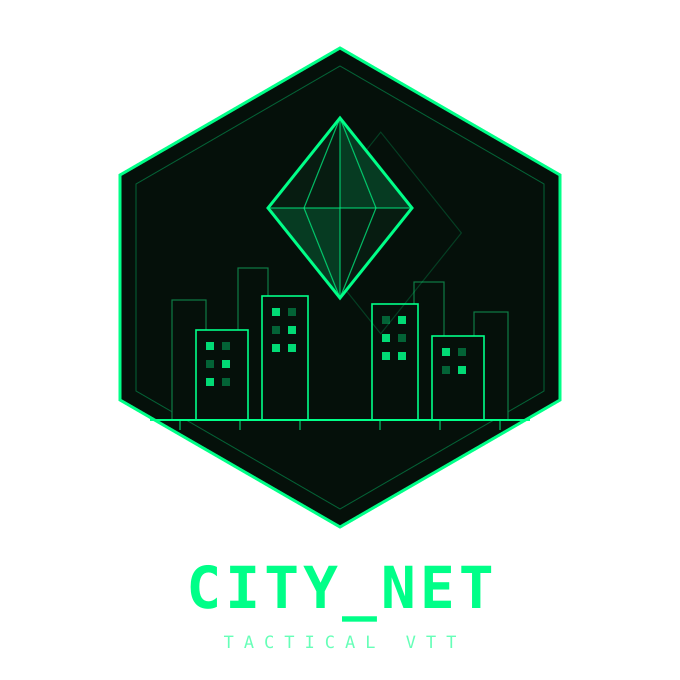

<table>
<tr>
<td width="160" align="center" valign="middle">

</td>
<td valign="middle" style="padding-left: 16px;">

## CITY_NET

**A self-hosted, real-time 3D city for tabletop RPG sessions.**

The GM generates a living cyberpunk city — procedural districts, roads, overpasses, traffic, and custom signs — while players connect live and interact with it. Run a battle map, manage the economy, roll dice, stream to an audience, and never touch a third-party platform.

Built with React + Three.js · Node.js + SQLite · Socket.IO · Docker

</td>
</tr>
</table>

<p>
  <a href="LICENSE"></a>
  <a href="https://github.com/over2take/CITY_NET/stargazers"></a>
  <a href="https://ko-fi.com/over2take"></a>
  <a href="https://discord.gg/Zc3GVztTAD"></a>
  
  
  
</p>

---

[CITY_NET Trailer](https://youtu.be/3DfL-aB5MKU)

---

## For Game Masters — Getting Started

### Prerequisites

- **Install Git:** [Git install](https://git-scm.com/install/)
- **Docker option:** [Docker Desktop](https://www.docker.com/products/docker-desktop/) (recommended, easiest setup)
- **Manual option:** [Node.js](https://nodejs.org/) v18 or newer
- A terminal (PowerShell, bash, etc.)

### 1. Clone the repo

```bash
git clone https://github.com/over2take/CITY_NET.git
cd CITY_NET
```

---

## Quick Setup (Guided Script)

> ## ⚠️ NEVER RUN SCRIPTS FROM AN UNTRUSTED SOURCE
>
> Only use `setup.ps1` / `setup.sh` if you downloaded them **directly from this repository** ([github.com/over2take/CITY_NET](https://github.com/over2take/CITY_NET)). Scripts can do anything your user account can do — if someone sends you a "setup script" for CITY_NET from anywhere else (Discord, forums, a re-upload, a YouTube description), **do not run it.** When in doubt, open the script in a text editor and read it first, or use the manual setup below instead — it's only a few copy-paste steps.

If you'd rather not edit config files by hand, run the guided setup script. It supports both install methods — Docker (recommended) or manual with Node.js — generates a secure `JWT_SECRET` for you, asks for your admin login and port, optionally sets up DuckDNS (Docker only), writes the `.env` files, and can build and launch the app — all from a few prompts.

**Windows:** double-click `setup.bat`, or from PowerShell:
```powershell
powershell -ExecutionPolicy Bypass -File setup.ps1
```

**Linux/Mac:**
```bash
bash setup.sh
```

Requires Docker (recommended) or Node.js v18+ to be installed. For manual configuration instead, follow the options below.

**Starting the app later:**
- **Docker install:** containers auto-restart; or run `docker compose up -d`
- **Node.js install:** double-click `start.bat` (Windows) or run `bash start.sh` (Linux/Mac). The server runs in that terminal — closing it stops the app.

---

## Option A: Docker (Recommended)

### 2. Configure environment

**Linux/Mac:**
```bash
cp backend/.env.example backend/.env
cp backend/.env .env
```

**Windows (PowerShell):**
```powershell
Copy-Item backend\.env.example backend\.env
Copy-Item backend\.env .env
```

Edit `backend/.env` with your values. See `backend/.env.example` for all options and defaults.

> **Note:** We copy to both locations because docker-compose needs the root `.env` to substitute variables like `DUCKDNS_SUBDOMAINS` in the compose file itself.

**Required in both files:**
```env
ADMIN_USER=your_admin_name
ADMIN_PASS=your_secure_password
JWT_SECRET=some_long_random_string
```

Generate a strong token:
```bash
node -e "console.log(require('crypto').randomBytes(32).toString('hex'))"
```

**Optional settings** (safe to leave as-is):
```env
PORT=5000
SECURE_MODE=false
APP_PORT=80
DUCKDNS_SUBDOMAINS=yourname
DUCKDNS_TOKEN=your-token-from-duckdns.org
TZ=America/Chicago
```

> **Never commit `.env` files.** They're already in `.gitignore`.

### 3. Start Docker

```bash
docker compose up -d
```

Everything runs automatically. Access the app at `http://localhost:$APP_PORT` (default `http://localhost:80`).

---

## Option B: Manual Setup

### 2. Configure the backend

**Linux/Mac:**
```bash
cd backend
cp .env.example .env
```

**Windows (PowerShell):**
```powershell
cd backend
Copy-Item .env.example .env
```

Edit `backend/.env` with your values (same required/optional settings as above).

### 3. Install dependencies

```bash
cd backend && npm install
cd ../frontend && npm install
```

### 4. Run in development

Open two terminals:

```bash
# Terminal 1 — backend
cd backend
node server.js

# Terminal 2 — frontend
cd frontend
npm run dev
```

Frontend is at `http://localhost:5173`, backend at `http://localhost:5000`.

### 5. Build for production

```bash
cd frontend
npm run build
cd ../backend
node server.js
```

---

## Connectivity & Deployment

The app runs locally on `localhost:5000` (manual) or `localhost:$APP_PORT` (Docker). To let players connect over the internet, you need to expose it publicly:

---

**Cloudflare Tunnel** (recommended — free, no port forwarding, works behind NAT)
1. Install [cloudflared](https://developers.cloudflare.com/cloudflare-one/connections/connect-networks/downloads/)
2. `cloudflared tunnel --url http://localhost:5000` (or `http://localhost:$APP_PORT` for Docker)
3. Cloudflare prints a public `https://` URL — share that with your players

---

**DuckDNS** (free persistent subdomain — good for home servers with dynamic IPs)

DuckDNS gives you a free subdomain like `yourcity.duckdns.org` that always points to your home IP even when it changes. Unlike Cloudflare Tunnel it requires port forwarding on your router, but it gives players a clean, permanent URL.

> **Port note:** port `80` gives a clean URL (`http://yourcity.duckdns.org`) but many residential ISPs block inbound port 80. If yours does, set `APP_PORT=8080` in `backend/.env` and players connect to `http://yourcity.duckdns.org:8080`. Port `443` enables a clean HTTPS URL but requires an SSL certificate (see Certbot below).

> **Firewall note:** OS firewalls (e.g. Windows Defender Firewall) will need a rule to allow incoming connections on your selected port (`80` or `8080`). Without it, the router forwards the port but the host machine silently drops the connection.

1. Register a free subdomain and copy your token at [duckdns.org](https://www.duckdns.org)
2. In `backend/.env` set:
   ```env
   DUCKDNS_SUBDOMAINS=yourcity
   DUCKDNS_TOKEN=your-token-here
   APP_PORT=80          # or 8080 if your ISP blocks 80
   TZ=America/Chicago   # your timezone
   ```
3. The `duckdns` service in `docker-compose.yml` runs automatically and keeps your IP updated — no cron job needed
4. Forward the chosen port (e.g. `80` or `8080`) on your router to the host machine
5. Players connect to `http://yourcity.duckdns.org` (or `:8080` if you used that port)

**Adding HTTPS with Let's Encrypt (optional but recommended)**
```bash
# Install Certbot with the DuckDNS plugin
pip install certbot certbot-dns-duckdns
# Issue a cert (DNS-01 challenge — no port 443 needed for issuance)
certbot certonly \
  --authenticator dns-duckdns \
  --dns-duckdns-token your-token-here \
  -d yourcity.duckdns.org
```
Then update `nginx.conf` to listen on 443 with the issued cert and set `APP_PORT=443`.

---

**IPv6 direct connect** (LAN play — no internet, no port forwarding)

If your players are on the same local network, they can connect directly via your machine's IPv6 address — no router config needed.

1. Find your IPv6 address:
   - **Windows:** `ipconfig` → look for `IPv6 Address` under your network adapter
   - **Linux/Mac:** `ip addr` or `ifconfig` → look for `inet6` (use the global address, not `fe80::`)
2. Make sure Docker is running (`docker compose up -d`)
3. Players open `http://[your-ipv6-address]` in their browser (brackets required)
   - Example: `http://[2001:db8:85a3::8a2e:370:7334]`
   - If using a custom `APP_PORT`: `http://[2001:db8::1]:8080`

> **Tip:** IPv6 LAN addresses are stable on most home networks but can change if the router restarts. For regular sessions, set a static IPv6 address on the host machine.

---

**ngrok** (quick and easy, free tier has session limits)
1. Sign up at [ngrok.com](https://ngrok.com) and install the CLI
2. `ngrok http 5000` (or `$APP_PORT` for Docker)
3. ngrok prints a public URL good for the session

---

**Nginx reverse proxy** (self-hosted VPS, requires a domain)
- An `nginx.conf` is included in the repo — it proxies HTTP and WebSocket traffic to port `5000`
- Point your domain's DNS at your server, install [Nginx](https://nginx.org/en/docs/install.html), drop the config in `/etc/nginx/sites-available/`, and enable it
- Pair with [Certbot](https://certbot.eff.org/) for free HTTPS via Let's Encrypt

**Checking for updates**

The admin panel includes a **Check for update** button that queries Docker Hub for new versions.

- **Docker installs (in-app):** When an update is available, click **CLICK TO UPDATE (docker only)** — the server pulls the latest images and restarts all containers automatically. The page reloads once the new version is live.
- **Docker installs (manual fallback):** If the button doesn't work, run these on your host:
  ```bash
  docker compose pull
  docker compose up -d
  ```
- **Manual installs:** Pull the latest changes from the repo and restart your server manually.

The GitHub Actions workflow automatically tags Docker images with version numbers from `package.json`. When you bump the version and run the release workflow, new images are available on Docker Hub with version tags.

**Checking for new environment variables after updates**

When you update the Docker images, new required environment variables may have been added. If you're missing any, the backend logs a warning on startup with the missing var names.

To see the latest `.env.example` from a running container:
```bash
docker cp citynet-backend:/app/.env.example ./backend/.env.example.new
diff backend/.env.example backend/.env.example.new
```

Compare the diff and add any new vars to your `backend/.env`, then restart:
```bash
docker compose up -d
```

---

## Secure Mode

When `SECURE_MODE=false` (default), players just enter a name to join — no password required.

When `SECURE_MODE=true`, players must register an account before they can access the map. Registration is self-service from the login screen.

**Admin first login with Secure Mode ON:**
Enter your `.env` admin credentials on the player login screen. The app will recognise them as admin credentials, log you in, and open the admin dashboard automatically — no separate player account needed.

---

## Admin Panel

Click `ADMIN_LOGIN` in the top bar once you're on the map. Enter your `.env` `ADMIN_USER` / `ADMIN_PASS`. This gives you access to:

- Full map editing (create, move, edit, delete locations)
- Player token management (place and move player characters)
- HP / injury tracking for all players
- Bank ledger and scheduled pay
- Dice roll history
- Battle map uploads
- City database and district management
- Custom sign placement (text, image, multi-line; free-transform gizmo for wall placement; custom font upload)
- Character sheets — game system selection, house rules, NPC library, per-system admin actions (CP:R LUCK reset, SR6 Edge replenishment)

---

## Project Structure

```
CITY_NET/
├── backend/
│   ├── server.js               # Express entrypoint — mounts routes, starts Socket.IO; trusts one proxy hop so `req.ip` is the caller rather than nginx, and serves /uploads through the sandbox headers
│   ├── db.js                   # SQLite schema and migrations. Holds the one sheet write that deliberately bypasses sheets/mutate.js — a boot-time migration, documented in place, running before the server listens and before anything exists to race with
│   ├── history.js              # The undo history, kept to the last 50 actions. A change too large to keep a copy of is recorded as "too large to undo" rather than stored whole, a failed write is logged rather than crashing the server, and boot trims a history that already ballooned
│   ├── bulk.js                 # Reads and deletes by id in pieces of 500, one transaction per delete so it still happens entirely or not at all. A map-sized city is more ids than SQLite takes in one statement
│   ├── updater.js              # In-app self-update — paginated registry tag listing so a run of dev builds cannot hide a stable release; release channels selected by IMAGE_TAG alone, the same variable compose pulls with (X.Y.Z-dev tags with an optional counter, ordered so a release supersedes its own dev builds); preflight (compose file mounted, docker socket, compose project labels) so a stack that cannot update says why instead of hanging, and offers updating from the host as an equal option since running without the socket is a supported posture; one update at a time, refused rather than queued, with a stale-run release so a hung pull does not deaden the button; the helper command passed as argv rather than through `sh -c`, so a compose label containing a command substitution is data and not code; upgrade-only semver check; update log on the data volume; boot id so a restart is detectable without a version change; the registry read goes through net/outbound, and the docker probe behind GET /api/version is asked once per process rather than once per request — execSync holds the event loop, so a probe on an open route was a way to stall the server
│   ├── buildingTypes.js       # What a building is for, which catalogues it sells, and which of those a shelf can actually show. Distinct from `classification`, which is the mesh a custom structure is drawn from - a ripperdoc and a noodle bar can share a shape
│   ├── vitest.config.js        # The backend's test setup: an unstubbed outbound call fails the test that made it (__tests__/setup/noNetwork.js) rather than quietly reaching the real service
│   ├── bank/
│   │   ├── accounts.js         # Bank accounts, one per player per game system (`bank_accounts`): a character's money belongs to the game it was earned in. Every read and write goes through here and waits for the one-time move from the old per-player table to finish
│   │   ├── currencies.js       # A player's money in each of a custom system's currencies: the first, main one is the account above (nothing moves), further ones keep their own balance and debt in `bank_balances`; a currency the system lacks is refused; built-ins have none here
│   │   └── moneyRules.js       # What the bank allows in one currency (withdraw, borrow, pay debt, the GM's edit), worked out before anything is written: built-ins keep today's bank, a custom currency borrows only with debt on and overdraws only with negative on
│   ├── buildings/
│   │   ├── gmNotes.js          # The GM's notes, in their own table rather than a column every player downloads. Kept through a single delete so undo brings them back; pruned on a map clear and replaced on a map load, the two places location ids are reused
│   │   ├── locationRows.js     # Putting whole location rows back - a saved map loading, a delete being undone - with every column the table has, read from the table. The hand-kept lists it replaced had fallen behind and dropped building types, buy-back rates, AC and more
│   │   └── photoTypes.js       # What a building photo may be. Requires nothing, so the frontend test holds the file picker's accept list to it
│   ├── net/
│   │   └── outbound.js         # Every request to a host we do not own goes through here. A named destination (exact hostname, never a suffix test), HTTPS, a deadline covering the body as well as the connection, a byte cap, and no redirect following — none of which a caller can opt out of. Two callers, one auditable surface
│   ├── middleware/
│   │   ├── auth.js             # Who a token belongs to, in one place. Every token is signed with the same secret, so a valid signature is not enough: `authenticate` admits the GM (role admin) or a granted editor, `authenticatePlayer` also admits a player's own login for their own sheet and portrait, `optionalAuthenticate` treats players as anonymous; `isMainAdmin` is what every admin socket event checks
│   │   ├── uploadConstraints.js # What an upload may be and how to say so when it is not. One message shape naming the file, what was wrong and what would have worked — plus a handler for multer's own failures, since an oversized file previously reached Express's HTML error page and the client reported a JSON syntax error to the user
│   │   ├── uploadHeaders.js    # What a browser may do with a file somebody uploaded. `/uploads` is served with no auth, so a sandbox CSP puts anything opened from it in an opaque origin and nosniff stops it being re-read as HTML — which is what lets the upload allowlists stay as wide as the file pickers
│   │   └── rateLimit.js        # A sliding per-caller ceiling, for the one open route that spends our outbound requests on an anonymous caller's say-so. Bounded in memory, since the key is whoever is asking; evicts the least recently seen, so it forgives rather than blocks
│   ├── routes/
│   │   ├── admin.js            # Admin-only REST endpoints; undo covers locations, roads, signs; POST /update preflights and returns 409 naming what is missing, GET /update/status reports phase and a stable failure code and nothing anyone said to us — it is unauthenticated by necessity, so the compose output that used to ride along on it now stays in the log file, POST /check-update offers only genuine upgrades from the deployment's own channel; POST /water marks generated water so a regenerate can clear its own river without touching a lake the GM drew
│   │   ├── locations.js        # Location CRUD; JOIN→CUSTOM classification upserts roots + child parts to custom_structure_library; serves GET /custom-library (CUSTOM-only); GET / includes sheet_data for the GM's NPC initiative rolls, and withholds it (and a silhouetted NPC's portrait) from everyone else via sheets/npcPrivacy.js; POST /purge-region clears one region's generated content in a single transaction, keeping GM-named structures, tokens, battle-map content and hand-drawn water; who may change a token, its health or its injuries is tokens/tokenAccess.js; PUT /:id/conditions sets a token's conditions (tokens/conditions.js) by the same rule, and the public list hides their rounds left from everyone but the GM
│   │   ├── battle_maps.js      # Battle map upload and management. Streams to a temporary file and hashes in chunks rather than buffering, so a 250MB animated map costs disk rather than RAM, then renames to the content hash — the same map on a dozen locations is one file. Sweeps partial uploads left by a process that died mid-transfer, since those are the one case the handler's own cleanup cannot reach. Accepts what the scene can actually draw, stills and loops alike, since a format the renderer cannot decode uploads perfectly and then shows nothing
│   │   ├── buildingDetails.js  # A building's photo and the GM's notes, mounted under /api/locations/:id. Photo upload and remove, and the notes both ways, are main-admin only - a player granted editing rights holds a token that passes `authenticate` and is refused here. The notes never join the public location list
│   │   ├── maps.js             # Saved map snapshots (locations, districts, roads, overpasses, water bodies); preserves only rhombus tokens on load/clear; records active_map_name in global_settings so exports can name their files
│   │   ├── music.js            # Radio Feed — library CRUD + file upload, checked by extension rather than by the Content-Type the uploader claims, since the name is what gets written and what decides how it is served back
│   │   ├── roads.js            # Road CRUD; DELETE /:id removes a single segment
│   │   ├── custom_dice.js      # GM-authored dice CRUD; GET is public so players see them, writes are admin-only; broadcasts customDiceUpdated after each change
│   │   ├── system_dice.js      # Read-only dice that ship with a game system; no write routes exist by design
│   │   ├── overpasses.js       # Overpass CRUD (GET all / POST one / DELETE :id)
│   │   ├── signs.js            # Custom sign CRUD (GET all / POST / PATCH :id / DELETE :id); text optional when image_url set; rotation_x/y/z persisted, non-finite angles rejected
│   │   ├── fonts.js            # Font file upload/list/delete (.ttf .otf .woff .woff2); served as static under /uploads/fonts/
│   │   ├── player.js           # Player auth (register, login, forgot, reset, registration status poll)
│   │   ├── systems.js          # Custom game systems: list, create (from a name, a whole definition, or a copy of a built-in example or genre starter), read, save a draft, publish, rename, duplicate, delete (a hide, refused for the running system); export a published system as a .citysys file, preview a file, install it as new, an update or a second copy; upload a currency or condition icon (PNG, WebP or SVG, 0.25MB, stored by content hash, one route for both) and set or clear a currency's icon in the draft and running copy alike; the builder's previews, which change nothing (a draft's values from its sample, its sheet as drawn, an NPC tier rolled for a level, health tried on a pretend token); the examples and starters, listed and opened; a built-in game's own conditions replaced (PUT /table-conditions/:system). Main admin only, reading included, except the two public reads every player needs: a published system's render copy, and the conditions a system offers (GET /conditions/:system, modifiers left out for anyone but the GM)
│   │   └── sheets.js           # Character sheets — admin sheet access, NPC library, portraits, LUCK/Edge reset & grant, CWN's long rest (System Strain down 1), a custom system's rests listed and called or previewed (GET /rests, POST /rest, GM and granted editors), import preview; a friendly NPC's sheet, read-only, for the player the GM gave it to (GET /npcs/controlled/:location_id). The table-wide resets scan to decide who is affected and then work out each value as that sheet is written, rather than writing back a scan that has already gone stale
│   ├── dice/
│   │   └── systemDice.js       # Built-in dice manifest keyed by game system (ids namespaced `builtin:`); lives in code, not the DB, so app updates change definitions with no migration and nothing is mutable through the API
│   ├── sheets/
│   │   ├── templates.js        # Server-side template metadata (public/combat/linked fields, max pairs, derived fields, per-system recompute hooks)
│   │   ├── rolls.js            # Per-system roll map (fieldId → formula); server-authoritative, so a sheet's roll button does nothing unless the field appears here. CP:R rollable stats include BODY; MOVE and LUCK are deliberately absent
│   │   ├── rollEngine.js       # Formula parse/resolve/execute (explode10, SR6 d6 hit-counting pool, deterministic RNG for tests)
│   │   ├── attack.js           # CP:R combat resolution — to-hit, damage, SP soak/ablation, shield, crits, death saves
│   │   ├── attackCwn.js        # CWN combat resolution — 1d20+BHB roll-to-hit, damage, trauma die vs TT, shock on miss, stabilize roll; vehicle mounts read through the same getWeapon via a field prefix; vehicle rules (AC moving vs stationary, Armour Rating as damage reduction, destruction, the -4 for firing from a moving vehicle) plus readOccupancy/getVehicle, which resolve where a character is and what is standing between them and the shot
│   │   ├── attackSr6.js        # SR6 combat resolution — attack pool (hits/glitch), AR vs Armor Rating DV modifier, potential damage (soak manual)
│   │   ├── npcPrivacy.js       # What of an NPC's sheet a caller may see. The map list and token card are public, so the sheet and a silhouetted face go only to the GM or a granted editor, who can open the sheet anyway; everyone else gets the token drawn in its side's color
│   │   ├── identity.js         # Sheet = source of truth for player identity: mirrors name/description to tokens, display-name cache for rolls; also drives the vehicle mirror, so every caller that saves a sheet refreshes it
│   │   ├── vehicleSeats.js     # Seats derived from the book's Crew number — ids are positional (driver, seat2..seatN) so the server needs only the count to validate one. Guns are deliberately not seats: a Tank is crew 3 with 3 hardpoints and can never man every gun and drive at once
│   │   ├── cyberware.js        # Chrome as rows, and the three ways it arrives. Reads a Companion export from `type` rather than `name` — real exports leave the name blank, which is why the import brought back nothing at all — and takes the humanity cost with it. Also parses the free-text field this replaced, and gathers the printed form's numbered boxes. Nothing here knows where a piece is installed, because no source does
│   │   ├── cyberwareEffects.js # What the chrome does to the numbers. One engine, a profile per system - the naming and the field lists differ, the matching and the resolution order do not, so a system contributes two lookup tables rather than a copy of the file. Cities Without Number adds a recompute step over the overlaid copy, because it rolls skills off attribute modifiers rather than attributes: an implant that raised DEX and stopped there moved no Dex roll. An overlay, never a write: the stored stat stays what the player typed and the total is computed on the way out, so nothing compounds and taking a piece out gives the stat back. Joins two vocabularies — modifiers name a stat, the sheet uses field ids, and the Companion says Intelligence where the sheet says INT. Only the (x2) cost marker is normalised away, never a whole bracket: Language (Streetslang) and Language (Other) are two skills. A name the sheet has no field for is reported rather than forced onto a near match
│   │   ├── mutate.js           # One writer at a time, per sheet. A sheet is a single JSON blob, so changing one field rewrites all of them — and with nothing held across the gap between the read and the write, two writers to the same sheet each built from the same stale copy and the second silently discarded the first. Queued per sheet id rather than globally, since writes to different sheets are genuinely independent and during a fight they are constant
│   │   ├── rests.js            # Calling a custom system's rest at the table: who rests (every player character in the running system or the ones named, case aside, each with its first token; chosen NPC tokens with the sheet linked to them in this game, or none); a preview rolls and writes nothing; calling one works each sheet out through its write queue with formulas worked out, then writes the token's health and conditions (a player's onto every token of theirs), one dice-log line each, and tells every screen
│   │   ├── vehicleState.js     # CWN vehicles, resolved against the DB: a rider points at another player's sheet by name, so it takes a query. Shared by the attack path and the token mirror so the badge cannot claim what the damage does not do. Mirrors only the derived combat numbers plus who is aboard onto tokens, never the sheet — whole-table, since boarding changes the driver's badge too. Also lends a gunner the mounts of the car they are in, seats and unseats people, and builds the roster the VEHICLES window reads — occupants live on their own sheets, so one pass turns that inside out
│   │   ├── headshots.js        # Stock NPC headshot pools (enemy/friendly), random assignment, URL validation
│   │   ├── vehicleSystems.js   # Which game systems have vehicles, and the field-id contract the shared machinery assumes. Small because the templates agree on ids: SDP is a damage pool and SP is armour, whatever a system calls them on screen
│   │   ├── enemyVehicles.js    # The GM's enemy vehicles: a roster of the vehicles on NPC sheets, keyed by sheet id since an NPC sheet has no username. Nothing needed storing — NPC sheets already render the vehicle section and live in folders, so an enemy van has persisted between sessions all along; what was missing was a read, every roster query filtering is_npc = 0
│   │   ├── vehicleTokens.js    # Tokens riding in vehicles (`vehicle_occupants`), shared by the GM seating enemies and a player inviting a friendly — the same write with a different allowlist of token shapes. Also the map-level filter: `battle_map_id IS ?`, since `= NULL` matches nothing in SQL and the city map is exactly the null case
│   │   ├── ram.js              # Ramming. Symmetric and self-harming, armour does not apply, and everyone aboard both vehicles takes the injury — the three things about the rule that a later refactor would tidy away, so each has a test
│   │   ├── pdfTemplate.js      # The blank fillable form the importer reads back. Field names are the contract, so the layout lives beside the importer and a test walks every label through mapFields
│   │   ├── companionImport.js  # Reads a Cyberpunk RED Companion export into importer candidates. Pure, so the whole of the parsing risk is testable without a network — and no mapping table between the two vocabularies, since the alias normaliser already reduces their AirVehicleTech and our Air Vehicle Tech to one key
│   │   ├── companionFetch.js   # The six-digit code, resolved in two hops. Server-side so a player's address stays out of a third-party request; the request itself belongs to net/outbound, so the deadline, the cap and the allowed host are enforced rather than remembered. Rate limited at the route, being open to anyone
│   │   ├── cwnGearMods.js      # Armor and weapon mods (p58-59) - a third modifier system, parallel to the chrome and separate from it. Applied on read rather than printed, because every effect lands on something the server recomputes, which is what makes taking a mod off actually undo it. The +3 ceiling is the mods' own and nothing else is measured against it
│   │   ├── cwnCyberMods.js     # Cyberware mods (p71), fitted per implant rather than per character. Each carries what it may be fitted to and is checked before anything applies, so a Monoblade on a cyberlimb is inert rather than quietly working
│   │   ├── cwnCyberWeapons.js  # Body weaponry as a weapon the attack picker can reach. Resolved from the installed chrome rather than copied into a weapon row, so a character who paid for blades stops attacking as though they had not
│   │   ├── awardXp.js          # Experience and levelling (p44-45). Per character rather than a pot split between them - divided, a full party would earn less each than a pair, which is the opposite of the rule. The thresholds are cumulative, and the level climbs to meet the total but never falls back
│   │   ├── cwnPharma.js        # The drug table (p60-61), all sixteen. Three change a number the server works out and the header says which; the rest carry the book's own sentence, because inventing a mechanic for them would be worse than not modelling one. Multiple drugs take the highest bonus and pay every price, which is the book's own rule
│   │   ├── cwnSkillplugs.js    # Skillplugs (p64). A plug grants a skill while loaded, overlaid on read like everything else here. Also the one place the app overrides a roll it has already computed: the worst the dice can do is an automatic failure no reroll can save, and the jack then locks for the scene. The intellectual/physical split is OURS and says so - the book gives a principle and six examples rather than a list
│   │   ├── charwn.js           # Characters Without Number exports. An ADAPTER, not a second importer: their file is flattened into the same candidates a filled-in PDF produces and handed to the ordinary mapper, so the alias table, the skill normaliser, the inventory parser and the cyberware gather all run unchanged. The rule for extending it is therefore to emit a label the FORM already prints
│   │   ├── importers.js        # Modular sheet import — PDF form extraction + data-driven per-system field mappers (makeMapFields)
│   │   └── npcTiers.js         # Per-system NPC power tiers for GENERATE_SHEET (CP:R: Mook→Elite; CWN: +Spirits; SR6: Ganger→Prime Runner); a published custom system's tiers through a hook, built-ins looked up first
│   ├── shops/                  # Buying and selling. The server decides every price and every payout; the window only prints them
│   │   ├── prices.js           # The built-in CWN catalogues as id -> [label, price], mirrored from the frontend tables and cross-checked line by line. Labels are here because a sheet records what you own by name
│   │   ├── purchase.js         # What a purchase does to an account, pure. Short of funds with the overdraft house rule on, it refuses with needs_choice rather than picking between debt and a negative balance for the player
│   │   ├── buyback.js          # What a shop pays for something sold back: this storefront's rate, then the global, then 45%. A shop set to 0 is set, not blank
│   │   ├── owned.js            # What a character owns, derived from the four places a sheet keeps things. Never cached - a manifest would go stale on every path that removes an item. How many weapon and vehicle rows to read comes from sheetSlots, per system
│   │   ├── sell.js             # Prices a sell basket and builds the sheet patch. A row is emptied of exactly the fields that system's template draws for it (sheetSlots), so a vehicle takes its mounts and fittings with it and a Cyberpunk RED gun its ROF. Refuses without a known system rather than guessing CWN; a basket that fails part way empties nothing
│   │   ├── checkout.js         # A shop cart, settled as one: prices from the server, the sale through sell.js, the account moved once by the difference, and nothing moved unless every line is good. Refuses a total that changed since the player was shown it
│   │   ├── sheetSlots.js       # Where each system keeps weapons and vehicles: row counts and every field a row owns, nested mounts included. The server's templates carry no field ids, so this is a copy of what the frontend reads out of its templates, compared entry for entry by a test
│   │   ├── availability.js     # Whether a system has shops: a sheet the shops know (a built-in, or any published custom system, whose purchases are inventory lines), with shops and the bank both on
│   │   ├── catalogueParse.js   # Reads a catalogue a GM pasted or uploaded: CSV, TSV or JSON, real RFC-4180 quoting, per-line problems rather than exceptions. The only reader - the preview is a round trip to it
│   │   ├── catalogueStore.js   # Uploaded catalogues in memory, added on top of the built-in ones, never replacing them. Holds one system at a time, and consults the built-in book only when that system is CWN - every other game's shops carry only what their GM uploaded. Requires nothing, so priceOf stays synchronous and the lot stays importable from a frontend test
│   │   └── catalogueDb.js      # The only piece that knows uploaded catalogues live in SQLite. A save replaces one catalogue wholesale, in a transaction
│   ├── tokens/
│   │   ├── conditions.js       # A token's conditions as stored ([{ id, left }]): read safely, checked against what the running system offers (one twice, an unknown one, rounds out of 1 to 99 refused by name; one that ends after rounds starting at its own), shown to everyone without the rounds left, and counted down a round at a time for a combat's tokens (tickCombat), coming off at none
│   │   ├── tokenAccess.js      # Who may change a token through the HTTP routes: its health, its injuries, or the token itself. The GM and granted editors any token; a player their own, by their own login, and a friendly NPC the GM gave them (its health only); under Secure Mode nobody unnamed changes anything. Before it, anyone could change any player's token, owner included
│   │   └── vitals.js           # A token's health, defense, injuries and conditions per game system. The token's own columns hold the running system's (so combat and damage are untouched); the others wait in `token_vitals`. switchSystem swaps them and changes `game_system` in one transaction; map clears and loads drop saved values for tokens that are gone
│   ├── sockets/
│   │   ├── tokenControl.js     # Who may move a token, in one place because two move handlers ask it. An admin always may; the owner may; a friendly NPC may name players, or open to everyone. Only friendly NPCs can carry a grant, enforced here rather than by the caller, so one that reaches an enemy row through an import or a restore is inert — and anything unreadable in the column means nobody, since a malformed grant must never open a token up
│   │   ├── index.js            # All Socket.IO event handlers. Every write to a character sheet goes through sheets/mutate.js: rolls, damage, death saves, stabilisation, spell effort and vehicle hulls all touch sheets their owner is very likely looking at, and anything relative is worked out inside the write so two of them landing together both count. Sheet rolls and sheet attacks can come from an NPC's sheet (rollSheetOf): the GM's for any NPC, a player's for a friendly NPC the GM gave them, the log naming the NPC. requestTokenConditions answers a token's conditions with rounds left and modifiers to whoever may change them, and which conditions to anyone else
│   │   └── initiative.js       # Initiative tracker socket events (start, roll, next, remove, reorder, end); individual and side-based modes; SR6 pass-decay on wrap; CWN side auto-create, PC-side score derivation, friendly-NPC routing; roll history broadcast; each new round counting its tokens' conditions down (tokens/conditions.js tickCombat), in Shadowrun only once every pass is spent
│   ├── systemBuilder/          # The system builder: a GM's own game system as data (words, parts, stats, formulas, sheet, NPCs, health, money), checked, stored, shared as a file, and run by the game once published. The built-in systems never run on it - their code in sheets/templates.js stays the truth, and their data versions are examples held to that code by a parity test
│   │   ├── expression.js       # The formula language, parsed and evaluated with no eval: numbers, @fields, $rules, a fixed list of functions and a system's lookup tables. Length, size and nesting capped; anything infinite or NaN comes out 0
│   │   ├── derived.js          # Checks a definition (every problem at once, with where it is, loops shown as a path), orders values by what they read, and works them out. apply() keeps the contract of the hand-written recompute functions
│   │   ├── rules.js            # Code-backed rule values a formula can name as $name, for what arithmetic cannot read (installed armor mods, fitted chrome, adept powers). A GM picks from this list, never adds to it
│   │   ├── definitions.js      # The built-in systems' derived values restated as data: CWN's and Shadowrun's entry for entry in the order their functions write them, Cyberpunk RED's EMP from Humanity (agreeing whenever Humanity is written as a number, its three differences written down), and Generic's nothing
│   │   ├── definition.js       # The system definition format (1: name, description, author, license, words, parts, buildings, currencies, bank, stats, samples, lookups, derived, sheet, npc, core, conditions, rests) and its server-side checks. Fatal (cannot be stored: not an object, too large, not JSON) vs ordinary problems (saved in a draft, block publishing), all reported with where they are. Also the app's renamable terms and switchable parts, with wordFor / partOn
│   │   ├── sheet.js            # A custom system's character sheet as data (tabs, header, sections of text/number/textarea/select fields with visibility, combat sensitivity, who edits it (the owner, or only the GM), max pairs and token/bank links) and its checks; a starter sheet for a system that has none
│   │   ├── terms.js            # The glossary: the 13 terms a system may rename, their neutral defaults (for the builder), and ownWords, only the terms a system renamed (for the running game)
│   │   ├── parts.js            # The parts of the app a system can turn off (bank, shops, vehicles...) and partOn(definition, part); nothing required, so the checks, the starter sheet and the runtime all use it
│   │   ├── buildings.js        # A system's own names for the app's building types and shop catalogues, and which it turned off (never new ones); the section's checks, buildingOn / buildingName, and the render copy's part
│   │   ├── currencies.js       # A system's own money: the currencies section's checks, the shaped list (the first the main one; debt and negative off unless on), and an amount written with coins (12 gp 3 sp 4 cp), a symbol and decimals ($4.34, 1.234,56 €, ¥1,234), mirrored in frontend/src/sheets/currencies.ts; each currency's icon, one of CURRENCY_ICON's five or an uploaded /uploads/currency_icons file
│   │   ├── bank.js             # A system's bank settings: whether the bank window's celebrations run (off unless a custom system turns them on; built-ins keep them) and its own whale threshold in the main currency
│   │   ├── core.js             # A custom system's setup answers: the health model (one pool, two tracks, damage types, harm levels, wound count, hit locations, none) with its settings, advancement styles, common dice and distance unit, and their checks; the health part of the starter sheet each model gives (no answer = the one-pool starter every system had); the distance unit sent to the browser (feet where none was given)
│   │   ├── health.js           # A custom system's health model in play, as pure rules: what DAMAGE and HEAL do under each model (second tracks with overflow, damage types turning heavier on a full track, harm moving up a level, wound penalties, hit-location notes), worked out from the token and the sheet behind it; the HIT_POINTS route (routes/locations.js) uses it for a custom system whose health is not one pool
│   │   ├── healthView.js       # What a token's HEALTH folder is sent under a custom health model: the full detail (a second track's numbers, box marks, harm notes, the wound penalty, location notes) for the GM, a granted editor or the token's owner, and only a description (fills, the worst harm's name, WOUNDED, which locations are hurt) for everyone else; sent by the socket's requestHealthView
│   │   ├── npc.js              # A custom system's NPCs as data: an optional stat-block layout (checked like a sheet, and linking shared fields the same way) and GENERATE_SHEET tiers (label, token HP and defense, starting values), each box a number, a formula with @level, or dice (rolled by tierRolls.js)
│   │   ├── runtime.js          # Published systems in memory for the running game: compiled once into the meta the built-in templates carry (public/combat/linked/GM-only fields, max pairs, derived recompute), reached by sheets/templates.js through a hook; the NPC tiers, reached by sheets/npcTiers.js the same way; the render copy the browser draws from, with no formulas and every word resolved; and wordIn(system, term, form, today's text) for text the server writes; partIn(system, part) for whether a part of the app is on (always, under a built-in system); conditionsIn(system) for the conditions its tokens can have (a custom system's own, or under a built-in one the standard set and the table's own, with no modifiers); definitionOf(system) for rules that read a published system whole (a rest)
│   │   ├── citysys.js          # A system as a file to share (.citysys): plain JSON with a cover (name, author, version, builder, license, origin); read as untrusted input, capped, and checked like the editor's work; never carries characters
│   │   ├── conditions.js       # A system's conditions: the standard set every system starts with (Blinded, Bleeding, Poisoned... ten in all), each renamed, described, given modifiers and an end (when removed, after rounds, or at the rests it names) or turned off, and the system's own, up to 60 in all. A definition stores only its changes; conditionsOf gives each one whole. Icons are one of 24 drawn for CITY_NET or an uploaded picture; modifiers name a stat, a formula or all rolls and are recorded until a system's rolls are built
│   │   ├── tableConditions.js  # A built-in game's own conditions, added from the GAME tab beside the standard set: a name, label, icon and description only (no modifiers or rounds, so the game's rules don't change), stored per game in global_settings and kept in memory once loaded
│   │   ├── stats.js            # A system's stats: the numbers players fill in, in groups (a skill may be tied to its ability), names for derived values, and the builder's sample character; until a system designs its own sheet, each group is a section of the starter sheet
│   │   ├── tierRolls.js        # An NPC tier worked out for a level: each box a number, a formula reading @level, or dice ("3d6", "@level d8 + 4"), rolled and clamped to the limits, with every die kept so the builder's TRY IT can show it. A rest's amounts are read the same way, naming the character's own numbers (rollAmount)
│   │   ├── rests.js            # A system's rests: Short rest, Long rest, End of scene and End of session (renamed or off) and its own, twelve in all, stored as changes only; each counts as other rests (no loops) and refills, in order, health (to full, or up by an amount where the model heals by amounts, a track named in a two-track system), a sheet number (to its maximum, up or down by, set to) or a whole section to its maximums; amounts are numbers, formulas or dice naming the character's own numbers. restsOf gives the ones on, whole
│   │   ├── resting.js          # What one rest does to one character: the rests it counts as first, then its own refills in order; health back through the system's own model (up by = its HEAL, to full the model's way: a pool to its max, a second track or marks cleared, harm slots emptied, wounds given back); sheet numbers held between 0 and their maximum; amounts read from the character as it stands; dice pending in a preview until something settles them; the conditions ending at any of those rests taken off. Pure: the route reads, calls it and writes. Also the rest's dice-log line and its dice, by sides
│   │   ├── tryHealth.js        # TRY IT's health: a made-up character's damage and healing on a pretend token under a draft's own health model, through the same rules the game runs (health.js), drawn as the HEALTH folder draws it for the owner and for everyone else. Nothing read or written
│   │   ├── examples.js         # The built-in games as whole systems to read and copy (Cities Without Number, Cyberpunk RED, Shadowrun, around their parity-tested formulas) and the genre starters (Sword & Spell, Starfarer, Story First), each ready to publish as it stands; listed by kind and copied under a new name. Generic has no example, since a copy would be BLANK
│   │   ├── names.js            # Whether two system names are the same name ("hearth " and "Hearth" are), and the next free "<name> copy", "copy 02"... for DUPLICATE and keep-both installs
│   │   └── store.js            # `custom_systems`: a draft the builder edits and the published copy a game runs. Ids are sys_ + hex, never a built-in id; publishing refuses a draft with problems; the running system cannot be deleted, and deleting hides a system so reinstalling its file brings it back with its characters; export, preview and install (new, update when unchanged here, keep both with a new origin; never a merge)
│   ├── startup/
│   │   ├── backup.js           # A whole copy of the database (VACUUM INTO, beside it) before a migration changes real data; skipped, and logged, when the disk lacks room
│   │   ├── bankAccounts.js     # The one-time move from one bank per player (`player_banks`, kept untouched) to one per player per system: the database copied first, each balance copied into every system the player has a sheet in plus the running one, in one transaction, with a marker so it never runs twice
│   │   ├── injuryConditions.js # The one-time move of BLIND and BLEED from the injury map into the Blinded and Bleeding conditions, on every token and in every game's saved values, the rest of each injury map and condition list kept; one transaction, a marker so it runs once, after tokenVitals.js
│   │   ├── tokenVitals.js      # The one-time start of per-system token health: each token's current values saved under every system it could be shown in (a player's sheet systems, or every system for enemies and friendlies, plus the running one), so switching shows what it showed before. Adds rows only; a marker so it runs once
│   │   └── sanity_checks.js    # In-memory DB checks on boot
│   ├── utils/
│   │   └── random.js           # cryptoRng — uniform [0,1) from OS entropy (crypto.randomInt); default rng for every roll that decides an outcome
│   └── __tests__/
│       ├── helpers/
│       │   ├── testDb.js               # In-memory SQLite factory for isolated test DBs
│       │   └── until.js                # Wait for a condition rather than a fixed number of milliseconds: socket handlers return before their database work lands, and a fixed sleep is a bet that loses under load
│       ├── admin.test.js               # Admin endpoints (auth, settings, undo access); update routes — 409 with a reason rather than a false success, unauthenticated status, boot id on /version; check-update against a stubbed registry — upgrades only, dev tags per channel, and a prerelease not hiding a stable release
│       ├── large_deletes.test.js       # A map-sized city (40,000 buildings, past SQLite's bound-value limit) deleted, purged and undone; a failed delete rolling back whole; the history capped, oversized entries marked too large to undo, and a failed history write logged rather than crashing
│       ├── gm_route_auth.test.js       # Walks a player's real login token against every route behind the GM check (all refused), and holds what must keep working: GM login, granted editors (grant, use, revoke, surrender), a player's own sheet and portrait, chat, and a player unable to become a socket admin, grant rights, approve their own edit request or set a bank balance; editor grants reach only the player promoted
│       ├── cpr_stats.test.js           # CP:R stat rolls — BODY rollable, MOVE and LUCK not, and every roll button in the template backed by a server-side roll
│       ├── shop_checkout_sockets.test.js # The cart's checkout over the socket: totals in each direction, every way a line fails taking the whole checkout down with it, a changed total, overdraft asked once, and the payer from the socket
│       ├── nginx_config.test.js        # The assumptions the app makes about the proxy every request arrives through, which no other test here touches — body ceiling at least the largest upload limit, X-Forwarded-For present, the socket able to upgrade, and every mounted path actually proxied. Two faults in one release lived exactly in that gap
│       ├── upload_constraints.test.js  # The three questions a refusal has to answer, and the oversized upload that used to come back as HTML. Also asserts the frontend's copy of the cap still equals the server's, read from the source rather than restated
│       ├── upload_headers.test.js      # Served through a real static mount rather than by calling the helper: a stored .html comes back sandboxed, an SVG likewise, and every file gets the headers rather than the ones something guessed were dangerous
│       ├── outbound.test.js            # The one door: a host that is merely a suffix of an allowed one, plain http, a body past the cap abandoned rather than measured, a registry that answers and then stops talking, and a deadline still armed while the body arrives
│       ├── rate_limit.test.js          # Time injected rather than waited for. Per caller rather than per house, a sliding window so the allowance cannot be spent twice across a boundary, and a bound on how many callers are remembered
│       ├── updater.test.js             # Version ordering including X.Y.Z-dev, tag filtering per channel, preflight refusals, and an update that records its failures instead of returning silently; the next page is read from Docker Hub even when the payload names another host; the docker probe is asked once and its answer remembered
│       ├── docker_config.test.js       # Deployment invariants — DB_PATH baked in, data excluded from the image, image tags parameterised by IMAGE_TAG, compose file mounted for the updater, channel shipped pointing at stable
│       ├── battle_maps.test.js         # Battle map upload/list/delete
│       ├── locations.test.js           # Location CRUD and classification
│       ├── locations.global.test.js    # Custom structure global persistence tests
│       ├── maps.global.test.js         # Map load/clear global preservation tests
│       ├── music.test.js               # Radio Feed library endpoints
│       ├── overpasses.test.js          # Overpass API (GET / POST / DELETE :id, 400 validation)
│       ├── player.test.js              # Player auth (register, login, forgot/reset, registration flow)
│       ├── roads.test.js               # Road API (GET / POST / DELETE / DELETE :id)
│       ├── custom_dice.test.js         # Custom dice API (public read, admin-only writes, validation, duplicate-name 409)
│       ├── system_dice.test.js         # Built-in dice manifest integrity; asserts no write route exists
│       ├── sockets.customdice.test.js  # Roll handler: DB vs builtin resolution, numeric summing, count clamp, forged-payload rejection
│       ├── signs.test.js               # Sign API (GET / POST / PATCH / DELETE, auth, image-only, filter_intensity clamping, XSS)
│       ├── sheets.test.js              # Sheet routes (system switch, admin access, portraits, derived fields, GET /own player self-fetch; the table-wide resets, CWN's long rest included, keeping an edit made at the same moment)
│       ├── system_builder_parity.test.js # CWN and Shadowrun as data against cwnRecompute and sr6Recompute over 3,000 seeded sheets each (blank, text, decimal, huge and stale values, broken JSON): same sheet, same changed fields, same order. Cyberpunk RED against applyDerived wherever Humanity is written as a number, its three differences pinned; Generic changing nothing
│       ├── system_builder_examples.test.js # The built-in examples ready to publish, their formulas the parity-tested ones and their samples worked out as each game's own code does; the genre starters' formulas, table, NPC rolls, health and credit; the routes listing each kind, opening one and copying it under a new name, main admin only
│       ├── system_builder_conditions.test.js # The standard set, a system's edits and its own resolved in order; every check (names, chip labels, icons drawn or uploaded, ends and rounds, modifiers on stats, formulas or all rolls, the limit of 60); the section in a definition; uploading a condition's icon, main admin only
│       ├── system_builder_table_conditions.test.js # A built-in game's own conditions: the checks (no standard ids, no modifiers or rounds, the condition checks and the limit), added after the standard ones and told to every screen, kept apart per game, taken by tokens and refused once gone, kept across a restart, a custom system refused, main admin only
│       ├── system_builder_stats.test.js # Stats in groups (ids, labels, ranges, ties to an ability), names for derived values, the sample character, and the starter sheet's sections from them
│       ├── system_builder_preview_values.test.js # A draft's values from its sample while it is still being written: every formula that can be worked out, a mistake shown without blanking the others
│       ├── system_builder_preview_sheet.test.js # The CHARACTER SHEET page's preview: a draft's sheet as it stands, and the starter sheet CUSTOMIZE copies
│       ├── system_builder_tier_rolls.test.js # NPC tiers that roll for a level: numbers, formulas with @level and dice (fixed rolls, so every result is known), limits, and mistakes said without the server's internal names
│       ├── system_builder_rests.test.js # Rests: the standard four, edits, off and own in order; every check (ids, names, the limit of 12, counting as rests that exist, loops named, refills of health per model and track, sheet numbers with and without a maximum, sections, what may not be refilled, amounts and the names they use); conditions ending at a rest; amounts worked out with dice counted by a name
│       ├── system_builder_resting.test.js # One rest on one character: the order of counted rests (loops never revisited), a long rest as the mockup shows it, dice pending, settled and rolled, sheet numbers clamped and read as they stand, no token, and health under every model (pool and its word, both tracks or one named, damage types, harm slots, wounds, hit locations, token health off)
│       ├── system_builder_call_rest.test.js # Calling a rest through the routes: the rests offered (none for a built-in game), a preview that writes nothing, a long rest written to sheets, every token of a player's and the dice log, dice rolled, players named or none, NPC tokens with and without a sheet of this game, formulas read, two rests at once both landing, an edit kept, refusals, and the log line and its dice
│       ├── system_builder_try_health.test.js # TRY IT's health: every model's DAMAGE and HEAL on a pretend token through the game's own rules, both views of the result, refusals changing nothing, and the route main admin only
│       ├── system_builder_rename.test.js # RENAME at once in the draft and the running copy, a name another system has refused so another can be picked straight away
│       ├── system_builder_duplicate.test.js # DUPLICATE from the draft, unpublished changes included, named "<name> copy", its own origin and unpublished
│       ├── system_builder_names.test.js # The same name whatever its case and spaces, and "<name> copy", "copy 02"... fitted inside the name limit
│       ├── token_conditions.test.js    # Conditions on tokens: the stored list read safely, checked against the running game's (a custom system's own, the standard set under a built-in one with no modifiers), put on and taken off by whoever may change the token's health, a player's on every token of theirs, rounds left only to the GM, the game's list public without modifiers, and each game keeping its own across a switch
│       ├── condition_rounds.test.js    # A round on: rounds left counting down and conditions coming off at none, for a combat's tokens only (a player's on every token of theirs, once); the real tracker counting down when its order wraps, when the sides wrap, and in Shadowrun only when every pass is spent; requestTokenConditions giving the GM, owner and a friendly NPC's controller the rounds left and modifiers, and anyone else which conditions
│       ├── token_access.test.js        # Who may change a token's health, injuries or row over HTTP: the GM and editors any, a player their own and a friendly NPC given to them, nobody else; Secure Mode refusing anyone unnamed; without it, as before
│       ├── token_control.test.js       # Who may move a token: the admin always, the owner, and players a friendly NPC was granted to; a grant never reaching a token not meant to carry one, and anything unreadable meaning nobody
│       ├── sockets.tokencontrol.test.js # The same rule through both move handlers and the database, waiting for each move to land rather than a fixed time
│       ├── npc_controlled_sheet.test.js # A friendly NPC's sheet for the player it was given to, read-only: by their own login, never an enemy's or another player's, the token's HP and armor filled in, nothing written
│       ├── npc_rolls.test.js           # Rolling from an NPC's sheet: the GM from any NPC, a player from the friendly NPC given to them, the log naming the NPC; anyone else ignored
│       ├── npc_attacks.test.js         # Attacking as an NPC in CWN, Shadowrun and Cyberpunk RED: its own sheet, wounds and position, the GM for any NPC and a controller for theirs, the log naming both
│       ├── readme_structure.test.js    # This tree held to the files on disk: every backend and frontend source and test file named in its own folder, and no line naming a file that has gone. Reads the tree by indentation into full paths
│       ├── system_isolation.test.js    # The CWN work kept out of the other systems where rolls are resolved and sheets written, so widening the shared engine has to be deliberate (the browser half is in components/__tests__/systemIsolation.test.tsx)
│       ├── bank_own_account.test.js    # The bank's player handlers acting on the sender's own account only, where they used to act on whatever name the message carried; the ordinary cases unchanged
│       ├── buildingTypes.test.js       # What each building type sells, and the server refusing shops outside the systems that have them, rather than only hiding the button
│       ├── building_details.test.js    # A building's photo and GM notes: the notes never reaching a player, by the notes route with a player's or an editor's token or in the location list
│       ├── districts.test.js           # Assigning buildings to districts by adding and removing, never by replacing the whole list, and a recolor reaching every building
│       ├── purge_region.test.js        # Clearing a generated region to generate again, keeping everything a GM named
│       ├── initiative.reorder.endcombat.test.js # Moving the turn marker and ending a combat from the nav list, through the real initiative handlers
│       ├── cpr_cyberware_roll.test.js  # Chrome reaching a Cyberpunk RED sheet roll through the real socket handler, the wiring nothing else exercised
│       ├── cyberware_effects.test.js   # What chrome does to the numbers, chiefly name matching between the two vocabularies that write modifiers, since a modifier matching nothing looks like a piece that does nothing
│       ├── cyberware_effects_cwn.test.js # Chrome under CWN: a raised attribute reaching its modifier, saves and rolls, without anything written to the sheet
│       ├── shop_purchase.test.js       # What a purchase does to an account, as plain arithmetic: funds, debt, the overdraft question
│       ├── shop_buyback.test.js        # What a shop pays back: the storefront's rate, the global one, then 45%, and a shop set to 0 staying 0
│       ├── shop_owned.test.js          # What a character owns, read off the sheet: the same gun twice, a renamed vehicle, an item no catalogue carries, missing fields
│       ├── shop_sell.test.js           # Selling a basket: a payout the client cannot talk up, the item really leaving the sheet, and nothing emptied when a basket fails part way
│       ├── shop_buy_sockets.test.js    # Buying through the socket as a cart of one, the old buy handler's cases moved across whole
│       ├── shop_sell_sockets.test.js   # Selling through the socket as a cart with nothing to buy, the old sell handler's cases moved across whole
│       ├── shop_catalogue_parse.test.js # Reading a GM's catalogue: commas inside names, semicolons from a European Excel, a byte-order mark, a price with its symbol; problems per line, never a throw
│       ├── shop_catalogue_store.test.js # Uploaded catalogues added to the built-in ones, never replacing them
│       ├── shop_catalogue_sockets.test.js # An uploaded catalogue end to end: pasted, saved, bought from and sold back, the built-in items all still there
│       ├── sockets.identify.secure.test.js # Secure Mode's gate on identify: a claimed admin flag with no token behind it connecting as nobody rather than walking past the player-token check
│       ├── update_helper.test.js       # The update helper's compose call: the working directory mounted at its own path, and values passed as arguments rather than through a shell
│       ├── bank_accounts.test.js       # Per-system accounts kept apart; the one-time move (every sheet's system plus the running one, the old table untouched, once only, all or nothing); the database copy and its disk-space check; switching systems in play; and db.js opening a 1.14.4-shaped database file in a child process
│       ├── injury_conditions.test.js   # BLIND and BLEED moving into conditions: one record (a flag that was off taken out, none added twice, junk left alone), every token and saved game's values, nothing that isn't a token, once only, all or nothing
│       ├── token_vitals.test.js        # Switching swaps and restores every token's health (enemies too, buildings untouched), entirely or not at all, and waits for the one-time start; the start's systems and run-once; map clears and loads; the system picker route and the settings route's guard; db.js on a real file
│       ├── system_builder_runtime.test.js # The sheet format's checks and starter sheet; a published system known to the game (never a draft), answering the same helpers as the built-ins without changing them, its render copy free of formulas, switched to from the picker, and a player's edit recomputing its derived values
│       ├── system_builder_core.test.js # The setup answers: every health model's starter sheet (and that it passes the sheet checks), the unanswered starter unchanged to the byte, and every mistake reported with where it is
│       ├── system_builder_health.test.js # Every health model's DAMAGE and HEAL rules; the HIT_POINTS route using them for players and linked NPCs, refusing what a model cannot do, keeping an edit made while damage lands, and leaving the built-in systems and a custom one-pool system on the route as before
│       ├── system_builder_initiative_words.test.js # The dice log's initiative lines, written by the server: today's text under every built-in system and an unrenamed custom one, a custom system's own word (in capitals) where it renamed initiative
│       ├── system_builder_parts.test.js # partIn: every part on under the built-in systems and unknown ids, off only where a published custom system turned it off (never a draft, never a deleted system), back on with a new version; a misspelled part throws; the browser names the same parts
│       ├── system_builder_parts_money.test.js # The bank turned off: no money handler moves anything, no balance is told, checkout refuses with no_bank, bank-linked sheet fields (and a section left empty) leave the sheet; every account kept, back with the bank; the bank unchanged where it is on
│       ├── system_builder_parts_shops.test.js # Shops under custom systems: open unless shops or the bank is off; building types, checkout (no_shops) and inventory sales follow; built-ins unchanged
│       ├── system_builder_buildings.test.js # Building types and catalogues renamed or off: the section's checks, the render copy, the routes (only kept types, by the system's names; an off type cannot be given) and checkout (off type no shop, off catalogue not sold), back when turned on; built-ins unchanged
│       ├── system_builder_parts_vehicles.test.js # Vehicles turned off: the garage and its three catalogues off (even if asked for by name), told to the browser, back with vehicles on; built-ins and seating unchanged
│       ├── system_builder_parts_cyberware.test.js # Cyberware turned off: the ripperdoc and its three catalogues off (even if asked for by name), with vehicles off the garage too, back with cyberware on; a custom sheet cannot have a cyberware table; built-ins unchanged
│       ├── system_builder_parts_initiative.test.js # Initiative turned off: no tracker started (asked of the running game, not the message), no roll or NPC-side roll into its combat, ending still allowed; built-ins and a custom system that kept it unchanged
│       ├── system_builder_parts_combat.test.js # Combat turned off: no attack starts; built-ins and a custom system that kept it start one as before
│       ├── system_builder_parts_tiers.test.js # NPC tiers turned off: none offered or sent to the browser, GENERATE_SHEET untiered (token HP and defense left alone), back when turned on; built-ins keep theirs
│       ├── system_builder_parts_health.test.js # Token health turned off: no health action (409), model none, no HP fields or HP bar on the character or NPC sheet, no starter health section; AC fields go with combat, cash with the bank; tier HP and defense written only with their parts on; built-ins unchanged
│       ├── system_builder_currencies.test.js # The currencies section's checks, the shared formatting cases (fixtures/currency-cases.json, also run by the browser), and the lookups: none for the built-in systems
│       ├── system_builder_bank.test.js # The bank section's checks (celebrations on or off; a whale threshold only with them on, a whole amount 1 or more) and what the browser is sent: off unless turned on; no render copy for a built-in
│       ├── system_builder_catalogue_currency.test.js # Each shop catalogue's currency: one of the system's own (refused otherwise, or on a building type), the main one when unset, none for a system without currencies or a built-in; sent to the browser only where named
│       ├── bank_currencies.test.js # Money per currency: the main one is the existing account (a balance already held is in it), further ones apart in bank_balances, each player's and system's own, not opened by a move; refused for a currency the system lacks; none for a built-in
│       ├── bank_money_rules.test.js # The money rules: today's bank for the built-ins (overdraw, borrow, any GM numbers); a custom currency's debt and negative switches, the GM's edit held to them; paying debt never more than held or owed
│       ├── bank_currency_handlers.test.js # The bank handlers per currency: the one named or the main one, each on its switches (refusals told as bankRefused), nothing in a currency the system lacks, PAY_PLAYERS in whole units, balance updates listing every currency; today's bank under built-ins and a custom system without currencies
│       ├── shop_checkout_currencies.test.js # A checkout in a custom system's currencies: each catalogue's currency settled on its own account, all or none; a shortfall covered only as the currency allows (debt, below zero, or refused, else asked); buy-back in whole units of the catalogue's currency
│       ├── shop_checkout_currency_sockets.test.js # Checkout through the socket in a custom system's currencies: two currencies paid from their own accounts, all or none; the debt choice asked then honored; refused where neither is allowed; buy-back paid in the catalogue's currency
│       ├── shop_catalogue_currency.test.js # Catalogue prices in a custom system's currencies: read as written (15gp, $4.34, 1.234,56 €) into whole smallest units with how each was read, misreadings refused with a reason; preview and save through the socket; built-ins read as always
│       ├── system_builder_health_view.test.js # Every model's full and described view; the socket sending the full one only to the GM, a granted editor or the owner (never through an NPC's owner field) and answering only the asker; a second track's SET MAX; the moved-up and turned-heavier details
│       ├── system_builder_npc_privacy.test.js # GM-only fields refused to the owner by edit, batch and upload but not to the GM or a granted admin; the NPC layout and tier checks; tiers generating a sheet and setting (or keeping) the token's HP and defense; built-ins unchanged
│       ├── system_builder_citysys.test.js # Export (published only, readable, never a character), reading a file as untrusted input, a preview that changes nothing, installing as new / update / keep both with their refusals, deleting as a hide, and a deleted system coming back under its old id with its characters
│       ├── system_builder_words.test.js # Every term in every form resolved for the builder; only the terms a system renamed sent with its sheet; the server's own text, the starter sheet and a one-pool HEALTH folder using a system's word only where it chose one
│       ├── system_builder_currency_icons.test.js # Uploading a currency icon (PNG, WebP, SVG; stored once by content hash; other types and oversized files refused by name) and setting one in the draft and running copy alike, clearing it, refusals, main admin only; cleans up the files it stores
│       ├── system_builder_store.test.js # The definition checks (every problem at once, fatal vs ordinary, words and parts), and the routes: main admin only, drafts saved with problems but not published, the published copy untouched while the draft moves on, the running system not deletable
│       ├── system_builder_engine.test.js # The formula language (precedence, functions, 0 for NaN, and a list of script-shaped inputs it refuses), limits, and definitions: dependency order, lookups, conditions, rules, and every mistake reported at once
│       ├── npc_privacy.test.js         # The map list and token card as anonymous, player and revoked-editor callers see them: no NPC sheet, no silhouetted face, even in the raw response text; the GM and a granted editor still get both
│       ├── npc_sheets.test.js          # NPC library routes (CRUD, links, folders, LUCK reset, HP overlay)
│       ├── cpr_attack.test.js          # CP:R attack module (to-hit, armor, shield, crits, death saves)
│       ├── npc_tiers.test.js           # NPC tier packages (escalation, weapon validity)
│       ├── sheet_mutate.test.js        # The race pinned as it stands — two unguarded writes, one change lost — so the queue's tests are measured against a demonstrated fault. Plus a guard that walks the backend and fails if any file writes a sheet directly, because the guarantee only holds when both sides of a collision take the queue
│       ├── sheet_import.test.js        # Import pipeline (PDF form extraction, alias mapping, preview route)
│       ├── rollEngine.test.js          # Roll formula engine
│       ├── random.test.js              # cryptoRng range/uniqueness; roll engine and attack modules exercised without an injected rng
│       ├── cwn_templates.test.js       # CWN template metadata (derived fields, AC linking, unset-stat neutrality)
│       ├── cwn_attack.test.js          # CWN attack module (roll-to-hit, damage, trauma vs TT, shock, stabilize)
│       ├── cwn_seating.test.js         # Seating and unseating: one seat one person, a seat the vehicle does not have refused, and only the occupant or the GM getting them out — checked over the socket, since hiding a button proves nothing
│       ├── cwn_occupancy.test.js       # Reading where a character is: every unreadable state resolves to on foot, so a bad reference costs cover rather than making someone unhittable
│       ├── cwn_gear_mods.test.js      # The armor and weapon mod tables, and the +3 ceiling belonging to mods alone
│       ├── cwn_cyber_mods.test.js     # The ten cyberware mods, each checked against what it may be fitted to before anything applies
│       ├── cwn_cyber_weapons.test.js  # Body weaponry resolved from installed chrome, and proven through a real attack against a target's hit points
│       ├── cwn_move.test.js           # The Move rate, and the mirror cross-check that caught a corrupted regex making the bonus silently zero
│       ├── award_xp.test.js           # The two threshold columns, cumulative rather than per-level, and a level that climbs to meet a total but never falls back
│       ├── sockets.awardxp.test.js    # Who may award experience, and the house rule actually reaching the award
│       ├── cwn_pharma.test.js         # The drug table as the RESOLVER sees it: a bonus that computes correctly and never reaches an attack is the failure this file exists to catch
│       ├── cwn_pharma_matrix.test.js  # All sixteen drugs against every roll the app makes. The valuable half asserts what each does NOT touch - skill checks, all four saves, stabilisation - because a bonus leaking into skill checks would make every drugged character better at picking locks
│       ├── cwn_skillplugs.test.js     # What a plug grants and what it costs, including the band widening with each plug past the first
│       ├── cwn_skillplugs_sockets.test.js # The wiring: a granted skill reaching a real roll, and a crashed jack persisting to the sheet
│       ├── sheet_import_inventory.test.js # The inventory and stash on the way in, and the CWN form covering the sheet it feeds - skills, six weapon rows, the gathered tables
│       ├── charwn_import.test.js      # Characters Without Number exports. The first block pins that it is an ADDITION: a PDF, a stat block and a plain JSON paste all still go where they went before
│       ├── cwn_vehicle_combat.test.js  # Shooting someone in a car: AR subtracts, HP comes off the owner's sheet, a wreck stops being cover, a rider whose owner is gone falls back, and a gunner fires a car they do not own
│       ├── cwn_vehicle_mirror.test.js  # What reaches other players' screens: derived numbers only, cleared on dismount, refreshed for riders when the owner saves
│       ├── cwn_vehicle_hp.test.js      # Damage and repair by hand: clamped to the hull at both ends, since `destroyed` is derived from HP rather than stored
│       ├── cpr_vehicle_seating.test.js # Cyberpunk vehicles on the shared roster, and the system gate: neither system lists, seats into or damages the other's cars
│       ├── cyberware.test.js           # The fixture is shaped from a real export, which is the point: the previous one invented a populated `name`, so the test passed while the feature imported nothing. Also pins that Number(null) is 0, so an unpriced piece must not normalise into a free one
│       ├── companion_import.test.js    # The wire format and the flattening, against a hand-written fixture shaped from a real export — collections keyed by uuid rather than listed, and a role that lives as the single key of roleAbilities
│       ├── companion_fetch.test.js     # Every way the fetch can fail, with no network involved: bad code, 404, timeout, a body that is not JSON, and a lookup that answers with no uuid in it
│       ├── setup/noNetwork.js          # Loaded before every backend test: an unstubbed `fetch` throws and names the address. Twice now a stubbed transport was replaced and the tests quietly carried on against the real service, passing because it agreed with them
│       ├── enemy_vehicles.test.js      # The enemy roster and its seam: neither roster shows the other's vehicles, the enemy path refuses a player's sheet id, and the seat pickers filter to the map level the GM is looking at
│       ├── cwn_vehicle_guests.test.js  # Friendly NPCs riding with players: hostiles refused by the server rather than merely hidden, and "one seat, one occupant" holding across both storage mechanisms in both directions
│       ├── cpr_ram.test.js             # Ramming: symmetric damage, no armour, everyone aboard both vehicles injured, and the driver-seat rule the permission model rests on
│       ├── cwn_sockets.test.js         # CWN socket integration: attack flow, dice-in-broadcast, system isolation
│       ├── cwn_stim_heal.test.js       # STIM_HEAL action (strain check, +1 strain, 409 on maxed strain)
│       ├── login_theme.test.js         # Login theme persistence (localStorage save, DB write on login, JWT round-trip)
│       ├── headshots.test.js           # Stock headshot pools (shape routing, URL validation, files exist)
│       ├── identity.test.js            # Player identity (name-field mapping, display-name cache, token mirroring)
│       ├── sr6_rollEngine.test.js      # SR6 pool shape (hits, glitch thresholds, critical glitch, pool floor)
│       ├── sr6_templates.test.js       # SR6 template metadata (monitor derivation, armor linking, tiers, importer)
│       ├── sr6_attack.test.js          # SR6 attack module (DV parsing, attack pool, AR vs armor, damage floor)
│       ├── sr6_sockets.test.js         # SR6 socket integration: pool attack flow, stun overflow, system isolation
│       ├── sockets.deathsave.test.js   # Socket integration: death saves, sheetAttack vs NPC SP, import apply, tiered generation
│       ├── sockets.editing.test.js     # Socket editing access flow; regression for stale elevatedUsers bug
│       ├── undo.test.js                # Undo endpoint (all action types, auth, ordering)
│       └── initiative.test.js          # Initiative tracker (start, roll ordering, next turn, SR6 pass-decay, breakdown/diceResults persistence, CWN PC-wins-ties, side mode)
│
├── frontend/
│   ├── src/
│   │   ├── App.tsx             # Root component — state, routing, socket wiring
│   │   ├── App.css / index.css # Global styles, and the seven themes. Each is a block of CSS variables on `.crt-container` — primary, ground, grid, glow, plus `--danger` and `--warning`, which are per-theme rather than shared because two themes' own text colours were the reds and ambers the code had hardcoded. The base text colour lives on the container rather than `body`: `body` is outside the element the theme class sits on, so a var() resolved there reads the defaults and every inheriting element stays green whatever theme is chosen
│   │   ├── cityGen/            # Pure city generator — bounds + options + world state in, blocks/roads/buildings/overpasses out. No React, no network; AdminPanel persists the result
│   │   │   ├── index.ts        # generateCity orchestrator; selects a layout, caps buildings under decks; injected rng and fillPlot make it testable
│   │   │   ├── types.ts        # Bounds, Block, RawBuilding, Obstacle, options/context/result shapes
│   │   │   ├── bsp.ts          # Recursive split into blocks + road seams; seams clipped to land and to any drawn boundary as they are laid; optional minimum block size
│   │   │   ├── layouts.ts      # LayoutFn registry — BSP (default), GRID (avenues every 4th line), SUPERBLOCK (large floor), RING (beltways with elevated spokes filling a disc), VORONOI (organic cells, streets on the cell boundaries), PERIMETER (elongated blocks cut into street-facing lots)
│   │   │   ├── lots.ts         # Cuts a block into building lots: a ring around the rim facing the street, ringing inward again while there is room and leaving the rest as back lot, with a block too thin for a rim and a middle becoming a terrace rather than one monolith. Rim depth and frontages vary per block. Each lot is flagged Block.lot so the generator takes the footprint as given instead of padding, squaring and setting it back
│   │   │   ├── voronoi.ts      # Voronoi cells by half-plane clipping, shared-edge dedup, and the inscribed rectangle that lets an irregular cell feed a rectangle-only plot filler
│   │   │   ├── collision.ts    # SpatialGrid (footprint spans every cell it covers), exact segment-vs-box road test, boundary rejection, and clampBuildingsUnderDecks so overpasses do not pierce towers
│   │   │   ├── zoning.ts       # Sector layout, concentric-ring zone assignment, park probability, plot aspect clamp
│   │   │   ├── parks.ts        # Holotree park plots and their optional ponds; a pond is elliptical so it fills a long thin plot, and is returned rather than pushed as a building
│   │   │   ├── landmarks.ts    # The four hero-building styles and their siting rule
│   │   │   ├── monuments.ts    # Six small civic ornaments for a roundabout island — column, statue, fountain, clock tower, arch, obelisk — sized against the island rather than the skyline. Shapes come from a SHAPES allow-list that deliberately excludes `rhombus`: a rhombus is a player/NPC token here, so using one as a finial made a monument publish a fake token inside itself, which turned it transparent and made it survive a purge as player content
│   │   │   ├── water.ts        # Water polygon parsing, point/footprint tests, submerged spans, and one clipper shared by water and drawn bounds (keepInside flips which side survives)
│   │   │   ├── waterGen.ts     # Generated rivers, coastlines and lakes; runs before the split so the grid stops at the banks and bridges get sited. NONE is both the default and the off switch
│   │   │   ├── shoreline.ts    # Waterfront roads offset onto land; snaps approach ends onto them
│   │   │   ├── bridges.ts      # Shore-stub pairing, span/grade limits, deck levelling by graph colouring, OVERPASS_DENSITY
│   │   │   ├── roundabouts.ts  # Overlay on a finished network, so it works with every layout — junction finding (shared endpoints and true crossings), siting by width/spacing/density, and approach trimming via the water clipper
│   │   │   ├── rng.ts          # seededRng (mulberry32), randomSeed, and seedFrom — hashes any typed seed into range instead of truncating it
│   │   │   ├── region.ts       # Region membership test and generated-content count, shared by the panel and REGENERATE
│   │   │   └── __tests__/
│   │   │       ├── cityGen.test.ts     # Split determinism, collision and buffer behaviour, zoning, landmarks, parks, end-to-end generation
│   │   │       ├── boundary.test.ts    # Drawn bounds — inside/outside/straddling, concave notch, clip inverse of water, unchanged output without a boundary
│   │   │       ├── layouts.test.ts     # Per-layout contracts, grid regularity vs BSP, ring density and deck ramps, height capping under decks
│   │   │       ├── perimeter.test.ts   # Lots that tile a block without overlapping, terrace gaps under two units, varied frontages and rim depths, block coverage bracketed from both sides (hollow and solid are both wrong), varied block sizes, a drawn boundary tested per lot rather than per block, and every other layout left unflagged
│   │   │       ├── voronoi.test.ts     # Cells closer to their own seed than any other, tiling without gaps, convexity, edge dedup, inscribed rectangle, and a road network that is not axis-aligned
│   │   │       ├── monuments.test.ts  # Scale against the island and against a landmark, nothing floating, one root per monument, and the three app-wide conventions a generator must not override — the `#00ff00` theme sentinel, `polyCount` 5, and never the token-reserved `rhombus`
│   │   │       ├── roundabouts.test.ts # Crossings with no shared endpoint, arterial-only siting, spacing, water and boundary exclusion, approaches cut back to the ring but still reaching it, closed ring, and every layout
│   │   │       ├── water.test.ts       # Polygon parsing, concave outlines, span detection, shoreline roads, bridge siting and levels
│   │   │       ├── waterGen.test.ts    # River/coast/lake shape and seeding; water reaching the city before the split rather than after
│   │   │       ├── parkPonds.test.ts   # Pond shape and size, containment in the plot, trees standing back from the water, and identical roads with ponds on or off
│   │   │       ├── seeds.test.ts       # Same seed rebuilds the same city; typed seeds survive intact; a new seed gives a different one
│   │   │       └── region.test.ts      # Region membership and counting for REGENERATE
│   │   ├── sounds/
│   │   │   ├── bootSounds.ts           # The boot screen's PC-speaker beep and drive head clicks, built in code like the bank's sounds. Plays only while the browser allows sound; nothing is queued before, so a first click does not set it all off at once
│   │   │   ├── useAmbientHum.ts        # The ambient hum as one sound for the session: its first start eases in (slowly after the boot, quickly on a refresh); the volume slider and mute adjust it in place. Only a real 'playing' counts as started, so a start the browser holds back is asked again on the next key or press
│   │   │   └── __tests__/
│   │   │       ├── bootSounds.test.ts      # No audio at all being harmless, since there are no speakers to check the rest by
│   │   │       └── useAmbientHum.test.tsx  # One hum per session: easing in once, the slider and mute adjusting it in place, and a start the browser holds back not taken for a start
│   │   ├── components/
│   │   │   ├── AdminPanel.tsx          # GM dashboard — CITY / EXPORT / GAME / PLAYERS tabs; CITY_GENERATOR delegates to cityGen/ and exposes LAYOUT, DRAG_RECT/DRAW_AREA bounds, OVERPASS_DENSITY, WATER, PARK_PONDS, an optional SEED and REGENERATE; CUSTOM type integrates into NEXT_STYLE cycle using cross-map custom_structure_library; data-driven HouseRulesPanel for CP:R, CWN, and SR6; SR6 Edge replenishment (reset all / give 1 to player); a built-in game's own CONDITIONS for the main admin (TableConditionsPanel)
│   │   │   ├── SystemPicker.tsx        # GAME tab's system picker: a searchable dropdown, BUILT-IN then YOUR SYSTEMS, portalled into the theme, asking before it switches the game for everyone
│   │   │   ├── systemPickerRules.ts    # The picker's rules on their own: grouping and order, search, arrow-key movement, what the button says
│   │   │   ├── InventorySection.tsx    # The inventory table, on every system. Its own file because SheetRenderer is long enough, and generic: which rows carry an extra button, and what pressing it does, is supplied from outside - so a drug offers CONSUME and a skillplug offers LOAD without either knowing about the other
│   │   │   ├── PharmaSection.tsx       # What is currently in the bloodstream, drawn in the sheet HEADER rather than a tab: a drug that wears off at the end of a scene and bills System Strain for it is not something to hide behind a tab somebody might not open. Draws nothing at all while a character is on nothing
│   │   │   ├── XpWindow.tsx            # AWARD_EXPERIENCE — points each rather than a pot to divide, with LEVEL_UP and LEVEL_DOWN for correcting a level on purpose
│   │   │   ├── HitPoints.tsx           # The HEALTH folder's two bodies: HitPointsPanel changes health (own token, or any for the GM) under a live heart monitor, with injuries, the token's conditions and STIM_HEAL (CWN); HealthReviewPanel only watches someone else's - the monitor, a stun bar, the injury map and which conditions, never a number - with STABILIZE for an ally on a mortal wound
│   │   │   ├── TokenConditions.tsx     # A token's CONDITIONS in its HEALTH folder: any number as wrapping chips with descriptions; whoever may change its health puts them on (+ CONDITION from the game's list) and takes them off, and sees rounds left and modifiers; everyone else sees which and what they mean
│   │   │   ├── healthBands.ts          # How hurt, as a band the heart monitor draws: its color and its rhythm (steady over half, twice as fast at half or less, fast, uneven and weakening at a quarter or less, flatline when down), on the same thresholds, for every system and the stream overlay; harm levels read their worst level instead
│   │   │   ├── HealthModelPanels.tsx   # The HEALTH folder under a custom system's health model (not one pool): each model's editor (track, damage type, harm level and hit location pickers, harm notes, wound pips and penalty, the GM's SET rows) saying what happened, and what other players see instead of numbers; HitPoints.tsx keeps the monitor, injury map and TEMP_HP around it
│   │   │   ├── BankWindows.tsx         # Player bank UI; the candle chart is nudged by balance changes on a log scale, so a fortune is a tall candle rather than a spike that flattens the rest. In a custom system's currencies: every account listed, amounts read and written the currency's way, refusals said in it, celebrations only as the system chose; PAYROLL and BANK_ADMIN likewise, per currency
│   │   │   ├── ChatWindow.tsx          # In-game chat
│   │   │   ├── DiceTray.tsx            # Dice roller; SR6 pool results show a pulsing GLITCH / CRITICAL GLITCH banner; initiative rolls appear with full breakdown; `sidesForKey` picks the 3D shape (custom dice key results by name and carry their side count in `diceSides`)
│   │   │   ├── CustomDieBuilder.tsx    # CUSTOM_DIE.EXE — draggable build/edit window (name, side count, per-face values); App keys it on the die being edited so switching targets reloads the form
│   │   │   ├── Buildings.tsx           # 3D building meshes
│   │   │   ├── Sidewalks.tsx           # Road-flanking pavement strips (mitered quad ribbons, no geometry under roads) + neon curb line overlays
│   │   │   ├── MapExportController.tsx # R3F bridge — renders null, lifts the export API out of the Canvas so AdminPanel buttons can drive it
│   │   │   ├── Rhombuses.tsx           # Player token meshes; carries the vehicle badge, drawn always rather than on hover — cover you have to hover to discover is cover nobody accounts for; and the token's conditions as up to four icons above it, then +N, for everyone
│   │   │   ├── Overpasses.tsx          # Elevated road meshes (deck tiles, ramps, pillars) + ghost OverpassPreview
│   │   │   ├── MapElements.tsx         # Roads, water, overlays; RoadEraser (segment/path delete with hover highlight)
│   │   │   ├── Sidebar.tsx             # Nav rail — controls, volume, help, geometry tools; initiative button blinks when a roll is needed; exports `hasSheetCombat` + `SheetAttackPanel` (system-agnostic via ATTACK_PANEL_CONFIG)
│   │   │   ├── SecureLogin.tsx         # Player login, registration, password reset UI; theme picker (saves to localStorage + DB on login); polls registration status until approved
│   │   │   ├── BootScreen.tsx          # The BIOS-style self test before the login window, once per tab: lines type out, it fades as the login fades in, and only its SKIP button skips it. Reports each line (for the drive clicks) and a click on it (when a browser first allows sound)
│   │   │   ├── LogoScene.tsx           # Three.js animated login logo (hex badge, wireframe skyline, spinning gem); colour driven by active theme
│   │   │   ├── CityDatabase.tsx        # Location search/browse
│   │   │   ├── DraggableWindow.tsx     # Every window: the solid title bar, dragging kept on screen, and desktop behavior - the front window is focused and the rest drawn inactive, a click anywhere focuses, Esc closes the focused one (not while typing), and each program reopens where it was last left. Titles read PROGRAM.EXE · SUBJECT
│   │   │   ├── windowFocus.ts          # Which window is in front (a tiny store every window registers its stacking with), and where each program was last left: keyed by the name before ' · ', kept in localStorage
│   │   │   ├── CursorPing.tsx          # Cursor-position ping broadcast and animation
│   │   │   ├── AttackAnimations.tsx    # Attack hit/miss animations (swipe, projectile, miss text)
│   │   │   ├── RadioFeed.tsx           # Admin music library panel (folder tree, upload, delete)
│   │   │   ├── RadioPlayer.tsx         # Playback window (scrubber, transport, per-client volume)
│   │   │   ├── Camera.tsx              # CameraController and cursor-pivot helpers
│   │   │   ├── MeasurementTool.tsx     # Ruler overlay for distance measurement, read in the running system's unit (sheets/distance.ts) from each map's own scale; no number in zones
│   │   │   ├── StatusDisplay.tsx       # Status log and status bar text
│   │   │   ├── Streamer.tsx            # Camera broadcaster/rig pairs for streamer mode
│   │   │   ├── StreamerOverlay.tsx     # HUD overlay rendered on the spectator window; a selected token's heart monitor, injury map and conditions by name and icon
│   │   │   ├── StreamerDirectorPanel.tsx # Admin director controls (camera mode, visibility flags)
│   │   │   ├── CharacterSheetWindow.tsx # Player's own character sheet (socket-based, self-only)
│   │   │   ├── NpcSheetWindow.tsx       # Admin view/edit of NPC or player sheets (REST-based)
│   │   │   ├── NpcLibrary.tsx           # NPC sheet library (folders, attach-to-token, move, open)
│   │   │   ├── SheetRenderer.tsx        # Template-driven sheet renderer (any game system); sections may declare groupSize to collapse repeated entries, rowHidden to drop a row of one, and fields may declare presetFill (one select writing a whole stat block, as one save), fullWidth, startsRow or the tag_list type (an add/remove list stored as JSON) — only entries holding data render, plus one blank and a reveal button, so what you filled in comes back after a reload without anything storing that it should; MORTALLY WOUNDED / FRAIL banners, ability_list layout (dynamic add/remove rows with attr dropdown, cost, die, roll), hidden-tab gating
│   │   │   ├── ImportSheetDialog.tsx    # Sheet import — fillable PDF, a Companion code (Cyberpunk only), or pasted JSON / stat block, plus a download of the blank form that upload expects
│   │   │   ├── CyberwareWindow.tsx      # The body diagram and the table. Wires are measured from the live layout, since panels grow as chrome is added and where a wire starts is only knowable once laid out. Portalled to the body — rendered in place it inherits the character sheet's bounds and half the diagram is clipped away
│   │   │   ├── ShopWindow.tsx          # A building that trades, on the terminal layout: BUY, SELL and CART folders, the building in the corner. One shelf tab per catalogue the shop sells, with the filter above the list. CWN shelves come from the book with CWN's own placement rules; every other system's are what the GM uploaded, placed through shopPlacement. + CART on either list fills the cart; CHECK OUT settles it on the server in one go, then places what was bought one at a time and shows a receipt. A checkout nobody answers gives up after 15 seconds. In a custom system's currencies, every price is in its catalogue's currency and the cart totals, asks and receipts per currency
│   │   │   ├── shopCart.ts             # The cart's arithmetic, pure: one line per thing bought (with a count), one per thing sold, totals both ways and the net, the sell half grouped as the server takes it, and what the character would carry afterwards. What the player is shown - the server works the money out again. In a custom system's currencies, one total per currency with its shortfall and the ways it may be covered
│   │   │   ├── TerminalWindow.tsx      # The shared terminal layout: the picture and folders down the left, the open folder on the right, buttons along the bottom. Folders switch by click or the arrow keys, and one can blink for attention; the panel is as tall as what it holds, or in 'list' mode keeps its top still while a table scrolls under it. What goes in the folders is the caller's
│   │   │   ├── TokenWindow.tsx         # A token's window on TerminalWindow: INFO (headed with the player's name, their public handle and role first), HEALTH, QUICK ACTIONS on your own token, GM NOTES for the main admin on NPCs. Health panels and the GM's defense and initiative sections come in as slots; which ones a viewer gets is tokenView()
│   │   │   ├── tokenActions.ts         # Pure rules for the token window, with what they reach for handed in: which buttons each viewer gets and what each does, which folders (tokenView), and whose health HIT_POINTS opens (hitPointsTarget)
│   │   │   ├── buildingActions.ts      # The same for the building window's buttons
│   │   │   ├── QuickActions.tsx        # Your own token's QUICK ACTIONS: your AC or DV, a button per save or stat, and a skill picker, each rolled through the sheet's own roll path
│   │   │   ├── GmNotes.tsx             # The GM NOTES folder, shared by buildings and NPC tokens; fetched with the main admin's token only
│   │   │   ├── BuildingWindow.tsx      # A building's info window as a terminal: folders down the left (INFO, RESIDENTS, and GM NOTES for the main admin only), the open one's text on the right, the building in the corner. Up and down arrows or a click switch folders; the caller hands over the buttons that apply. Reads exactly the fields the old window did
│   │   │   ├── BuildingPreview.tsx     # The corner picture: the GM's photo, else the building's own parts turning as a wireframe in its own small canvas, else the CITY_NET badge. The color is read from the theme's CSS variable where it sits - the info windows render outside the ThemeContext provider, so the context alone drew every theme in classic green
│   │   │   ├── BuildingExtrasEditor.tsx # The photo and GM notes in the admin edit view. Nothing saves on its own: UPDATE_DATA_POINT commits them after the building saves, and a 200 with nothing in it - an old server not yet restarted - is reported rather than called saved
│   │   │   ├── CityNetIcon.tsx         # The CITY_NET badge from assets/citynet-logo.svg in the theme's colors, for anywhere that needs a picture and has none
│   │   │   ├── CatalogueWindow.tsx     # Where a GM adds to what shops sell: download an example or the current list, paste or upload, preview, save. SAVE only ever stores text that was previewed, and the preview is the server's own parser, so it cannot show something different from what gets stored
│   │   │   ├── EmptyShopSteps.tsx      # What a GM is told when a shop has nothing on any shelf, which outside CWN is every new one: the steps to stock it, a button straight to SHOP_CATALOGUES, and the header line for that shop's section in this game. Shown where the building type is set and to an admin opening the shop
│   │   │   ├── CyberwareSection.tsx     # What the GEAR tab shows: a count, the humanity cost, and the way in. Says when pieces are still unplaced, because an import lands everything unfiled and nothing else would mention it
│   │   │   ├── ImportPreviewWindow.tsx  # What an import would do, in its own window: what was recognised, what the source never held, and which of your fields a replace would clear. The window is the confirmation — applying replaces the sheet
│   │   │   ├── EnemyVehiclesWindow.tsx  # The GM's enemy cars: same geometry and hull colours as the player window, keyed by NPC sheet id. Seat pickers offer the GM's tokens on the current map level, friendlies tinted blue so a body on your own side is not put in a hostile driver's seat in a hurry
│   │   │   ├── VehiclesWindow.tsx       # Who is in which vehicle: a picker across every player's sheet, the wireframe with a dropdown per seat, a MOVING toggle, the car's AC/AR, and a hull bar with REPAIR/DAMAGE for its owner. Seat anchors are generated, so a crew of sixteen works
│   │   │   ├── VehicleBadgeButton.tsx   # The car badge on the sheet and token menu — inline SVG so it takes the theme; inert on someone else's token rather than hidden
│   │   │   ├── vehicleArt.tsx           # Ten top-down wireframes, one per book vehicle. Stroke-only and currentColor, matching how the city itself is drawn
│   │   │   ├── TvPortrait.tsx           # Reusable glitchy TV/CRT portrait effect (chromatic fringe, scanlines, rollband); optional shadow silhouette
│   │   │   ├── BuilderScreen.tsx        # The system builder: takes over the whole window, the map's icon rail down the left (MY SYSTEMS, the pages, SAVE, PUBLISH, EXIT TO MAP), the open page under a bar naming it and over a status line. Autosaves the draft and warns on leaving only when saving failed. Opens a built-in example or genre starter read-only: every page locked but for tabs and things opening out, TRY IT usable, COPY TO CHANGE IT
│   │   │   ├── MySystemsPage.tsx        # MY SYSTEMS: every system as a line item opening out in place (OPEN, RENAME, DUPLICATE, EXPORT, DELETE), + NEW and INSTALL A FILE, all without leaving the builder
│   │   │   ├── SystemsPanels.tsx        # MY SYSTEMS' parts: + NEW (blank, or a copy of a built-in example or genre starter from their cards, with LOOK FIRST), INSTALL A FILE with its preview, and the badges
│   │   │   ├── SetupPage.tsx            # SETUP: the system's name, description, author and license; its health model with that model's settings and a preview of what the sheet and token show; advancement, common dice and distance unit
│   │   │   ├── WordsPage.tsx            # WORDS: the app's terms in one table, each one's one, many and short forms with the app's word as placeholder (a blank box stores nothing); a term whose part is off greyed
│   │   │   ├── FeaturesPage.tsx         # FEATURES: the parts of the app as switches, the bank opening out to its currencies and celebrations (BankSettings) and shops to their building types and catalogues
│   │   │   ├── BankSettings.tsx         # The bank's settings on FEATURES: each currency counted in whole numbers, decimals or coins, its debt and below-zero switches, icon and READS AS line; MAKE MAIN; the celebrations and whale threshold
│   │   │   ├── StatsRulesPage.tsx       # STATS & RULES: STATS (groups, ranges, ties, the sample character), FORMULAS (each with its value worked out by the server as you type, mistakes under it, an INSERT panel) and TABLES (bands with a TRY IT box)
│   │   │   ├── SheetPage.tsx            # CHARACTER SHEET: automatic until CUSTOMIZE copies the starter; a tree of tabs, sections and fields to move and edit, who sees and who changes each field, a tray of stats not placed yet, and a live preview. Also edits NPCS' stat block of its own (GM-only preview)
│   │   │   ├── SheetPreview.tsx         # The sheet designer's live preview, drawn by the real SheetRenderer, as its owner, the GM and everyone else see it
│   │   │   ├── NpcsPage.tsx             # NPCS: the stat block (the character sheet, or one of its own) and TIERS, each box a number, a formula with @level or dice, typed text kept as typed, a TRY IT roll at a level
│   │   │   ├── ConditionsPage.tsx       # CONDITIONS: the standard set with switches and a system's own (+ CONDITION, DELETE after asking), up to 60; each one's name (the standard name as placeholder), chip label, icon (ConditionIconPicker), description, how it ends (when removed, after rounds, or at the rests ticked, the same setting as RESTS' WEARS OFF) and modifiers on all rolls, a stat or a formula, typed numbers kept as typed
│   │   │   ├── RestsPage.tsx            # RESTS: the standard four with switches and a system's own (+ REST, DELETE after asking), up to 12; each one's name (the standard name as placeholder), ALSO COUNTS AS (a rest that would loop greyed), refills in order (what from the sheet the server previews, how, an amount, a track in a two-track system; one naming something gone said so), the refills of rests it counts as shown above its own, and WEARS OFF (the conditions, rounds ones greyed, one ending through a counted rest said so)
│   │   │   ├── ConditionIcon.tsx        # A condition's icon: one drawn for CITY_NET, stroked in the theme's color, or an uploaded picture through  only; anything unknown draws the target
│   │   │   ├── ConditionIconPicker.tsx  # A condition's icon picked: the 24 drawn ones, or UPLOAD for a small PNG, WebP or SVG (a refusal said); the builder's CONDITIONS page and the GAME tab's both use it
│   │   │   ├── TableConditionsPanel.tsx # The GAME tab's CONDITIONS under a built-in game, main admin only: the standard set (four shown, the rest folded) and the table's own, added with a name, icon and description (no modifiers or rounds) or removed after asking; the server's refusal said, and every screen asking again once saved
│   │   │   ├── TryItPage.tsx            # TRY IT: the draft as a player would meet it, unsaved changes included. A made-up character on its own sheet with formulas worked out as you type, its health on a pretend token in the HEALTH folder's own panels with what others see, and an NPC rolled from a tier. Saves nothing but SAVE AS THE SAMPLE CHARACTER
│   │   │   ├── ControlledNpcSheetWindow.tsx # A friendly NPC's sheet for the player the GM gave it to: read-only, with rolls made for the NPC through the server
│   │   │   ├── UpdateModal.tsx          # Draggable update notification modal (shown on admin login when update available; Update Now / Remind Me Later / Skip Version; docker-aware)
│   │   │   └── __tests__/              # Component unit tests (Vitest + Testing Library)
│   │   │       ├── AdminPanel.test.tsx
│   │   │       ├── SystemPicker.test.tsx            # The game-system dropdown: search, keys, the themed container, asking before a switch, nothing asked about the running system, and a refused switch said so
│   │   │       ├── systemPickerRules.test.ts        # Built-ins in their fixed order then custom A to Z, empty groups left out, every-word search, wrapping arrow keys, the version tag
│   │   │       ├── AttackAnimations.test.tsx
│   │   │       ├── BankWindows.test.tsx
│   │   │       ├── AdminCurrencyWindows.test.tsx    # The GM's money windows in a custom system's currencies: BANK_ADMIN edits every account (debt box only where owed or owable, refusals before saving, only changed accounts sent), PAYROLL pays in the picked currency with each player's share, and the house rules' shortfall note in place of the overdraft rule
│   │   │       ├── CurrencyIconWindows.test.tsx     # Currency icons in the windows: an uploaded icon drawn through  only, a currency's icon in BANK.EXE and on the sidebar's BANK button (built-ins keep the table-wide one), and CURRENCY_ICON's row per currency (NONE, the five, UPLOAD then set, refusals shown)
│   │   │       ├── BankWindowCurrencies.test.tsx    # BANK.EXE in a custom system's currencies: the account list, boxes for the picked one (no DEBT box where it can't be owed), amounts read and sent in whole units, refusals said in that currency, celebrations on or off by the system and today's under built-ins
│   │   │       ├── shopCart.test.ts                 # Cart lines and counts, totals both ways, sells grouped for the server, and the carry projection
│   │   │       ├── shopCartCurrencies.test.ts       # The cart's totals per currency (main first, shortfalls and the ways each currency allows covering them), held to the server's own checkout on 2,000 seeded carts
│   │   │       ├── ShopWindowCurrencies.test.tsx    # The shop in a custom system's currencies: shelf, sell list and cart prices in each catalogue's currency, every account in the header, a total per currency, one question for every short currency (only the ways it allows), a currency that allows none refusing by name, the per-currency receipt, and repricing in one currency
│   │   │       ├── Buildings.test.tsx
│   │   │       ├── Camera.test.tsx
│   │   │       ├── ChatWindow.test.tsx
│   │   │       ├── CityDatabase.test.tsx
│   │   │       ├── CursorPing.test.tsx
│   │   │       ├── DiceTray.test.tsx
│   │   │       ├── CyberwareWindow.test.tsx          # jsdom has no layout, so the wires cannot be tested — every rectangle is zero by zero. What is tested is everything deciding what gets drawn: rows landing in the right panel by type and side, imports showing unfiled, unpriced sorting last, and removing the row you clicked rather than the one at that index
│   │   │       ├── CustomDieBuilder.test.tsx  # Create/edit modes, name-clash rules, face preservation, reload-on-target-switch regression
│   │   │       ├── DraggableWindow.test.tsx
│   │   │       ├── BootScreen.test.tsx              # Types out by itself and finishes, skips on SKIP and nothing else, reports lines and clicks
│   │   │       ├── HitPoints.test.tsx
│   │   │       ├── wordsInBankAndShops.test.tsx     # The glossary in the SHOP and VIEW_BANK menu buttons and the empty-shop steps: today's text under every built-in system and an unrenamed custom one, a custom system's own words where it renamed them (the shop window's own are in ShopWindow.test.tsx)
│   │   │       ├── partsMoneyWindows.test.tsx       # The bank turned off, in the windows: no BANK button, VIEW_BANK, bank windows, PAY_PLAYERS, CURRENCY_ICON, BANK SOUNDS or overdraft rule (whose setting is left alone); all as today where the system has a bank
│   │   │       ├── partsShops.test.tsx              # Shops under custom systems in the browser: shopsAvailable, every purchase an inventory line, the no_shops refusal and the buy-back rate in the system's word for shops
│   │   │       ├── partsInitiative.test.tsx         # Initiative turned off, in the windows: no tracker window, sidebar button or panel, or INITIATIVE FOLLOWS BUILDING; all as today where the game has initiative
│   │   │       ├── partsCombat.test.tsx             # Combat turned off, in the windows: no attack buttons, no defense in the GM's HEALTH or the owner's QUICK ACTIONS (the manual initiative entry stays); all as today where the game has combat
│   │   │       ├── partsHealth.test.tsx             # Token health turned off, in the windows: no map or stream health, no HIT_POINTS, no MAX HEALTH (no SAVE_STATS with combat off too), no health panel, and a HEALTH folder only for what the GM keeps there; all as today where the game has it
│   │   │       ├── importButton.test.tsx            # The sheet windows' IMPORT: offered under every built-in system, not under a custom one (no importer for it)
│   │   │       ├── buildingNames.test.tsx           # A custom system's building types and catalogues, renamed or off: the names and lookups, the catalogue file, the building window header and the shop's shelves; built-ins named as today (the type picker is in AdminPanel.test.tsx)
│   │   │       ├── wordsInGmNotesAndAdmin.test.tsx  # The glossary in the building GM notes (window, notes box, admin editor) and the GAME tab (BANK SOUNDS, INITIATIVE FOLLOWS BUILDING): today's text under every built-in system and an unrenamed custom one, a custom system's own words (capitals in labels, as written in sentences) where it renamed them
│   │   │       ├── wordsInWindows.test.tsx          # The glossary in the sidebar, sheet header, HEALTH folder and token window: exactly today's text under every built-in system and under a custom system that renamed nothing; a custom system's own words, in the label style, where it did
│   │   │       ├── HealthModelPanels.test.tsx       # Each model's editor sending what the server expects and reporting it (spills, boxes turning heavier, harm moving up, out, refusals), the GM-only SET rows, other players seeing no numbers or notes, and the built-in systems' folder untouched and never asking
│   │   │       ├── healthBands.test.tsx             # The bands' thresholds and colors, each rhythm's beats (the steady one unchanged, beats inside their stretch, weak ones drawn smaller), reduced motion, and the same band in the editing panel, the review panel and the stream
│   │   │       ├── MapElements.test.tsx
│   │   │       ├── MeasurementTool.test.tsx
│   │   │       ├── RadioFeed.test.tsx
│   │   │       ├── RadioPlayer.test.tsx
│   │   │       ├── Rhombuses.test.tsx
│   │   │       ├── SecureLogin.test.tsx  # Login, register, approval polling, password reset, deny flows
│   │   │       ├── CharacterSheet.test.tsx   # Template registry, renderer, sheet window, weapon rows, death saves
│   │   │       ├── NpcLibrary.test.tsx
│   │   │       ├── ImportSheetDialog.test.tsx
│   │   │       ├── TerminalWindow.test.tsx          # Folders by click and arrow keys (not while typing), falling back to the first when one disappears, and the buttons laid out as given
│   │   │       ├── TokenWindow.test.tsx             # Folders shown exactly as handed over, INFO's handle and role from the server's public card, the GM's defense edit and ADD TO INIT, and opening HEALTH on request
│   │   │       ├── tokenActions.test.ts             # Every viewer against the full list of buttons and folders it should get, and whose health HIT_POINTS opens
│   │   │       ├── tokenActionClicks.test.ts        # Presses every token button against fakes: the attack it starts, the row it deletes, the window it opens
│   │   │       ├── buildingActions.test.ts          # The same for buildings: who gets which button and what each does
│   │   │       ├── QuickActions.test.tsx            # Every quick roll goes out as the sheet's own roll request, by field id, for each system
│   │   │       ├── SheetAttackPanel.mounts.test.tsx # Mounts in the weapon picker: keyed by (vehicle, mount) so one does not shadow another, and the mounts of a car you are riding in
│   │   │       ├── SheetAttackPanel.target.test.tsx # What the attacker is told before firing: the vehicle's name, AC, Armour Rating and whether it is moving
│   │   │       ├── EnemyVehiclesWindow.test.tsx     # What the GM window sends: sheet-id keyed damage, seating a token, friendlies marked apart, and a passenger who has left the map level staying selectable rather than reading as empty
│   │   │       ├── VehiclesWindow.test.tsx          # Seat naming from the book, the front pair sitting side by side, the permission asymmetry, sizing to the vehicle, the hull bar sending the sign the button implies, and the window running with no game system behind it
│   │   │       ├── vehicleArt.test.tsx              # Every wireframe draws, stays inside the 0..100 box the seat anchors are percentages of, and is stroke-only on currentColor
│   │   │       ├── SheetAttackPanel.ram.test.tsx    # RAM offered only to a driver, reading as melee, and leaving by its own event rather than the attack path
│   │   │       ├── VehicleBadgeButton.test.tsx      # Reads as an action on your own and a statement on someone else's; themed rather than a fixed colour
│   │   │       ├── SheetRenderer.vehicles.test.tsx  # Collapsing repeated entries — one empty vehicle at rest, filled ones visible on reload, whitespace not counting as data
│   │   │       ├── Sidebar.test.tsx
│   │   │       ├── BuilderScreen.test.tsx           # The builder taking over the window, every page reached from the rail and saved like any other change, SAVE and PUBLISH, leaving with or without unsaved work, MY SYSTEMS; looking at a built-in example or genre starter locked (tabs and opening out still working, TRY IT usable) and COPY TO CHANGE IT
│   │   │       ├── MySystemsPage.test.tsx           # Line items opening out in place, RENAME refused where typed, DUPLICATE, EXPORT, DELETE, INSTALL A FILE; + NEW blank, from a built-in example's or genre starter's card, and LOOK FIRST
│   │   │       ├── SetupPage.test.tsx               # Five questions on one page, each saved as answered, the name refused like RENAME, and the warning when characters already play the system
│   │   │       ├── WordsPage.test.tsx               # One table of terms, a blank box storing nothing, a term whose part is off greyed
│   │   │       ├── FeaturesPage.test.tsx            # A switch per part, SHOPS opening out to building types and catalogues, the parts custom systems don't use yet off and greyed
│   │   │       ├── BankSettings.test.tsx            # Currencies in whole numbers, decimals or coins with their switches and icons, MAKE MAIN, and the celebrations' whale threshold
│   │   │       ├── StatsRulesPage.test.tsx          # Stats in groups with their SAMPLE column, formulas with live values and mistakes, and tables with TRY IT
│   │   │       ├── SheetPage.test.tsx               # Automatic or customized, the tree of tabs, sections and fields, moving and removing them (sections going to a tab you choose, the last tab making one page), and each field's settings
│   │   │       ├── NpcsPage.test.tsx                # The stat block shared or its own, tiers whose boxes keep what was typed, and TRY IT rolling one, all through the server's own code
│   │   │       ├── mapConditions.test.tsx           # Condition icons over tokens: four then +N naming the rest, on every kind of token for anyone with token health off too, nothing for none, and one shared request for the game's list (again after a system changes or a request fails)
│   │   │       ├── TokenConditions.test.tsx         # The HEALTH folder's conditions: chips with rounds, descriptions and modifiers for whoever may change them, putting one on and taking one off (a refusal said), nothing but which and what for everyone else, nothing drawn for a token with none, the list asked again when a system changes, and the stream overlay showing them
│   │   │       ├── ConditionsPage.test.tsx          # Switches storing only "off", renaming and putting back, icons drawn or uploaded (a refusal said), ends and rounds, ending at the rests ticked (one turned off offered only to untick), modifiers typed negative, a system's own added, named, deleted after asking, and + CONDITION stopping at 60
│   │   │       ├── RestsPage.test.tsx               # Switches storing only "off", own rests added, opened and deleted after asking, stopping at 12, names and their placeholders, counting as rests that are on and never in a loop, refills added and fitted to what they name, from the previewed sheet or health alone, tracks, a refill naming something gone, nothing to refill, and what wears off ticked from the rest's side; every change held to the server's checks
│   │   │       ├── TableConditionsPanel.test.tsx    # The GAME tab's conditions against a fake server running the real checks: standard ones folded, the table's own listed, one added with a drawn or uploaded icon and sent whole with the GM's login, removed only once asked, a refusal said with the typing kept, + CONDITION stopping at 60, and the panel only for the main admin under a built-in game
│   │   │       ├── TryItPage.test.tsx               # The made-up character and its formulas, SAVE AS THE SAMPLE (absent with nowhere to save), RESET, health on a pretend token under each model, both maximums, and an NPC rolled from a tier
│   │   │       ├── ControlledNpcSheetWindow.test.tsx # A friendly NPC's sheet read-only for the player it was given to, fetched with their own login, rolling as the NPC
│   │   │       ├── SheetAttackPanel.attackAs.test.tsx # ATTACK AS: a player with a friendly NPC given to them, the GM with an NPC near the target, its weapons and LUCK, firing as it
│   │   │       ├── SheetAttackPanel.cyber.test.tsx  # Attacking with body weaponry, the only way a player reaches the server's cyberIndex
│   │   │       ├── AdminPanel.districts.test.tsx    # Districts in three views: ASSIGN only adds, EDIT changes the color and removes one at a time, and nothing empties a district by accident
│   │   │       ├── AdminPanel.tokencontrol.test.tsx # Handing a friendly NPC to the players running it: what the panel offers, what it sends, and never a grant on a token that can't carry one
│   │   │       ├── BuildingWindow.test.tsx          # A building's terminal window showing every player what it did before, the GM's notes offered to and fetched for the main admin only
│   │   │       ├── BuildingExtrasEditor.test.tsx    # The photo and GM notes staged until UPDATE_DATA_POINT, sending exactly what was staged, reporting every failure, never overwriting notes it couldn't load
│   │   │       ├── CatalogueWindow.test.tsx         # Adding to the shops: SAVE only ever stores text that was previewed
│   │   │       ├── EmptyShopSteps.test.tsx          # An empty shop telling the GM how to stock it, where the shop is set up
│   │   │       ├── ShopWindow.test.tsx              # The shop: what a building carries, and nothing reaching a sheet until the server says the account was charged
│   │   │       ├── CyberwareWindow.cybermods.test.tsx # Fitting a cyberware mod the way a player reaches it, the UI honouring the server's fitting rules
│   │   │       ├── SheetCyberware.test.tsx          # The sheet showing what the chrome does, so a correct effects layer is actually read
│   │   │       ├── InventorySection.test.tsx        # The inventory table editing one field cleanly, though every keystroke rewrites the whole list
│   │   │       ├── PharmaSection.test.tsx           # Taking a dose from a Readied inventory row, and what is running shown in the sheet header
│   │   │       ├── Skillplugs.test.tsx              # LOAD on a Readied plug, the granted skill on SKILLS, and what is loaded in the header
│   │   │       ├── XpWindow.test.tsx                # Awarding experience per character, never a pot split between them
│   │   │       ├── SheetRenderer.carry.test.tsx     # Readied or Stowed per weapon, recorded and shown as radios
│   │   │       ├── SheetRenderer.encumbrance.test.tsx # The encumbrance line on GEAR and each weapon's CARRY and ENC
│   │   │       ├── SheetRenderer.fullwidth.test.tsx # A fullWidth field spanning its section in every layout, so a weapon's mods aren't squeezed into one column
│   │   │       ├── SheetRenderer.header.test.tsx    # The HP and EXP bars stacking, by fixed widths either side
│   │   │       ├── SheetRenderer.languages.test.tsx # Adding a language from the list, or typing one the list could never hold
│   │   │       ├── SheetRenderer.numbers.test.tsx   # Typing a negative number, which a lone minus sign used to wipe to 0 on every sheet
│   │   │       ├── SheetRenderer.retired.test.tsx   # A retired field shown only while it still holds text, so old notes aren't lost
│   │   │       ├── SheetRenderer.soak.test.tsx      # Damage Soak back to full with one button
│   │   │       ├── SheetRenderer.stash.test.tsx     # Moving a weapon between the stash and the carried rows in one save, never in both or neither
│   │   │       ├── systemIsolation.test.tsx         # The CWN work kept out of the other systems in the browser: no vocabulary, field or control of one game showing up in another
│   │   │       └── UpdateModal.test.tsx  # Rendering, docker/non-docker branching, button callbacks, update flow
│   │   ├── modules/
│   │   │   ├── signs/
│   │   │   │   ├── hooks/
│   │   │   │   │   └── useSignEditing.ts       # Placing, selecting and repositioning: the six pieces of state that only make sense together, the effect that disarms the gizmo when the selection moves, and the save that converts the mesh centre back to the sign's base. Fetching signs is deliberately NOT here — that stays in useMapData beside the five other map resources it loads with
│   │   │   │   ├── components/
│   │   │   │   │   ├── Signs.tsx               # Custom sign meshes — canvas-texture renderer (text, image, multi-line), TV/CRT shader filter, free-transform gizmo; rotation on all three axes so signs can lie flat as ground labels. Only the selected sign reports its mesh: every sign used to write to the same slot and the last in the list won, so the gizmo only ever reached the newest
│   │   │   │   │   ├── AutoSignage.tsx         # Procedural signs on building faces (seeded RNG, weighted type pool: text, preset SVG images, vertical neon; overlap check). Shares the module because it draws the same kind of object, not because it is the same feature — it is generated from where the buildings are and stored nowhere
│   │   │   │   │   └── SignEditor.tsx          # The editor: list, form, presets, placement and transform controls. Lifted out of AdminPanel unchanged, so App still owns the state and the API calls still go to the same routes
│   │   │   │   ├── index.ts                    # Signs, AutoSignage, SignEditor, useSignEditing, and the SignData/SignLine types
│   │   │   │   └── __tests__/
│   │   │   │       ├── SignSelection.test.tsx        # The gizmo attaching to the sign picked, not the last one in the list
│   │   │   │       ├── SignEditingSelection.test.tsx # Only signs selectable while the signs editor is open, so aiming at a sign never picks the building behind it
│   │   │   │       ├── useSignEditing.test.ts        # The gizmo disarming when the selection moves, and a save converting the mesh's centre back to the sign's base
│   │   │   │       └── SignRotation.test.tsx   # LAY_FLAT / STAND_UP presets, per-axis sliders, all three axes reaching the PATCH body
│   │   │   └── initiative/
│   │   │       ├── index.ts                    # The module's exports: the tracker window and nav panel, its hook, the NPC portrait rule, and their types
│   │   │       ├── npcPortrait.ts              # The portrait an NPC's entry may carry: none for a silhouetted NPC, since the tracker goes to every player and would show the face in full
│   │   │       ├── hooks/
│   │   │       │   └── useInitiative.ts        # Socket-backed initiative state (start, roll, join, next, remove, reorder, end); Side interface; side mode support
│   │   │       ├── components/
│   │   │       │   ├── InitiativeWindow.tsx     # Floating/sidebar tracker UI; branches on mode ('individual'/'side'); SR6 pass counter, new-round banner, extra-dice selector, floor-aware NPC filtering
│   │   │       │   ├── InitiativeSideView.tsx   # Side-based render path (CWN RAW); side panels with active highlight, sub-ordering, within-side drag-and-drop, player JOIN button
│   │   │       │   ├── InitiativeCombatantRow.tsx # Single combatant row with drag-to-reorder and admin remove
│   │   │       │   └── InitiativeNavPanel.tsx   # The tracker in the nav panel: the turn order, the scene it is in, and END COMBAT, in a custom system's own words for initiative and the turn
│   │   │       ├── systems/
│   │   │       │   ├── index.ts                # InitiativeSystem interface (+ defaultMode) + getInitiativeSystem(key) registry
│   │   │       │   ├── generic.ts              # 1d20 roll; TURN counter; no pass decay
│   │   │       │   ├── sr6.ts                  # REA+INT+Xd6 roll; PASS counter; end-of-pass −10 decay; Wired Reflexes extra dice
│   │   │       │   ├── cpr.ts                  # REF+1d10 roll; ROUND counter; order held for entire combat; exploding d10 via house rule
│   │   │       │   ├── cwn.ts                  # 1d8+DEX mod roll; ROUND counter; PCs win ties; defaultMode: 'side'
│   │   │       │   └── random.ts               # cryptoRng — uniform [0,1) from crypto.getRandomValues; shared by every system
│   │   │       └── __tests__/
│   │   │           ├── initiativeWords.test.tsx # The glossary in the tracker, side view and nav panel: today's text under every built-in system (ROUND, PASS, TURN kept) and an unrenamed custom one, a custom system's own words for initiative and the turn where it renamed them
│   │   │           ├── systems.test.ts          # Registry lookup, generic/SR6/CP:R/CWN formulas, extra dice, breakdown format, diceResults shape
│   │   │           ├── npcPortrait.test.ts      # A silhouetted NPC enters initiative with no portrait, since the tracker goes to every player
│   │   │           ├── random.test.ts           # Browser cryptoRng range/uniqueness; every system exercised on its default rng
│   │   │           ├── InitiativeWindow.test.tsx # START INITIATIVE for the GM only, JOIN EXISTING COMBAT, and the window with no combat running
│   │   │           ├── InitiativeNavPanel.test.tsx # The nav list's combats, one END COMBAT per combat carrying its id even when it runs in two scenes
│   │   │           └── useInitiative.test.ts    # Hook state transitions, socket emit payloads
│   │   ├── context/
│   │   │   └── StreamerVisibilityContext.ts # React context for audience-layer visibility flags
│   │   ├── hooks/
│   │   │   ├── useVideoMapTexture.ts  # A looping battle map as a texture. All browser policy rather than rendering: muted because no browser autoplays sound, playsInline because iOS would otherwise take it full-screen, paused on a hidden tab because decoding for nobody is real battery, and the source released on unmount because pausing alone keeps the buffers
│   │   │   ├── useSocket.ts        # Socket.IO connection and all event listeners
│   │   │   ├── useApi.ts           # Fetch helpers
│   │   │   ├── useMapExport.ts     # PNG/WebM city export — one cached off-screen renderer for the session, shared ortho camera, GPU size clamp, per-frame render loop for video, MediaRecorder with codec fallback; never touches the live camera
│   │   │   ├── useCustomTemplates.ts # Redraws when a custom system's sheet template arrives, and fetches the running system's ahead of need
│   │   │   ├── useConditionList.ts # The running game's conditions (GET /api/systems/conditions/:system, modifiers only with the GM's login), one request shared by every window and token, asked again when a published system or a built-in game's own change, or a request failed; and a token's rounds left and modifiers for whoever may see them (requestTokenConditions)
│   │   │   ├── useHealthView.ts    # A token's health under a custom model, as the server lets this viewer see it: asked over the socket (requestHealthView), again on every sheet or map change
│   │   │   ├── useMapData.ts       # Location/district/road/overpass/water body/sign data fetching. Sends the GM's sign-in with the location list, held in a ref so signing in does not give fetchLocations a new identity
│   │   │   ├── useCustomDice.ts    # Custom dice state — fetches GM dice and the active system's built-ins, merges them (built-ins first, flagged `locked`), and applies `customDiceUpdated` broadcasts
│   │   │   ├── useEnemyVehicles.ts # The GM's enemy vehicles, and the tokens on the map level that could fill their seats. Asked for rather than pushed, and refused to anyone but the GM — so a player's client never holds enemy pools or armour at all, which is what keeps "what may players see" from being a question the feature has to answer
│   │   │   ├── useVehicleRoster.ts # Every vehicle in play and who is in which seat. Held outside the window because the buttons that open it need to know whether the table owns a vehicle at all — one subscription, so the two cannot disagree. Takes the socket ref, not its current value: a ref is not reactive, and reading it before the socket exists binds to nothing forever
│   │   │   ├── usePlayerSheet.ts   # Shared sheet state, debounced saves, house-rule flags, action emitters (roll/deathSave/stabilize/castSpell); used by CharacterSheetWindow and SheetPage
│   │   │   └── __tests__/
│   │   │       ├── useApi.test.ts                        # Fetch helper unit tests
│   │   │       ├── useMapData.test.ts                    # The location list asks anonymously until the GM signs in, then with their token, and again without after sign-out
│   │   │       ├── useMapExport.test.ts                  # Recorder codec fallback (vp9 → vp8 → webm → default), export camera framing, grid fade restore, countdown drift under starved timers
│   │   │       ├── useCustomDice.test.ts                 # Loading, system/GM merge order, locked flag, broadcast handling, mutation auth and errors
│   │   │       ├── useVehicleRoster.test.tsx             # Binds when the socket turns up, empties on a system switch, re-asks on a sheet save
│   │   │       ├── useVideoMapTexture.test.ts            # Every assertion is a silent failure: an unmuted video never starts, a hidden tab keeps decoding, a released map keeps its buffers, and a browser that refuses autoplay leaves a still frame with no explanation
│   │   │       ├── usePlayerSheet.save.test.tsx          # Edits held 400ms so typing is one save, and anything still waiting sent rather than dropped when the sheet goes away
│   │   │       ├── usePlayerSheet.xprate.test.tsx        # The slow-advancement house rule reaching the XP bar, so the bar and the server level people on the same column
│   │   │       ├── useSocket.conditions.test.ts          # The server saying conditions changed (a built-in game's own, or a published system) telling every window that shows them
│   │   │       └── useSocket.pendingRequests.test.ts     # Pending edit-request state; regression for stale requests on newly-promoted temp admins
│   │   ├── data/
│   │   │   ├── buildingTypes.ts # What a building is for and which catalogues it sells, mirrored from the server, plus which systems have shops (every one with a sheet, held equal to the server's gate by a test) and what each game calls a storefront - same ids everywhere, so a Ripperdoc becomes a Street Doc when the system changes rather than disappearing
│   │   │   └── shopRules.ts     # The overdraft house rule, the buy-back rate and how it resolves, and the words for every refusal (refusalText, in a custom system's own words for shops, money and characters). Mirrored from backend/shops and compared against it value for value, since the window quoting one price and the server paying another is the failure worth fearing
│   │   ├── sheets/
│   │   │   ├── types.ts            # Sheet template type system (fields, sections, header, death saves, NPC tiers)
│   │   │   ├── index.ts            # Template registry, getMaxPairs, GATED_TABS/hiddenTabsFor (house-rule-gated sheet tabs). getTemplate also answers for published custom systems
│   │   │   ├── customTemplates.ts  # Custom systems' sheets: the server's render copy turned into a SheetTemplate for the ordinary SheetRenderer (derived values read-only, only armor writing through to the token, GM-only fields marked), with the system's NPC layout and tiers and its words; fetched once and cached, with an event the app redraws on
│   │   │   ├── words.ts            # The glossary in the browser: word(term, form, today's text). A built-in system always gets today's text back, so its wording never changes; a custom system gets its own word for a term it renamed, and today's text for the rest. asLabel puts a word in the terminal-label style (HIT_POINTS). useWords redraws when the words arrive
│   │   │   ├── parts.ts            # Which parts of the app the running system uses: partOn(system, part) and useParts. A built-in system has every part on, so each place keeps its own rule; a custom system has off only what it turned off, and everything on until it loads. Tested in sheets/__tests__/parts.test.tsx
│   │   │   ├── currencies.ts       # A custom system's currencies in the browser and how an amount is written; held to the server's answers by backend/__tests__/fixtures/currency-cases.json (sheets/__tests__/currencies.test.ts)
│   │   │   ├── distance.ts         # The running system's distance unit (feet in every built-in system and where a custom one gave none) and what the map's ruler reads in it: meters and yards converted from the map's feet, squares and hexes in map squares, no number in zones (sheets/__tests__/distance.test.ts)
│   │   │   ├── importable.ts       # Which systems can fill a sheet from a PDF (the server's importers: CWN, Cyberpunk RED, Shadowrun), so the sheet windows offer IMPORT only there
│   │   │   ├── moneyText.ts        # What the money windows say in a custom system's currencies (amounts that can't be read, bank refusals, the cart's shortfall question and refusals) and whether the bank celebrates: built-ins as today, a custom system only as its bank section says (sheets/__tests__/moneyText.test.ts)
│   │   │   ├── vehiclePresets.ts   # The CWN vehicle table (p.82) — picking a TYPE fills the stat block. Armour left unset on the * and ** vehicles: those are immunities the GM rules on, not numbers
│   │   │   ├── vehicleWeapons.ts   # The ten weapons a hardpoint can carry (p.81). Damage stored as clean dice; the book's ! rides on the trauma value, since only marked weapons can traumatise a vehicle
│   │   │   ├── vehicleFittings.ts  # The 24 fittings (p.84) and the Power/Mass budget they spend, weapons included. Power Systems raise the pool rather than un-spending
│   │   │   ├── vehicleLayouts.ts   # Seat ids mirrored from the backend, with the diagram anchors
│   │   │   ├── vehicleArchetypes.ts # Starting points for a vehicle in systems whose table cannot ship — ours, not any publisher's, approximate on purpose and editable after
│   │   │   ├── vehicleSystems.ts   # Which systems have vehicles, mirroring the backend list; decides what the interface offers, never what the server allows
│   │   │   ├── cyberwareLocations.ts # Install types per system - Cyberpunk RED's nine, Cities Without Number's five from the book's own Type column - and where each lands on the figure. Ids are unique across systems, so a stored row reads back without knowing which game wrote it. Side is a property of a row rather than part of the type, so sorting a list by type does not split somebody's two arms apart. The anchors were measured by hit-testing the drawing rather than guessed — and the figure's centreline is 0.428, not 0.5
│   │   │   ├── cwnCyberwarePresets.ts # The sixty implants from the CWN tables as data - install type, concealment, System Strain, price and effect. Modifiers only where the book states them outright; a conditional or off-sheet effect is a note instead, since a wrong number quietly beats no number
│   │   │   ├── cyberwareRows.ts    # The row shape, mirrored from the backend, plus the System Strain ceiling: installed chrome may not exceed your maximum, with a Full Body Conversion and a Cybernetic Infrastructure Baseline changing what that maximum means. Humanity loss and eddies are different costs and both are kept; an unpriced piece stays blank rather than defaulting to zero, or it sorts as the cheapest thing on the sheet
│   │   │   ├── cwnGearMods.ts      # The armor and weapon mod tables mirrored for the pickers and chips; the server's copy decides what a roll does
│   │   │   ├── cwnCyberMods.ts     # The cyberware mod table mirrored, plus what each may be fitted to - the picker lists every mod with the impossible ones disabled and carrying the reason, so a rule is taught rather than looking like a missing option
│   │   │   ├── cwnCyberWeapons.ts  # Body weaponry mirrored, for the attack picker and the sheet
│   │   │   ├── cwnWeaponPresets.ts # 32 weapons from the book with their real damage, trauma, shock and Encumbrance; the footnote markers are stripped off the damage and kept as a note
│   │   │   ├── cwnArmorPresets.ts  # The armor table (p53): 14 pieces in three groups. Accessories add to AC where armor sets it. Obsolete Tech is kept as a constant, not a row, because its penalties are rolled after the sale
│   │   │   ├── cwnGearPresets.ts   # Common Operator Gear (p50), 27 items. The Enc column's ~ and * are kept as a note beside a numeric Enc, so the encumbrance sum never has to parse a symbol
│   │   │   ├── ownedItems.ts       # What a character owns, from inventory rows, weapon slots and stash, cyberware and vehicle slots, reading the rows that system's sheet has. Consults the CWN book only on CWN. Mirrored from backend/shops/owned.js and run against it on every system. Boxed chrome is listed before installed, so selling one of two sells the spare
│   │   │   ├── catalogueSchema.ts  # The shape of an uploaded catalogue, read out of each system's own sheet template rather than written down - so the example a GM downloads cannot drift. Also writes the 'download current' file, with the built-in rows behind a #
│   │   │   ├── uploadedCatalogues.ts # What the GM uploaded, as the window sees it, so shelves and the SELL tab can show what the server would sell
│   │   │   ├── sheetSlots.ts       # Where each system's sheet keeps weapons and vehicles, read out of the templates: rows are the highest numbered name field, fields are everything row 1 declares. The source the server's copy is checked against
│   │   │   ├── quickRolls.ts       # What QUICK ACTIONS can roll, read off the sheet template: fields with a roll outside a skills section as buttons, skills grouped for the picker, house-rule-hidden tabs left out
│   │   │   ├── shopPlacement.ts    # Where a bought uploaded item lands on any system's sheet: the first free row of its group with only the fields that row has, a new unplaced cyberware row where the sheet draws that table, or an inventory line. Pure, and run twice - to refuse before paying, and again when the receipt arrives
│   │   │   ├── cwnWeaponStash.ts   # Weapons you own but are not carrying. No Encumbrance, a location note, and one move each way - the move clears every field including atk, because a zero counts as data and would leave a ghost row
│   │   │   ├── cwnEncumbrance.ts   # Readied and Stowed against Strength-derived limits, counted always and charged only where the house rule asks. Being overloaded in CWN costs Move and nothing else, which makes this a much smaller feature than the word usually implies
│   │   │   ├── inventory.ts        # Everything carried that is not a weapon, on all four systems - structured rows, because a textarea cannot be counted. CWN adds the book's bundling rule, where three small items are one item of Encumbrance
│   │   │   ├── cwnAdvancement.ts   # The experience bar's arithmetic and the slow-advancement house rule, which is table-wide rather than a per-character field: one table advances at one pace
│   │   │   ├── cwnLanguages.ts     # Thirty-four real languages grouped by region, plus the Connect/Know allowance that pays for them. Typed entry is the load-bearing part - the two a character starts with are invented per campaign and no fixed list could hold them
│   │   │   ├── cwnPharma.ts        # The drug table mirrored, plus what the sheet owns: which doses you are carrying (inventory rows), taking one, and ending the doses a scene ends. Cross-checked against the server copy entry by entry
│   │   │   ├── cwnSkillplugs.ts    # Skillplugs mirrored, plus the controls - whether a row can be loaded and why not, which is where the jack's ceiling is explained rather than enforced silently
│   │   │   ├── cyberwareEffects.ts # The same sums as the backend module, so the sheet shows the number the dice will use — a skill reading 3 that rolls at 9 is worse than showing nothing. Mirrored rather than shared, with the drift cross-checked against the real server module in tests
│   │   │   ├── modTargets.ts      # What a modifier may point at, read off the sheet template rather than listed: the template already knows this system's stats and skills. Stats are found through the skills, since each names the stat it keys off — which works unchanged on CWN, whose skills key off a modifier field. Maximums and derived fields are excluded, both being values a modifier could never hold
│   │   │   ├── systemsApi.ts       # The builder's requests to the server (routes/systems.js), each answering ok with a value or the server's own words for what went wrong
│   │   │   ├── systemsLibrary.ts   # What MY SYSTEMS says about each system: its badges, version, facts, and the messages after a rename, duplicate, delete or install
│   │   │   ├── builderSession.ts   # The builder's saving as rules: autosave after a pause, SAVE now, whether leaving needs asking, what PUBLISH says, and its pages
│   │   │   ├── setup.ts            # SETUP as logic: the health models, advancement, dice and distance it offers, each model's starting shape, and the answers read from and written to a definition
│   │   │   ├── wordsFeatures.ts    # WORDS and FEATURES as logic: terms and their forms, parts and what turning one off greys, building types, catalogues and currencies written back to a definition
│   │   │   ├── statsRules.ts       # STATS & RULES as logic: stat groups, ranges, ties and samples, formulas and tables, the ids already taken (stats, formulas, the sheet's own fields) and names a table may not use
│   │   │   ├── sheetDesigner.ts    # CHARACTER SHEET as logic: a system's own sheet read from its definition and written back - tabs, sections, fields, placement, the tray, and the problems that stop it saving
│   │   │   ├── publicLines.ts      # What everyone else sees of a custom system's character: the sheet's public lines, for ID.EXE's INFO and the sheet preview's EVERYONE ELSE
│   │   │   ├── npcs.ts             # NPCS as logic: the stat block (shared or its own), tiers and their boxes (number, formula with @level, or dice), the server's limits, and a rolled box as text
│   │   │   ├── conditions.ts       # CONDITIONS as logic: the standard set and a system's own read from a definition and written back storing only what differs (a standard one put back leaves nothing), the count against 60, new and deleted ones, an end when removed, after rounds or at the rests named, and what a modifier may name; mirrors the server's conditions.js
│   │   │   ├── rests.ts            # RESTS as logic: the standard four and a system's own read from a definition and written back storing only what differs, the count against 12, new and deleted ones (nothing left counting as or ending at a deleted one), what each counts as and loops, what a rest can refill under the health model and the sheet it plays with, refills added, fitted to what they name, changed and removed, and the conditions it wears off set from either side; mirrors the server's rests.js
│   │   │   ├── tokenConditions.ts  # A token's conditions in the windows as logic: the column read as the server reads it, what to draw from the game's list (one it no longer has left out), rounds left and modifiers where sent, putting one on or taking one off without resetting another's rounds, and the map's four icons then +N
│   │   │   ├── tableConditions.ts  # The GAME tab's CONDITIONS as logic: the table's own from the game's list, sent back whole, one added under an id no standard or other one has (name and description trimmed, a blank description not sent), one removed, the limit of 60 counting the standard set
│   │   │   ├── conditionIcons.ts   # The 24 condition icons drawn for CITY_NET as path data on a 24-pixel grid, ours to use (the four first sketched too close to Feather's redrawn), and telling a drawn icon from an uploaded one
│   │   │   ├── tryIt.ts            # TRY IT as logic: the made-up character from the sample, typed values, SAVE AS THE SAMPLE, the pretend token and its maximum
│   │   │   ├── examples.ts         # The examples' and starters' cards (health, advancement in the system's own XP word, stats, formulas, distance), the copy's suggested name, and locking a page while one is looked at (every control but tabs, things opening out and marked views)
│   │   │   ├── templates/
│   │   │   │   ├── generic.ts                  # Minimal fallback template
│   │   │   │   ├── cyberpunk_red.ts            # Cyberpunk RED — stats (rollable ones first, MOVE and LUCK last as they have no roll), skills, weapons, armor, tiers, IP and Reputation, vehicles (SDP/SP/seats filled from our own archetypes, since the book's table is not ours to ship; every field editable after). Labels + dice math only, no book content
│   │   │   │   ├── cities_without_number.ts    # Cities Without Number — attributes + SWN mods, saves, AC (token-linked), armor rows, weapons, vehicles (34 fields each: the book stat block, mounts bounded by hardpoints, a fittings list and its own notes; empty ones collapse and ADD seeds a Motorcycle), Deluxe tab (spells/summoning), conditions. Occupancy is not here — it is shared state, in the VEHICLES window
│   │   │   │   └── shadowrun_6e.ts             # Shadowrun 6E — attributes, d6 pool skills, Edge pips (SPEND button, admin replenish), weapons (DV/AR), Stun track, gated AWAKENED/EMERGED tabs; dynamic spell list (DRAIN/CAST) and adept power list (PP cost auto-summed)
│   │   │   └── __tests__/
│   │   │       ├── vehiclePresets.book.test.ts  # The book's ten rows held verbatim, in the book's column order — five values had already been transcribed wrong before this existed
│   │   │       ├── vehicleWeapons.test.ts       # Clean damage dice, the ! marker on the trauma value, hull-size gating
│   │   │       ├── vehicleFittings.test.ts      # The 24 fittings, and a budget where a Power System raises the pool rather than un-spending
│   │   │       ├── systemsApi.test.ts           # Every builder request going to routes/systems.js with the GM's token, each answer as a value or the server's own words
│   │   │       ├── systemsLibrary.test.ts       # What MY SYSTEMS says: badges, facts, the install preview's notices and buttons, and the line after each action
│   │   │       ├── builderSession.test.ts       # The builder's saving: autosave after editing stops and on leaving, SAVE now, a warning on leaving only when a save failed
│   │   │       ├── setup.test.ts                # SETUP's answers and previews, held to the server's core.js
│   │   │       ├── wordsFeatures.test.ts        # WORDS and FEATURES written back to a definition, blank never stored, held to the server's own rules
│   │   │       ├── statsRules.test.ts           # Stats, samples, formulas and tables written back, ids from first names and kept after, held to the server's check and engine
│   │   │       ├── sheetDesigner.test.ts        # The sheet designer's every step (customize, the tray, moving and removing tabs, sections and fields, attack numbers never EVERYONE), held to the server's check
│   │   │       ├── npcs.test.ts                 # The stat block and tiers written back, held to the server's check and rolled by its tierRolls
│   │   │       ├── conditions.test.ts           # The standard set and what the game offers held to the server's own conditionsOf, each change storing only what differs, a system's own added, renamed and deleted, the limit of 60, and what a modifier may name
│   │   │       ├── rests.test.ts                # RESTS logic held to the server's own rests.js, definition checks and conditionsOf: rests listed and offered, counting order and loops, edits stored as changes only, own ones added to 12 and deleted without leaving anything pointing at them, refill targets per health model and sheet, refills described, fitted and edited, and what wears off from either side
│   │   │       ├── tableConditions.test.ts      # The GAME tab's conditions held to the server's own checks and conditionsOf: the table's own read and sent back, ids that never clash, blank descriptions not sent, removing, needing a name, and the limit of 60
│   │   │       ├── tokenConditions.test.ts      # Reading a token's conditions as the server does, what is drawn (in order, rounds and modifiers where sent, one the game lacks left out), putting on and taking off keeping the others' rounds, and the words for modifiers and rounds
│   │   │       ├── conditionIcons.test.tsx      # The 24 icons are the server's, path data alone, none of Feather's paths, stroked in currentColor and never filled; an upload drawn through ; anything unknown drawn as the target
│   │   │       ├── tryIt.test.ts                # The made-up character, typed values, SAVE AS THE SAMPLE and RESET, the pretend token and its maximum
│   │   │       ├── examples.test.ts             # The examples' and starters' card facts read off the server's own definitions, XP in the system's word, and locking a page but for browsing
│   │   │       ├── customTemplates.test.tsx     # A published custom system's sheet drawn by the ordinary renderer from the server's render copy, the generic template standing in until it loads
│   │   │       ├── customTemplates.npcPrivacy.test.tsx # A custom system's GM-only fields read-only to the owner, its NPC layout and GENERATE_SHEET tiers
│   │   │       ├── words.test.tsx               # The glossary in the browser: today's text for a built-in system, a custom system's own word once its words arrive
│   │   │       ├── parts.test.tsx               # Every part on for a built-in system, off only where a custom system turned it off, and on until its definition loads
│   │   │       ├── currencies.test.ts           # A custom system's money written the same way as the server writes it, from the shared cases file
│   │   │       ├── moneyText.test.ts            # What the money windows say in a custom system's currencies, and whether the bank celebrates
│   │   │       ├── distance.test.ts             # The ruler in each unit: meters and yards converted from feet, squares and hexes counted, zones with no number, feet where none was given
│   │   │       ├── quickRolls.test.ts           # What QUICK ACTIONS can roll, read off the real templates, so a roll added to or taken off a sheet shows up here
│   │   │       ├── catalogueSchema.test.ts      # An uploaded catalogue's columns derived from each system's own template, so the downloaded example can't drift
│   │   │       ├── catalogueRoundTrip.test.ts   # The example the app hands out surviving being handed back to the server's parser
│   │   │       ├── csvToSale.test.ts            # A CSV all the way through: written, parsed by the server, placed on a sheet and sold back, every field arriving
│   │   │       ├── shopPrices.test.ts           # Every price a shelf shows equal to what the server would charge
│   │   │       ├── shopPlacement.test.ts        # Buying onto any system's sheet and the server selling it back off, the sheet left as it was before
│   │   │       ├── ownedItems.test.ts           # What a character owns, worked out by both sides on the same sheets and compared
│   │   │       ├── sheetSlots.test.ts           # Where each system keeps weapons and vehicles, the template's shape and the server's copy compared entry for entry
│   │   │       ├── inventory.test.ts            # Inventory rows on all four systems, sharing Readied, Stowed and Stash with weapons
│   │   │       ├── modTargets.test.ts           # What a cyberware modifier may point at, derived from three differently shaped templates, never a target that could not work
│   │   │       ├── cyberwareEffects.test.ts     # The sheet's chrome sums agreeing with the server's on the same cases
│   │   │       ├── cyberwarePlacement.test.ts   # Placing a piece as its own decision, so naming its type never installs it
│   │   │       ├── cwnCyberwarePresets.test.ts  # The CWN cyberware table's shape, and the rows most likely to have been mistyped
│   │   │       ├── cwnCyberMods.test.ts         # The cyberware mod table mirrored, with the two effects the browser works out
│   │   │       ├── cwnCyberWeapons.test.ts      # The implants that are weapons mirrored, so the picker offers them and prints what will be rolled
│   │   │       ├── cwnGearMods.test.ts          # The armor and weapon mod tables walked field by field against the server's
│   │   │       ├── cwnPharma.test.ts            # The drug table mirrored entry by entry, and the stacking rule (highest bonus, every price)
│   │   │       ├── cwnSkillplugs.test.ts        # Skillplugs mirrored over the same sheets, and the controls the sheet draws
│   │   │       ├── cwnWeaponPresets.test.ts     # The book's weapons in formats the server can parse, footnote markers off the damage
│   │   │       ├── cwnShopCatalogues.test.ts    # The armor and Common Operator Gear tables checked against the book's own figures
│   │   │       ├── cwnWeaponStash.test.ts       # Weapons owned but not carried: no Encumbrance, and one move each way
│   │   │       ├── cwnEncumbrance.test.ts       # Encumbrance counted always and charged only under the house rule, costing Move and nothing else
│   │   │       ├── cwnMove.test.ts              # The Move rate held to the server's module on the same data
│   │   │       ├── cwnLanguages.test.ts         # How many languages Connect and Know allow, on the book's own worked example
│   │   │       ├── cwnAdvancement.test.ts       # The XP bar on the table's chosen column, saying "ready" and leaving the level to the player
│   │   │       └── cprVehicles.test.ts          # The CP:R vehicle section: one archetype picker that fills the block, names an unnamed vehicle but never a named one, and carries no book numbers
│   │   ├── SheetPage.tsx       # Standalone browser-tab sheet (?sheet=true); reads theme from auth handshake or localStorage; shares logic via usePlayerSheet
│   │   ├── HealthBar.tsx           # 3D health bar rendered above tokens
│   │   ├── main.tsx            # The entry point: the app, or with ?sheet=true the standalone character sheet tab
│   │   ├── types.ts            # The map's shared data shapes: Location (with what a building is for, its buy-back rate and photo), districts, roads, overpasses, water and the rest
│   │   ├── BattleMapManager.tsx # A location's battle maps: upload (stills and loops, refused by name and reason when the server says no), list and delete
│   │   ├── PingEffect.tsx      # The bouncing arrow a ping draws over its target on the map
│   │   ├── headshots.ts        # The stock NPC headshot pools, mirrored in backend/sheets/headshots.js for random assignment and checking a URL; keep the two in step when adding art
│   │   ├── vite-env.d.ts       # Vite's client types
│   │   ├── streamerMode.ts     # IS_SPECTATOR constant — detects ?streamer=true URL param
│   │   ├── theme/
│   │   │   ├── themes.ts       # The seven themes' names and colors, and the context the 3D scenes read them from
│   │   │   └── __tests__/
│   │   │       └── themes.test.ts # Exactly the seven theme ids, each with every color filled in and its id matching its key
│   │   ├── test/
│   │   │   └── setup.ts        # Loaded before every frontend test: Testing Library's DOM matchers
│   │   ├── __tests__/
│   │   │   ├── App.smoke.test.tsx       # The app mounts without throwing and draws the sidebar and canvas area, so a broken import or a crash on first render fails here
│   │   │   ├── BattleMapScene.test.tsx  # Which loader a map goes to — the whole of the animated-map change, and previously uncovered since the app smoke test mocks the scene away. A loop must not reach `useLoader`, which suspends with nothing above it to catch that
│   │   │   ├── battleMapMedia.test.ts   # Still or loop, including the trap where the last dot is in the query string rather than the filename
│   │   │   └── crossBoundaryImports.test.ts # What a frontend test may reach into the backend for. Many do so on purpose - mirroring is only safe if one test walks both copies - but this suite installs only its own dependencies, so a backend module that pulls a package resolves on a developer's machine and fails in CI. Follows each import through its own requires and names the file and the package. Written after exactly that broke a build an hour after the suite was called green
│   │   ├── assets/body.svg      # The figure the augmentation window draws. A bitmap trace, cleaned: editor metadata stripped, four stray specks removed, `currentColor` so CSS drives the green, and the viewBox re-fitted to the ink — it sat flush right with a 17% empty margin, which put every anchor beside the body rather than on it
│   │   ├── battleMapMedia.ts   # Whether a battle map is a still or a loop, mirrored from the backend allowlist. Decides which loader the scene reaches for, never what the server accepts; an unrecognised name falls through to the image path every existing map already takes
│   │   ├── BattleMapScene.tsx  # The battle map plane. Two components rather than one with a branch, because `useLoader` suspends and there is no Suspense boundary above it — so an animated map goes to a VideoTexture instead, and a still one takes exactly the path it always did
│   │   └── utils/
│   │       ├── themeRoot.ts        # Where a portalled window must mount for the theme to reach it: inside the element carrying the theme class, not document.body, or it renders in Classic green under every theme
│   │       ├── updateClient.ts     # One implementation of the in-app update flow, shared by the update modal and the nav panel — stale-container probe, server refusal passed through verbatim, restart detected by boot id, bounded wait. Two copies is how one of them stayed unhardened
│   │       ├── locationHelpers.ts  # Location geometry utilities; exports ZONE_TYPE_NAMES and isUserDefinedName
│   │       ├── tokenControl.ts     # The client's copy of the movement rule, so the map does not offer a drag the server would refuse. Mirrored from backend/sockets/tokenControl.js — which is authoritative — and cross-checked against it by a test that walks the same rows through both
│   │       ├── rotation.ts         # The one place that says what the three stored rotation numbers MEAN. Euler angles only exist alongside the order they are applied in, and the readers all build 'YXZ' while the editor's group carried the default 'XYZ' - so a save read one and wrote the other, and a structure came back at an angle nobody chose. Goes through the quaternion, which is the orientation itself with no order to disagree about; reads the source's own order rather than assuming one, since the object is a real Group while editing and a plain stand-in while placing
│   │       ├── rhombusHelpers.ts   # Player token position math
│   │       ├── threeHelpers.tsx    # Three.js scene utilities
│   │       ├── buildingParts.ts    # A building's root and child parts in the root's own frame, centered and measured, so a preview can draw the building alone and fit it to a box - the same arithmetic Buildings.tsx places them with
│   │       ├── roadHelpers.ts      # consolidateRoads, chainRoadPolylines, buildRoadRibbonGeometry, getClosestPointOnRoads
│   │       ├── overpassHelpers.ts  # Elevation profile, deck tile subdivision, pillar placement avoiding roads and lower decks
│   │       ├── fontLoader.ts       # FontFace loader for remote fonts (cached by URL); BUILTIN_FONTS list
│   │       ├── mapExportBounds.ts  # City framing math — rotation-safe circumradius, road width, water, overpasses; tokens excluded; resolution presets and GPU-aware size resolution
│   │       ├── mapExportWatermark.ts # CITY_NET watermark plus repo URL drawn in 2D canvas space; per-frame composite loop for video; exportFilename from the live map name
│   │       └── __tests__/
│   │           ├── rotation.test.ts         # A rotation survives a save, swept across the whole angle range rather than sampled. Keeps the old behaviour beside the fix so the bug stays legible: 22 degrees out on two axes, and exactly right on a plain Y spin, which is why it went unnoticed for so long
│   │           ├── locationHelpers.test.ts  # Unit tests for isUserDefinedName and getStructLabel
│   │           ├── roadHelpers.test.ts      # consolidateRoads, chainRoadPolylines, buildRoadRibbonGeometry
│   │           ├── mapExportBounds.test.ts  # Bounds coverage; GPU clamping on both axes, aspect preserved when scaling down
│   │           ├── mapExportWatermark.test.ts # Watermark anchor and stacking, scaling floor, filename slugging, download link cleanup
│   │           ├── updateClient.test.ts     # Stale-container detection including an index.html fallback answering 200, refusals passed through, nothing POSTed to a server that cannot act
│   │           ├── buildingParts.test.ts    # A building's parts in its own frame for the turning preview: where each sits, the whole size, a turned building's parts turned with it
│   │           ├── rhombusHelpers.test.ts   # A token's health read from the database when deployed, never reset to full on leaving a battle map
│   │           ├── threeHelpers.test.tsx    # The scene helpers' geometry, checked as elements with no WebGL needed
│   │           ├── tokenControl.test.ts     # The browser's copy of the movement rule walked through the same rows as the server's, so the two can't disagree
│   │           └── overpassHelpers.test.ts  # Elevation, geometry, and path-sampling tests
│   └── public/
│       ├── signs/              # Preset neon SVG sign images (motel, bar, cyber-clinic, etc.)
│       └── ...                 # Audio, icons, kofi.png
│
├── docs/                       # Reference docs (deployment plans, feature notes)
├── Dockerfile.backend
├── Dockerfile.frontend
├── .github/workflows/          # CI Tests on PRs and main; Release to Docker Hub on green main; Dev Build to Docker Hub on dispatch or a push to dev. Includes Nginx Proxy Behaviour, which runs the real nginx against the repository config and a stub upstream — a 40MB body through, the caller's address forwarded, the socket upgrading — because every other test mounts a router directly and never sees the proxy
├── docker-compose.yml          # Image tags read ${IMAGE_TAG:-latest}, so the release channel is a setting rather than an edit
├── nginx.conf                  # Proxies /api and the socket to the backend. Forwards X-Forwarded-For, without which every request reaches the app from this container's address and anything counting per caller counts the whole table as one; and allows a body at least as large as the biggest upload the app accepts, or a large map is refused by the proxy before the app ever sees it. A backend test asserts the second
└── .env.example
```

### Tech stack

| Layer | Tech |
|---|---|
| Frontend | React 19, TypeScript, Three.js, @react-three/fiber, Vite |
| Backend | Node.js, Express 5, SQLite3 |
| Realtime | Socket.IO |
| Auth | JWT (admin) + bcrypt (player accounts) |
| Deployment | Docker, Nginx, GitHub Actions |

### Key architectural patterns

- **Socket.IO is the source of truth for live state.** REST endpoints handle persistence; sockets broadcast `dataUpdated` events so all clients re-fetch.
- **`useSocket.ts` owns all socket subscriptions.** Adding a new real-time event means adding it there and nowhere else.
- **`DraggableWindow` is the UI primitive.** Every floating panel wraps it.
- **Inline SVG components instead of `` tags** for icons that need CSS-variable colour control.
- **Roads are chained into continuous ribbons, not per-segment quads.** `chainRoadPolylines` walks degree-2 nodes into full street polylines; `buildRoadRibbonGeometry` builds a single mitered-joint mesh per street so bends render seamlessly. Ghost traffic uses the same chains.
- **Undo is action-history driven.** Mutating operations push a typed payload to `action_history`; `POST /api/admin/undo` pops the latest entry and reverses it in a single `db.serialize` block.
- **Secure Mode is a pure opt-in.** When `SECURE_MODE=false`, the player auth routes return 404 and the frontend shows the simple name-only login — existing behaviour is unchanged.
- **Streamer mode is a read-only spectator client.** Append `?streamer=true` to the URL to open a broadcast-safe overlay view. The spectator socket role is invisible to presence/chat and all mutating events are blocked server-side. A `DirectorState` object is broadcast from admin to spectators over Socket.IO, controlling camera mode, visibility flags, scene title, and letterbox.

---

## Upgrading

See [UPGRADE.md](UPGRADE.md) for step-by-step instructions when updating an existing install.

---

## Contributing

1. Fork the repo and create a branch off `main`
2. `npm run dev` (frontend) + `node server.js` (backend) for local development
3. Run tests: `cd frontend && npm test` / `cd backend && npm test`
4. Open a PR against `main` — describe what changed and why

---

## License

[GNU Affero General Public License v3.0](LICENSE)

You are free to use, modify, and self-host this software. If you distribute a modified version — or run it as a hosted service — you must release your changes under the same AGPL-3.0 license and provide users access to the source code.
